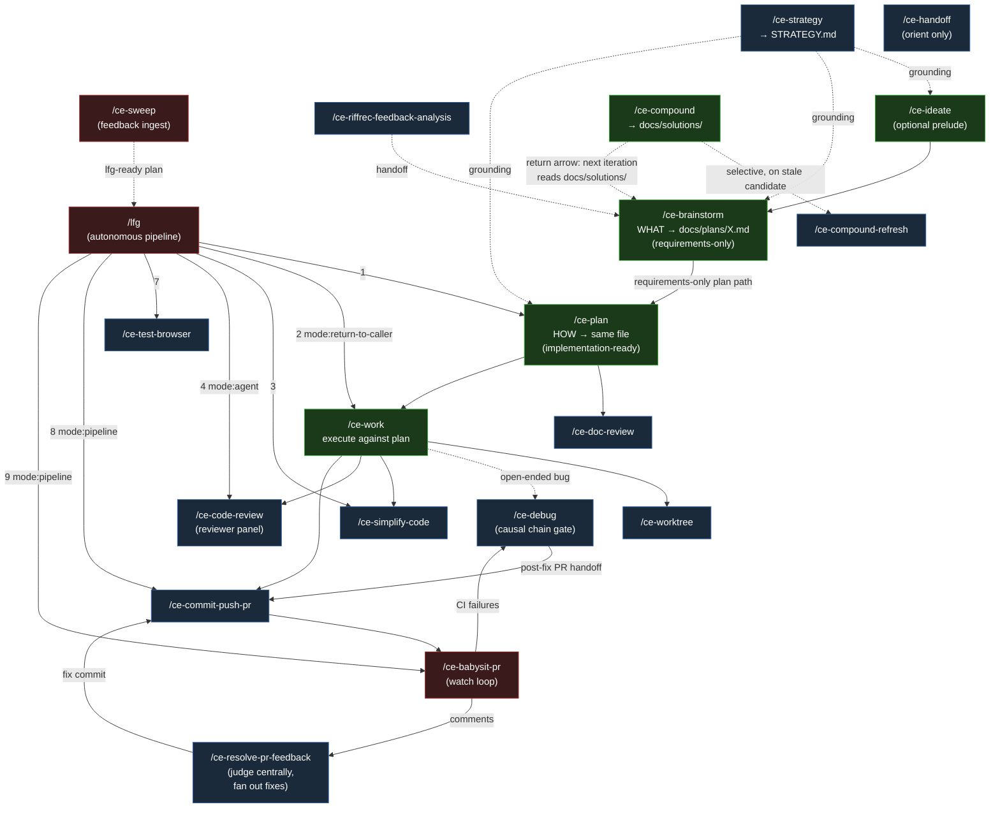

# Research: Compound Engineering Plugin — Multi-Agent Prompt System

> Repository: [everyinc/compound-engineering-plugin](https://github.com/everyinc/compound-engineering-plugin)
> Branch: `main` · Pinned SHA: [`80ec750e`](https://github.com/everyinc/compound-engineering-plugin/commit/80ec750ee32a3eef72e11636661df02aa4819827)
> Studied: 2026-07-17
> Scope: how the system routes work between skills, what each skill/subagent is for, and the flows the plugin prescribes.

---

## 1. Executive Summary

- **Compound Engineering (CE)** is a cross-host plugin (~30 `ce-*` skills + `lfg`) built around one methodology: *"structure engineering work so each unit makes the next one easier, capturing reusable knowledge as you go so the toolset gets smarter with every use."* The "compounding" is literal — `ce-compound` writes solved problems into `docs/solutions/`, which `ce-brainstorm` and `ce-plan` read as grounding on the next iteration. See [`README.md` L102–L116`](https://github.com/everyinc/compound-engineering-plugin/blob/80ec750ee32a3eef72e11636661df02aa4819827/README.md) and [`docs/skills/README.md` L9–L27`](https://github.com/everyinc/compound-engineering-plugin/blob/80ec750ee32a3eef72e11636661df02aa4819827/docs/skills/README.md).
- **The canonical flow is a 5-step core loop**: `/ce-ideate` (optional) → `/ce-brainstorm` (WHAT) → `/ce-plan` (HOW) → `/ce-work` (BUILD) → `/ce-compound` (CAPTURE). Hand-offs are *durable artifacts* (`docs/plans/`, `docs/solutions/`, `STRATEGY.md`, `CONCEPTS.md`), not in-memory state. See [`docs/skills/README.md` L11–L42`](https://github.com/everyinc/compound-engineering-plugin/blob/80ec750ee32a3eef72e11636661df02aa4819827/docs/skills/README.md).
- **`/lfg` is the autonomous pipeline** that chains the loop end-to-end with no check-ins: `ce-plan` → `ce-work mode:return-to-caller` → `ce-simplify-code` → `ce-code-review mode:agent` → apply fixes → `ce-test-browser` → `ce-commit-push-pr` → `ce-babysit-pr` to green. Each skill receives the prior skill's structured return. See [`skills/lfg/SKILL.md` L11–L83`](https://github.com/everyinc/compound-engineering-plugin/blob/80ec750ee32a3eef72e11636661df02aa4819827/skills/lfg/SKILL.md).
- **There are no standalone agent definitions.** CE's design choice is explicit: *"most CE specialist behavior is not exposed as standalone Agent definitions; Skills seed generic subagents with Skill-local prompt material instead."* Specialists live as **prompt assets** under each skill's `references/agents/*.md` and are dispatched as *generic* subagents with the asset's contents injected into the prompt. See [`CONCEPTS.md` L11–L17`](https://github.com/everyinc/compound-engineering-plugin/blob/80ec750ee32a3eef72e11636661df02aa4819827/CONCEPTS.md) and [`AGENTS.md` L245–L255`](https://github.com/everyinc/compound-engineering-plugin/blob/80ec750ee32a3eef72e11636661df02aa4819827/AGENTS.md).
- **Model tiering is structural, not by name.** Each skill declares three tiers — *extraction* (cheapest capable), *generation* (mid), *ceiling* (orchestrator's model, inherited) — and dispatches subagents by *tier* so model names never hardcode into skill content. When a host can't select per-agent models, cost control falls back to read budgets and output caps. See [`CONCEPTS.md` L74–L77`](https://github.com/everyinc/compound-engineering-plugin/blob/80ec750ee32a3eef72e11636661df02aa4819827/CONCEPTS.md).

---

## 2. System at a Glance

CE is **one plugin authored once and converted to many hosts**. The authoring surface is the source repo; the runtime surface is the installed plugin in the user's environment (Claude Code, Cursor, Codex, etc.). At authoring time, `AGENTS.md`, `CLAUDE.md` (symlink), and `GEMINI.md` are the master prompt for whoever is editing the repo; at runtime, each skill's `SKILL.md` is authoritative. Skills are **self-contained units** — a `SKILL.md` may reference only files inside its own directory tree (`references/`, `assets/`, `scripts/`), never sibling skills. If two skills need the same supporting file, it is **duplicated** byte-for-byte into each (this is the "Shared Repo-Grounding Profile Cache" pattern). See [`AGENTS.md` L257–L275`](https://github.com/everyinc/compound-engineering-plugin/blob/80ec750ee32a3eef72e11636661df02aa4819827/AGENTS.md).

The authoring guide ([`docs/solutions/skill-design/portable-agent-skill-authoring.md`](https://github.com/everyinc/compound-engineering-plugin/blob/80ec750ee32a3eef72e11636661df02aa4819827/docs/solutions/skill-design/portable-agent-skill-authoring.md)) is the canonical reasoning layer; everything else supplements it.

### Repo layout (top-level)

| Path | Purpose | Permalink |
|------|---------|-----------|
| `AGENTS.md` | Authoring-context master prompt (43 KB) — repository rules, conventions, validation gates | [`AGENTS.md`](https://github.com/everyinc/compound-engineering-plugin/blob/80ec750ee32a3eef72e11636661df02aa4819827/AGENTS.md) |
| `skills/` | **30 plugin skills** (29 `ce-*` + `lfg`); each is a self-contained dir with `SKILL.md` | [`skills/`](https://github.com/everyinc/compound-engineering-plugin/blob/80ec750ee32a3eef72e11636661df02aa4819827/skills/) |
| `docs/skills/` | End-user docs, one page per skill (purpose, mechanics, when-to-use, chain position) | [`docs/skills/`](https://github.com/everyinc/compound-engineering-plugin/blob/80ec750ee32a3eef72e11636661df02aa4819827/docs/skills/) |
| `docs/solutions/` | **The compounded knowledge store** — past problems solved, by category, with YAML frontmatter | [`docs/solutions/`](https://github.com/everyinc/compound-engineering-plugin/blob/80ec750ee32a3eef72e11636661df02aa4819827/docs/solutions/) |
| `docs/plans/` | Unified plan artifacts (`ce-brainstorm` → requirements-only; `ce-plan` → implementation-ready) | [`docs/plans/`](https://github.com/everyinc/compound-engineering-plugin/blob/80ec750ee32a3eef72e11636661df02aa4819827/docs/plans/) |
| `docs/brainstorms/`, `docs/ideation/`, `docs/specs/` | Historical/lifecycle artifacts | [`docs/`](https://github.com/everyinc/compound-engineering-plugin/blob/80ec750ee32a3eef72e11636661df02aa4819827/docs/) |
| `CONCEPTS.md` | Shared domain vocabulary (glossary — plugin/skill/agent/specialist, learning, model tier, detached job, …) | [`CONCEPTS.md`](https://github.com/everyinc/compound-engineering-plugin/blob/80ec750ee32a3eef72e11636661df02aa4819827/CONCEPTS.md) |
| `src/` | Bun/TS CLI: parsers, converters, target writers (Claude Code → other hosts) | [`src/`](https://github.com/everyinc/compound-engineering-plugin/blob/80ec750ee32a3eef72e11636661df02aa4819827/src/) |
| `.claude-plugin/`, `.cursor-plugin/`, `.codex-plugin/`, … | Per-host plugin manifests + marketplace catalogs | root-level dirs |
| `.compound-engineering/config.local.example.yaml` | Optional project-local config (output formats, feedback sources, skip-scoping flags) | [`.compound-engineering/`](https://github.com/everyinc/compound-engineering-plugin/blob/80ec750ee32a3eef72e11636661df02aa4819827/.compound-engineering/) |
| `plugin.json`, `package.json` | Plugin manifest + CLI package | root |

### Supported hosts

| Host | Install surface | Notes |
|------|-----------------|-------|
| **Claude Code** | `/plugin marketplace add EveryInc/compound-engineering-plugin` then `/plugin install compound-engineering` | First-class; skills use `AskUserQuestion` blocking-question tool |
| **Cursor** | `/add-plugin compound-engineering` | First-class |
| **Codex App** | Custom marketplace (git ref `main`) | Self-contained install |
| **Codex CLI** | `codex plugin marketplace add …` + `codex plugin add compound-engineering@…` | Self-contained |
| Cline, Grok Build CLI, Devin CLI, GitHub Copilot, Factory Droid, Qwen Code, OpenCode, Pi, Antigravity CLI (`agy`), Kimi Code CLI | via the Bun `convert` / `install --to <provider>` CLI | All map from the same authored source |
| Gemini | `GEMINI.md` present | authoring context + conversion target |

> Skills use platform-portable patterns: the model-filled `SKILL_DIR` anchor for executed shell (works on every host because no env var is involved), platform-agnostic blocking-question fallbacks (`AskUserQuestion` / `request_user_input` / `ask_question` / `ask_user`), and a tier-based model dispatch that degrades gracefully when a host can't select per-agent models. See [`AGENTS.md` L294–L328`](https://github.com/everyinc/compound-engineering-plugin/blob/80ec750ee32a3eef72e11636661df02aa4819827/AGENTS.md).

---

## 3. Question 1 — Recommended Flows

CE's flows are documented explicitly in [`docs/skills/README.md`](https://github.com/everyinc/compound-engineering-plugin/blob/80ec750ee32a3eef72e11636661df02aa4819827/docs/skills/README.md). There is **one canonical core loop** plus an autonomous pipeline (`lfg`) that runs the loop hands-off.

### 3.1 Core loop — feature lifecycle (ideation → strategy → plan → work → PR → compound)

The canonical 5-step pipeline. Each step hands a **durable artifact** to the next; nothing is in-memory only. From [`docs/skills/README.md` L11–L42`](https://github.com/everyinc/compound-engineering-plugin/blob/80ec750ee32a3eef72e11636661df02aa4819827/docs/skills/README.md):

```text
   [/ce-ideate]       (optional) "What's worth exploring?"
        │
        ▼
┌─→ /ce-brainstorm    "What does this need to be?"        (requirements-only plan)
│       │
│       ▼
│   /ce-plan          "What's needed to accomplish this?" (implementation-ready plan)
│       │
│       ▼
│   /ce-work          "Build it."                         (code; ships through quality gates)
│       │
│       ▼
└── /ce-compound      "Capture what we learned."          (writes docs/solutions/)
```

Stage-by-stage (from [`docs/skills/README.md` L35–L42`](https://github.com/everyinc/compound-engineering-plugin/blob/80ec750ee32a3eef72e11636661df02aa4819827/docs/skills/README.md) and the per-skill SKILL.md headers):

| Step | Skill | Answers | Output artifact |
|------|-------|---------|-----------------|
| 0 (optional) | `/ce-ideate` | "What's worth exploring?" | ranked ideation doc → `docs/ideation/` (HTML or md) |
| 1 | `/ce-brainstorm` | "What does this need to be?" | requirements-only unified plan → `docs/plans/` (`artifact_readiness: requirements-only`) |
| 2 | `/ce-plan` | "How should it be built?" | enriched plan → same file (`artifact_readiness: implementation-ready`) |
| 3 | `/ce-work` | "Build it." | code + tests; ships through quality gates |
| 4 | `/ce-compound` | "Capture what we learned." | learning doc → `docs/solutions/<category>/`, with optional `CONCEPTS.md` updates |

**The plan contract is load-bearing.** `ce-work` Phase 0 refuses to execute a plan with `artifact_readiness: requirements-only` and tells the user to run `ce-plan` first. From [`skills/ce-work/SKILL.md` L29–L37`](https://github.com/everyinc/compound-engineering-plugin/blob/80ec750ee32a3eef72e11636661df02aa4819827/skills/ce-work/SKILL.md):

> "If it carries `artifact_contract: ce-unified-plan/v1`, classify `artifact_readiness` before reading the body.
>   - `artifact_readiness: requirements-only` -> stop and tell the user this Product Contract needs `ce-plan` enrichment before implementation. Offer the exact `ce-plan <plan-path>` handoff.
>   - `artifact_readiness: implementation-ready` plus `execution: code` -> continue to Phase 1 using the unified-plan reader strategy below."

```mermaid
flowchart TD
    Start([User has an idea or problem])

    Start --> Q1{Know what to work on?}
    Q1 -->|No| Ideate["/ce-ideate<br/>rank candidate directions<br/>output: docs/ideation/"]
    Q1 -->|Yes| Strat{STRATEGY.md exists?}

    Ideate --> Strat
    Strat -->|No| Strategy["/ce-strategy<br/>write STRATEGY.md<br/>(anchor for downstream)"]
    Strat -->|Yes| Brainstorm

    Strategy --> Brainstorm["/ce-brainstorm<br/>WHAT to build<br/>output: docs/plans/X.md<br/>artifact_readiness: requirements-only"]
    Brainstorm --> Plan["/ce-plan<br/>HOW to build<br/>output: same file enriched<br/>artifact_readiness: implementation-ready"]
    Plan --> DocReview{Optional: doc review}
    DocReview -->|yes| CeDocRev["/ce-doc-review<br/>reviewer-persona panel<br/>on the plan"]
    DocReview -->|no| Work
    CeDocRev --> Work["/ce-work<br/>implement against plan guardrails<br/>creates branch / worktree<br/>runs quality gates inline"]
    Work --> Simplify["/ce-simplify-code<br/>refine branch diff<br/>(behavior-preserving)"]
    Simplify --> CodeReview["/ce-code-review<br/>skill-local reviewer personas<br/>confidence-gated findings"]
    CodeReview --> Commit["/ce-commit-push-pr<br/>atomic commits + open PR"]
    Commit --> Babysit["/ce-babysit-pr<br/>watch PR until merge-ready"]
    Babysit --> Merged{PR merged?}
    Merged -->|yes| Compound["/ce-compound<br/>write learning to docs/solutions/<br/>+ CONCEPTS.md vocabulary capture"]
    Merged -->|no| Babysit
    Compound -.->|"return arrow: next iteration<br/>reads docs/solutions/ as grounding"| Brainstorm

    classDef default fill:#1a1a1a,color:#fff,stroke:#555
    classDef loop fill:#1a3a1a,color:#fff,stroke:#3a3
    classDef decision fill:#3a3a1a,color:#fff,stroke:#aa3
    class Ideate,Brainstorm,Plan,Work,Simplify,CodeReview,Commit,Babysit,Compound,Strategy,CeDocRev loop
    class Q1,Strat,DocReview,Merged decision
```



The "return arrow" from `/ce-compound` back to `/ce-brainstorm` is the entire point of the methodology — it is what makes the loop *compound*. ([`docs/skills/README.md` L27`](https://github.com/everyinc/compound-engineering-plugin/blob/80ec750ee32a3eef72e11636661df02aa4819827/docs/skills/README.md))

### 3.2 PR review / feedback loop — `ce-babysit-pr` driving `ce-resolve-pr-feedback` + `ce-debug`

For an already-open PR, `ce-babysit-pr` is the watch loop. Its core principle is **never serialize comment work behind CI** ([`skills/ce-babysit-pr/SKILL.md` L44–L48`](https://github.com/everyinc/compound-engineering-plugin/blob/80ec750ee32a3eef72e11636661df02aa4819827/skills/ce-babysit-pr/SKILL.md)):

> "**Never wait for a full CI run before addressing review comments.** A comment fix pushes a new commit that re-triggers CI anyway, so handling comments *while CI is still running* collapses the two timelines instead of serializing them. Handle comments first; if that pass pushed, the old CI failure is against a dead SHA — skip it and let the new run start."

Each tick of the watch loop runs an ordering invariant ([`skills/ce-babysit-pr/SKILL.md` L119–L150`](https://github.com/everyinc/compound-engineering-plugin/blob/80ec750ee32a3eef72e11636661df02aa4819827/skills/ce-babysit-pr/SKILL.md)):

1. Terminal check first (if PR is MERGED/CLOSED, stop).
2. Capture head SHA.
3. **Feedback before CI** — if there are unresolved threads or non-thread feedback candidates, invoke `ce-resolve-pr-feedback` once (in `mode:pipeline` for non-interactive).
4. **Stale-SHA cancellation** — if head changed during step 3, the CI failures in this snapshot are against a dead SHA, skip them.
5. **CI on the current head** — aggregate failing checks into one remediation pass. Flaky/infra → `gh run rerun`; real failures → invoke `ce-debug mode:pipeline` once.
6. **Branch currency** — route from `pr_chain` (managed stack vs manual dependency chain vs independent PR).

`ce-babysit-pr` owns only the watch loop; it delegates every actual fix. From [`skills/ce-babysit-pr/SKILL.md` L9`](https://github.com/everyinc/compound-engineering-plugin/blob/80ec750ee32a3eef72e11636661df02aa4819827/skills/ce-babysit-pr/SKILL.md):

> "Comment fixes are delegated to `ce-resolve-pr-feedback`; CI failures are delegated to `ce-debug`. This skill owns the watch loop: snapshot, order, dedup, act, and decide when to **keep watching**, move to the next authorized managed-stack layer, or stop."

```mermaid
sequenceDiagram
    autonumber
    participant U as User
    participant BS as ce-babysit-pr
    participant DET as pr-snapshot<br/>(background change-detector)
    participant RS as ce-resolve-pr-feedback
    participant DB as ce-debug
    participant GH as GitHub

    U->>BS: /ce-babysit-pr <PR>
    BS->>BS: Step 1: confirm GitHub + classify PR chain
    BS->>DET: arm background watch (no agent tokens)
    Note over BS,DET: BS stays in-session, waits for sentinel

    loop until terminal/budget/user-stop
        DET->>BS: BABYSIT_WAKE {reason}
        BS->>GH: snapshot both streams (reviews + CI)
        BS->>BS: capture head SHA
        alt attention set has threads or feedback
            BS->>RS: invoke ce-resolve-pr-feedback mode:pipeline
            RS->>RS: orchestrator judges centrally;<br/>fans out only approved fixes to subagents
            RS->>GH: reply / resolve / push fix commit
            RS-->>BS: {filed, failed, no_sink, residuals}
        end
        alt head SHA changed during comment pass
            Note over BS: stale-SHA cancellation:<br/>skip CI failures against dead SHA
        else CI has failing checks on current head
            BS->>DB: invoke ce-debug mode:pipeline<br/>(aggregate, not per-check)
            DB->>DB: root-cause, propose fix
            DB->>GH: commit + push (or mark dispatched)
            DB-->>BS: {fixed-and-pushed, flaky-infra,<br/>diagnosed-no-fix, needs-human}
        end
        BS->>BS: mark items acted-on (claim→act→confirm)
        BS->>DET: re-arm watch
    end

    BS->>U: report (looks-ready / blocked / budget / merged)
    Note over U,BS: merge authorization stays with the user;<br/>BS only declares merge-readiness
```

### 3.3 Other notable flows

#### `/lfg` — the full autonomous pipeline

The hands-off version of the core loop, with **no check-ins**. From [`skills/lfg/SKILL.md` L11–L83`](https://github.com/everyinc/compound-engineering-plugin/blob/80ec750ee32a3eef72e11636661df02aa4819827/skills/lfg/SKILL.md): `ce-plan` → `ce-work mode:return-to-caller <plan>` → `ce-simplify-code` → `ce-code-review mode:agent plan:<plan>` → apply fixes → autonomous residual handoff → `ce-test-browser mode:pipeline` → `ce-commit-push-pr mode:pipeline branding:on` → `ce-babysit-pr mode:pipeline` → DONE. Each step has a GATE that stops the pipeline on a structured failure (blocked, non-software, settled-decision-invalidated). Detailed in §4.1 below.

#### Maintenance flows

- **`/ce-compound-refresh`** — maintain `docs/solutions/` over time. Five outcomes per existing doc: Keep / Update / Consolidate / Replace / Delete. Interactive + Autofix modes. Run when a new learning suggests an older doc is stale.
- **`/ce-sweep`** — recurring feedback sweep across configured sources (Slack, GitHub Issues; email experimental). Ingests items since per-source cursors, acknowledges at source, analyzes recordings, verifies fixes merged, reconciles an `/lfg`-ready rolling plan.
- **`/ce-product-pulse`** — single-page time-windowed report on usage, performance, errors, followups. Saved to `docs/pulse-reports/` as a timeline. Outer feedback loop.

#### Debug / explain / polish (on-demand)

- **`/ce-debug`** — systematic root-cause finding: causal chain gate, predictions, post-fix polish/review, PR handoff. Has a `mode:pipeline` form for autonomous invocation by `ce-babysit-pr` or `lfg`.
- **`/ce-explain`** — turn a concept, diff, idea, or window of recent work into a dense visual explainer written for the developer personally. Optional check-in (predict-then-reveal for diffs).
- **`/ce-polish`** — conversational UX polish: starts dev server, opens browser, iterates together. Auto-detects 8 frameworks.
- **`/ce-pov`** — form a decisive, project-grounded point of view (adoption verdict, doc take, or position on approaches). Optional named/`oracle` panel with bounded debate.
- **`/ce-simplify-code`** — refine recently changed code (reuse, quality, efficiency); behavior preservation verified.
- **`/ce-optimize`** — metric-driven iterative optimization loops; three-tier evaluation, parallel experiments, persistence discipline.

#### Setup / handoff / dogfood

- **`/ce-setup`** — diagnose optional tool capabilities and bootstrap safe project-local config.
- **`/ce-handoff`** — create a session handoff (defaults to managed `/tmp/compound-engineering/ce-handoff/<repo>/<topic>.md` with `artifact_contract: ce-handoff/v1` frontmatter) **or** resume from any user-selected source. Crucially: *"selection supplies context but no authority to continue automatically"* — handoff orients, it does not auto-continue. See [`skills/ce-handoff/SKILL.md` L9–L24`](https://github.com/everyinc/compound-engineering-plugin/blob/80ec750ee32a3eef72e11636661df02aa4819827/skills/ce-handoff/SKILL.md).
- **`/ce-dogfood`** — hands-off diff-scoped browser QA of the active branch. Maps flows, autonomously fixes small breakages with regression tests and commits, writes a durable report.

---

## 4. Question 2 — Skill & Agent Decomposition

### 4.1 The routing mechanism — how skills chain

CE has **no top-level orchestrator agent**. Instead, three patterns route work between skills:

**Pattern A — User-invoked, hand-off via durable artifact.** The default. The user types `/ce-brainstorm`; the skill writes `docs/plans/X.md`; later the user (or a later skill) passes that path to `/ce-plan` or `/ce-work`. Each skill is independent and the hand-off is a file path, not in-memory state. This is what makes the system composable and crash-safe.

**Pattern B — Skill-to-skill invocation via the platform's `Skill` tool.** Used inside `lfg` and `ce-babysit-pr`. From [`skills/lfg/SKILL.md` L9–L11`](https://github.com/everyinc/compound-engineering-plugin/blob/80ec750ee32a3eef72e11636661df02aa4819827/skills/lfg/SKILL.md):

> "When invoking any skill referenced below, resolve its name against the available-skills list the host platform provides and use that exact entry. Some platforms list skills under a plugin namespace (e.g., `compound-engineering:ce-plan`); others list the bare name."

The caller passes a `mode:` token (`mode:pipeline`, `mode:return-to-caller <path>`, `mode:agent`, `mode:headless`) that the callee honors. The callee returns a **structured envelope** the caller interprets — for example `ce-work mode:return-to-caller` returns `{ status, plan_path, changed_files, u_ids_attempted, verification_evidence, behavior_change, standalone_shipping_skipped, settled_decision_conflicts }` ([`skills/lfg/SKILL.md` L21`](https://github.com/everyinc/compound-engineering-plugin/blob/80ec750ee32a3eef72e11636661df02aa4819827/skills/lfg/SKILL.md)).

**Pattern C — Generic-subagent dispatch with skill-local persona.** Used inside individual skills for parallelism or specialization. The skill writes a prompt asset to `references/agents/<name>.md` (no YAML frontmatter, no model selection — those belong in the calling `SKILL.md` per [`AGENTS.md` L245–L255`](https://github.com/everyinc/compound-engineering-plugin/blob/80ec750ee32a3eef72e11636661df02aa4819827/AGENTS.md)) and dispatches a *generic* subagent with the asset's contents in the prompt. This is the "no-standalone-agents" design choice made concrete.

> Example — `ce-compound` Phase 1 launches **three parallel background subagents**: Context Analyzer, Solution Extractor, Related Docs Finder. Each writes its full output to a per-run scratch file under `/tmp/compound-engineering/ce-compound/<run_id>/` and returns only the artifact path (this is the **issue #956 reliability pattern**: subagents asked to return long prose inline sometimes return only an executive summary, and the original is unrecoverable). See [`skills/ce-compound/SKILL.md` L82–L155`](https://github.com/everyinc/compound-engineering-plugin/blob/80ec750ee32a3eef72e11636661df02aa4819827/skills/ce-compound/SKILL.md).

> Example — `ce-resolve-pr-feedback` "judges centrally, fans out only the fixes": the orchestrator reads every thread from one fetch (so it can dedup reads, catch a systematically-wrong reviewer across threads, and weigh author design intent), then dispatches a skill-local fixer persona only for items it has approved. See [`skills/ce-resolve-pr-feedback/SKILL.md` L9–L21`](https://github.com/everyinc/compound-engineering-plugin/blob/80ec750ee32a3eef72e11636661df02aa4819827/skills/ce-resolve-pr-feedback/SKILL.md).

### 4.2 Catalogue of all 30 skills

Organized by the categories used in [`docs/skills/README.md`](https://github.com/everyinc/compound-engineering-plugin/blob/80ec750ee32a3eef72e11636661df02aa4819827/docs/skills/README.md). The "Calls" column lists other CE skills the skill is documented as invoking; "(generic subagents)" means it spawns subagents seeded with skill-local prompt assets rather than calling another CE skill.

#### The Core Loop

| Skill | File | Job | Calls | Permalink |
|-------|------|-----|-------|-----------|
| `/ce-ideate` | `skills/ce-ideate/SKILL.md` | Optional first step — generate and rank grounded ideas | (generic subagents across 6 ideation frames) | [ce-ideate](https://github.com/everyinc/compound-engineering-plugin/blob/80ec750ee32a3eef72e11636661df02aa4819827/skills/ce-ideate/SKILL.md) |
| `/ce-brainstorm` | `skills/ce-brainstorm/SKILL.md` | WHAT to build — collaborative dialogue → requirements-only unified plan in `docs/plans/` | (research subagents) | [ce-brainstorm](https://github.com/everyinc/compound-engineering-plugin/blob/80ec750ee32a3eef72e11636661df02aa4819827/skills/ce-brainstorm/SKILL.md) |
| `/ce-plan` | `skills/ce-plan/SKILL.md` | HOW to build — enriches the requirements-only plan to `implementation-ready` | optional `ce-doc-review` | [ce-plan](https://github.com/everyinc/compound-engineering-plugin/blob/80ec750ee32a3eef72e11636661df02aa4819827/skills/ce-plan/SKILL.md) |
| `/ce-work` | `skills/ce-work/SKILL.md` | Execute against plan guardrails; figure out HOW with code in front of you | optional `ce-worktree`, `ce-debug` | [ce-work](https://github.com/everyinc/compound-engineering-plugin/blob/80ec750ee32a3eef72e11636661df02aa4819827/skills/ce-work/SKILL.md) |
| `/ce-compound` | `skills/ce-compound/SKILL.md` | Capture what was learned → `docs/solutions/` + `CONCEPTS.md` vocabulary capture | optional `ce-compound-refresh` (selective) | [ce-compound](https://github.com/everyinc/compound-engineering-plugin/blob/80ec750ee32a3eef72e11636661df02aa4819827/skills/ce-compound/SKILL.md) |

#### Around the Loop

| Skill | File | Job | Calls | Permalink |
|-------|------|-----|-------|-----------|
| `/ce-strategy` | `skills/ce-strategy/SKILL.md` | Create/maintain `STRATEGY.md` — upstream anchor | (none) | [ce-strategy](https://github.com/everyinc/compound-engineering-plugin/blob/80ec750ee32a3eef72e11636661df02aa4819827/skills/ce-strategy/SKILL.md) |
| `/ce-product-pulse` | `skills/ce-product-pulse/SKILL.md` | Outer feedback loop — time-windowed report on usage/perf/errors/followups | (analysis subagents) | [ce-product-pulse](https://github.com/everyinc/compound-engineering-plugin/blob/80ec750ee32a3eef72e11636661df02aa4819827/skills/ce-product-pulse/SKILL.md) |
| `/ce-sweep` | `skills/ce-sweep/SKILL.md` | Recurring feedback sweep across sources | `lfg`-ready rolling plan | [ce-sweep](https://github.com/everyinc/compound-engineering-plugin/blob/80ec750ee32a3eef72e11636661df02aa4819827/skills/ce-sweep/SKILL.md) |
| `/ce-compound-refresh` | `skills/ce-compound-refresh/SKILL.md` | Maintain `docs/solutions/` over time (Keep/Update/Consolidate/Replace/Delete) | (none directly) | [ce-compound-refresh](https://github.com/everyinc/compound-engineering-plugin/blob/80ec750ee32a3eef72e11636661df02aa4819827/skills/ce-compound-refresh/SKILL.md) |

#### On-Demand

| Skill | File | Job | Calls | Permalink |
|-------|------|-----|-------|-----------|
| `/ce-pov` | `skills/ce-pov/SKILL.md` | Decisive project-grounded POV (adoption verdict, doc take, position on approaches) | optional `oracle` panel subagents | [ce-pov](https://github.com/everyinc/compound-engineering-plugin/blob/80ec750ee32a3eef72e11636661df02aa4819827/skills/ce-pov/SKILL.md) |
| `/ce-explain` | `skills/ce-explain/SKILL.md` | Dense visual explainer for the developer personally | (none) | [ce-explain](https://github.com/everyinc/compound-engineering-plugin/blob/80ec750ee32a3eef72e11636661df02aa4819827/skills/ce-explain/SKILL.md) |
| `/ce-debug` | `skills/ce-debug/SKILL.md` | Systematic root-cause finding with causal chain gate, predictions, post-fix polish | (diagnosis subagents) | [ce-debug](https://github.com/everyinc/compound-engineering-plugin/blob/80ec750ee32a3eef72e11636661df02aa4819827/skills/ce-debug/SKILL.md) |
| `/ce-code-review` | `skills/ce-code-review/SKILL.md` | Structured code review with skill-local reviewer personas; 4 modes | (panel of reviewer-persona subagents; cross-model pass) | [ce-code-review](https://github.com/everyinc/compound-engineering-plugin/blob/80ec750ee32a3eef72e11636661df02aa4819827/skills/ce-code-review/SKILL.md) |
| `/ce-doc-review` | `skills/ce-doc-review/SKILL.md` | Review requirements/plan docs with skill-local reviewer personas | (panel: coherence, feasibility, product-lens, design-lens, security-lens, scope-guardian, adversarial) | [ce-doc-review](https://github.com/everyinc/compound-engineering-plugin/blob/80ec750ee32a3eef72e11636661df02aa4819827/skills/ce-doc-review/SKILL.md) |
| `/ce-simplify-code` | `skills/ce-simplify-code/SKILL.md` | Refine recently changed code; behavior preservation verified | (none) | [ce-simplify-code](https://github.com/everyinc/compound-engineering-plugin/blob/80ec750ee32a3eef72e11636661df02aa4819827/skills/ce-simplify-code/SKILL.md) |
| `/ce-optimize` | `skills/ce-optimize/SKILL.md` | Metric-driven iterative optimization loops | (parallel experiments as subagents) | [ce-optimize](https://github.com/everyinc/compound-engineering-plugin/blob/80ec750ee32a3eef72e11636661df02aa4819827/skills/ce-optimize/SKILL.md) |

#### Research & Context

| Skill | File | Job | Calls | Permalink |
|-------|------|-----|-------|-----------|
| `/ce-riffrec-feedback-analysis` | `skills/ce-riffrec-feedback-analysis/SKILL.md` | Turn raw Riffrec recordings into structured feedback | `ce-brainstorm` handoff | [ce-riffrec-feedback-analysis](https://github.com/everyinc/compound-engineering-plugin/blob/80ec750ee32a3eef72e11636661df02aa4819827/skills/ce-riffrec-feedback-analysis/SKILL.md) |

#### Git Workflow

| Skill | File | Job | Calls | Permalink |
|-------|------|-----|-------|-----------|
| `/ce-commit` | `skills/ce-commit/SKILL.md` | Single well-crafted git commit; convention-aware, sensitive-file-safe, file-level logical splitting | (none) | [ce-commit](https://github.com/everyinc/compound-engineering-plugin/blob/80ec750ee32a3eef72e11636661df02aa4819827/skills/ce-commit/SKILL.md) |
| `/ce-commit-push-pr` | `skills/ce-commit-push-pr/SKILL.md` | Working changes → open PR with adaptive descriptions; 3 modes (full / desc-update / desc-only) | (none) | [ce-commit-push-pr](https://github.com/everyinc/compound-engineering-plugin/blob/80ec750ee32a3eef72e11636661df02aa4819827/skills/ce-commit-push-pr/SKILL.md) |
| `/ce-babysit-pr` | `skills/ce-babysit-pr/SKILL.md` | Watch open PR until merge-ready | **`ce-resolve-pr-feedback`** (comments), **`ce-debug`** (CI) | [ce-babysit-pr](https://github.com/everyinc/compound-engineering-plugin/blob/80ec750ee32a3eef72e11636661df02aa4819827/skills/ce-babysit-pr/SKILL.md) |
| `/ce-worktree` | `skills/ce-worktree/SKILL.md` | Ensure work happens in isolated git worktree | (host-native worktree tool, or plain git fallback) | [ce-worktree](https://github.com/everyinc/compound-engineering-plugin/blob/80ec750ee32a3eef72e11636661df02aa4819827/skills/ce-worktree/SKILL.md) |

#### Autonomous Pipeline

| Skill | File | Job | Calls (in order) | Permalink |
|-------|------|-----|------------------|-----------|
| `/lfg` | `skills/lfg/SKILL.md` | Full hands-off shipping pipeline plan→PR→green | `ce-plan` → `ce-work` → `ce-simplify-code` → `ce-code-review` → (apply fixes) → `ce-test-browser` → `ce-commit-push-pr` → `ce-babysit-pr` | [lfg](https://github.com/everyinc/compound-engineering-plugin/blob/80ec750ee32a3eef72e11636661df02aa4819827/skills/lfg/SKILL.md) |

#### Frontend Design / Collaboration / Workflow Utilities

| Skill | File | Job | Calls | Permalink |
|-------|------|-----|-------|-----------|
| `/ce-polish` | `skills/ce-polish/SKILL.md` | Conversational UX polish (8-framework auto-detect) | (none) | [ce-polish](https://github.com/everyinc/compound-engineering-plugin/blob/80ec750ee32a3eef72e11636661df02aa4819827/skills/ce-polish/SKILL.md) |
| `/ce-proof` | `skills/ce-proof/SKILL.md` | Publish/view/comment/edit markdown via Proof editor | (Proof hosted v3 web API) | [ce-proof](https://github.com/everyinc/compound-engineering-plugin/blob/80ec750ee32a3eef72e11636661df02aa4819827/skills/ce-proof/SKILL.md) |
| `/ce-promote` | `skills/ce-promote/SKILL.md` | Draft user-facing announcement copy (X, changelog, LinkedIn, email) | (optional Spiral CLI for voice matching) | [ce-promote](https://github.com/everyinc/compound-engineering-plugin/blob/80ec750ee32a3eef72e11636661df02aa4819827/skills/ce-promote/SKILL.md) |
| `/ce-resolve-pr-feedback` | `skills/ce-resolve-pr-feedback/SKILL.md` | Evaluate/fix/reply to PR review feedback in parallel | (skill-local fixer-persona subagents) | [ce-resolve-pr-feedback](https://github.com/everyinc/compound-engineering-plugin/blob/80ec750ee32a3eef72e11636661df02aa4819827/skills/ce-resolve-pr-feedback/SKILL.md) |
| `/ce-dogfood` | `skills/ce-dogfood/SKILL.md` | Hands-off diff-scoped browser QA of active branch | (browser-driver subagents; small-fix commits inline) | [ce-dogfood](https://github.com/everyinc/compound-engineering-plugin/blob/80ec750ee32a3eef72e11636661df02aa4819827/skills/ce-dogfood/SKILL.md) |
| `/ce-test-browser` | `skills/ce-test-browser/SKILL.md` | End-to-end browser tests using host-native browser | (agent-browser fallback) | [ce-test-browser](https://github.com/everyinc/compound-engineering-plugin/blob/80ec750ee32a3eef72e11636661df02aa4819827/skills/ce-test-browser/SKILL.md) |
| `/ce-test-xcode` | `skills/ce-test-xcode/SKILL.md` | Build and test iOS apps on simulator via XcodeBuildMCP | (none) | [ce-test-xcode](https://github.com/everyinc/compound-engineering-plugin/blob/80ec750ee32a3eef72e11636661df02aa4819827/skills/ce-test-xcode/SKILL.md) |
| `/ce-setup` | `skills/ce-setup/SKILL.md` | Diagnose optional tool capabilities; bootstrap project-local config | (none) | [ce-setup](https://github.com/everyinc/compound-engineering-plugin/blob/80ec750ee32a3eef72e11636661df02aa4819827/skills/ce-setup/SKILL.md) |
| `/ce-handoff` | `skills/ce-handoff/SKILL.md` | Create session handoff or resume from any continuity source | (none — orients only, never auto-continues) | [ce-handoff](https://github.com/everyinc/compound-engineering-plugin/blob/80ec750ee32a3eef72e11636661df02aa4819827/skills/ce-handoff/SKILL.md) |

### 4.3 What stays in the main agent vs. what is delegated — and why

CE's design philosophy is explicit about the orchestrator-vs-specialist split. Two patterns dominate:

**Stay in the skill's main context:**
- **Routing / mode detection** — every skill opens with mode detection (interactive vs `mode:pipeline` vs `mode:headless`), output-format resolution, focus-hint parsing. This is judgment the orchestrator is better positioned to make than the user (see `ce-compound` Execution Strategy, [`skills/ce-compound/SKILL.md` L67–L77`](https://github.com/everyinc/compound-engineering-plugin/blob/80ec750ee32a3eef72e11636661df02aa4819827/skills/ce-compound/SKILL.md)).
- **Central validity judgment** — `ce-resolve-pr-feedback`'s orchestrator judges every thread centrally *before* dispatching any fix. The rationale: *"the validity decision is made by the orchestrator, which holds every thread from a single fetch — so it can dedup reads, catch a systematically-wrong reviewer across threads, and weigh the author's design intent against the finding. A confidently-wrong code-review bot is caught at this gate, not blindly fixed by an isolated subagent."* ([`skills/ce-resolve-pr-feedback/SKILL.md` L20–L21`](https://github.com/everyinc/compound-engineering-plugin/blob/80ec750ee32a3eef72e11636661df02aa4819827/skills/ce-resolve-pr-feedback/SKILL.md))
- **Overlap assessment and final write** — only `ce-compound`'s orchestrator writes product files; subagents write to per-run scratch and return only artifact paths. ([`skills/ce-compound/SKILL.md` L84–L95`](https://github.com/everyinc/compound-engineering-plugin/blob/80ec750ee32a3eef72e11636661df02aa4819827/skills/ce-compound/SKILL.md))
- **User interaction** — blocking questions, post-generation menus, consent gates (e.g. `ce-compound`'s Discoverability Check consent for editing `AGENTS.md`).
- **Final synthesis across subagent results**.

**Pushed into a separate subagent — with stated rationale:**

- **Parallel research / evidence gathering** — `ce-compound` Phase 1 fires Context Analyzer + Solution Extractor + Related Docs Finder in parallel because they're independent and wall-clock matters. Each writes to scratch and returns only a path. *Rationale:* (a) parallelism; (b) the **issue #956 reliability pattern** — *"a subagent asked to return a long prose body as its inline response intermittently returns an executive summary instead ('Doc body complete — six sections filled. Returning above.'), and the original prose is then unrecoverable from the orchestrator side. Writing to disk first means the full output always survives."* ([`skills/ce-compound/SKILL.md` L94`](https://github.com/everyinc/compound-engineering-plugin/blob/80ec750ee32a3eef72e11636661df02aa4819827/skills/ce-compound/SKILL.md))
- **Single-lens reviewer personas** — `ce-code-review` and `ce-doc-review` dispatch a panel of reviewers (security, correctness, scope, design, …) as separate subagents so each lens gets a fresh context and the findings can be cross-corroborated. *Concept:* **Reviewer persona** ([`CONCEPTS.md` L98–L99`](https://github.com/everyinc/compound-engineering-plugin/blob/80ec750ee32a3eef72e11636661df02aa4819827/CONCEPTS.md)).
- **Cheap extraction vs expensive generation** — model tiering means a cheap scout subagent gathers an **Evidence dossier** (verbatim quotes with source pointers, written to scratch) and the orchestrator carries only a short gist. *Concept:* **Evidence dossier** ([`CONCEPTS.md` L79–L80`](https://github.com/everyinc/compound-engineering-plugin/blob/80ec750ee32a3eef72e11636661df02aa4819827/CONCEPTS.md)).
- **Work that must outlive the calling turn** — `ce-babysit-pr` and `lfg` use **Detached job** semantics: a delegated worker process launched into its own session so it outlives the shell tool call that started it, with state kept in a durable job directory the orchestrator polls between turns. ([`CONCEPTS.md` L85–L88`](https://github.com/everyinc/compound-engineering-plugin/blob/80ec750ee32a3eef72e11636661df02aa4819827/CONCEPTS.md))
- **Cross-model independent review** — `ce-code-review` supports a **Cross-model pass**: an additive delegated run through a different model-provider route, folded back into the host's synthesis. Counts as independent corroboration only when verified by a **Model identity receipt**. ([`CONCEPTS.md` L90–L94`](https://github.com/everyinc/compound-engineering-plugin/blob/80ec750ee32a3eef72e11636661df02aa4819827/CONCEPTS.md))
- **Repo-profile derivation on a cache miss** — a generic subagent seeded with `references/agents/repo-profiler.md` derives the project profile and writes it to the shared cache at `/tmp/compound-engineering/repo-profile/<root-sha>/<inputs-digest>.json`. Future runs hit the cache. ([`AGENTS.md` L277–L292`](https://github.com/everyinc/compound-engineering-plugin/blob/80ec750ee32a3eef72e11636661df02aa4819827/AGENTS.md))

**The skill-to-skill call graph** (router skills at the top, leaf skills at the bottom; edges are "calls"):



### Anatomy of one representative skill — `/lfg`

`lfg` is the cleanest illustration of CE's "skill as a chain of skills" pattern. It does almost nothing itself; it orchestrates. From [`skills/lfg/SKILL.md` L7–L83`](https://github.com/everyinc/compound-engineering-plugin/blob/80ec750ee32a3eef72e11636661df02aa4819827/skills/lfg/SKILL.md):

> "CRITICAL: You MUST execute every step below IN ORDER. Do NOT skip any required step. Do NOT jump ahead to coding or implementation. The plan phase (step 1) MUST be completed and verified BEFORE any work begins."

```mermaid
flowchart LR
    subgraph LFG["/lfg main context (keeps)"]
        Step1["STEP 1<br/>compose settled-decisions brief<br/>from invoking conversation"]
        Gate1{"GATE: plan file<br/>created?"}
        Step2["STEP 2<br/>read structured return"]
        Gate2{"GATE: status=complete<br/>+ verification_evidence<br/>(when behavior_change=true)"}
        Step3["STEP 3<br/>skip if docs-only<br/>or <10 lines"]
        Step4["STEP 4<br/>read Actionable Findings;<br/>read settled_conflict stamps"]
        Step5["STEP 5<br/>apply eligible review fixes<br/>(load references/review-followup.md)"]
        Step6["STEP 6<br/>autonomous residual handoff<br/>(only when actionable<br/>downstream-resolver findings)"]
        Step7["STEP 7<br/>browser tests"]
        Step8["STEP 8<br/>commit + push + open PR"]
        Step9["STEP 9<br/>drive CI to green"]
        Step10["STEP 10<br/>output &lt;promise&gt;DONE&lt;/promise&gt;"]
    end

    subgraph Delegated["Delegated (other CE skills)"]
        CePlan["/ce-plan"]
        CeWork["/ce-work mode:return-to-caller"]
        CeSimplify["/ce-simplify-code"]
        CeCodeReview["/ce-code-review mode:agent"]
        CeTestBrowser["/ce-test-browser mode:pipeline"]
        CeCommit["/ce-commit-push-pr mode:pipeline"]
        CeBabysit["/ce-babysit-pr mode:pipeline"]
    end

    subgraph External["External / state"]
        Tracker["tracker tickets<br/>(GitHub Issues, Linear, Jira)"]
        RecFile["docs/residual-review-findings/<br/branch-or-sha>.md"]
        GH["GitHub PR + CI"]
    end

    Step1 --> CePlan
    CePlan -.->|"plan path"| Gate1
    Gate1 -->|"no, retry"| CePlan
    Gate1 -->|"yes"| Step2
    Step2 --> CeWork
    CeWork -.->|"structured return"| Gate2
    Gate2 -->|"evidence missing, retry"| CeWork
    Gate2 -->|"ok"| Step3
    Step3 --> CeSimplify
    Step3 --> CeCodeReview
    CeCodeReview -.->|"Actionable Findings"| Step4
    Step4 --> Step5
    Step5 --> Step6
    Step6 -.->|"files →"| Tracker
    Step6 -.->|"writes →"| RecFile
    Step6 --> Step7
    Step7 --> CeTestBrowser
    Step7 --> Step8
    Step8 --> CeCommit
    CeCommit -.->|"PR URL"| Step9
    Step9 --> CeBabysit
    CeBabysit -.->|"watches + fixes"| GH
    CeBabysit -.->|"structured result"| Step10

    classDef kept fill:#1a3a1a,color:#fff,stroke:#3a3
    classDef del fill:#3a1a1a,color:#fff,stroke:#a33
    classDef ext fill:#1a2a3a,color:#fff,stroke:#36a
    class Step1,Gate1,Step2,Gate2,Step3,Step4,Step5,Step6,Step7,Step8,Step9,Step10 kept
    class CePlan,CeWork,CeSimplify,CeCodeReview,CeTestBrowser,CeCommit,CeBabysit del
    class Tracker,RecFile,GH ext
```



Each step has a **GATE** that stops the pipeline on a structured failure (e.g. `ce-plan` returning `settled-decision-invalidated`, or `ce-work` returning `status: blocked`). Residuals are made durable in two places: review findings go to tracker tickets (GitHub Issues / Linear / Jira via the project's configured tracker) plus a committed record file at `docs/residual-review-findings/<branch-or-sha>.md`; CI residuals go to a run-report PR comment via `ce-babysit-pr` — never a PR-body section. ([`skills/lfg/SKILL.md` L37–L83`](https://github.com/everyinc/compound-engineering-plugin/blob/80ec750ee32a3eef72e11636661df02aa4819827/skills/lfg/SKILL.md))

---

## 5. Code Snippets & Key Prompts

### 5.1 The methodology

> "**Each unit of engineering work should make subsequent units easier -- not harder.** … 80% is in planning and review, 20% is in execution:
> - Plan thoroughly before writing code with `/ce-brainstorm` and `/ce-plan` using one readiness-based plan artifact
> - Review to catch issues and calibrate judgment with `/ce-code-review` and `/ce-doc-review`
> - Codify knowledge so it is reusable with `/ce-compound`"
> — [`README.md` L102–L113`](https://github.com/everyinc/compound-engineering-plugin/blob/80ec750ee32a3eef72e11636661df02aa4819827/README.md)

### 5.2 The "no standalone agents" design choice

> "The compound-engineering plugin no longer ships standalone agent definitions under `agents/`. When a skill needs a specialist persona, store it inside that skill directory, usually under `references/agents/` or `references/personas/`, and have the calling skill dispatch a generic subagent with that file's contents in the prompt.
>
> Internal prompt asset file names should be descriptive and unprefixed because they are not externally exposed agent names. … These prompt assets must not include YAML frontmatter. Model selection, tool constraints, and dispatch policy belong in the calling skill's `SKILL.md`, not in the prompt asset."
> — [`AGENTS.md` L245–L255`](https://github.com/everyinc/compound-engineering-plugin/blob/80ec750ee32a3eef72e11636661df02aa4819827/AGENTS.md)

### 5.3 The babysit-pr core principle

> "**Never wait for a full CI run before addressing review comments.** A comment fix pushes a new commit that re-triggers CI anyway, so handling comments *while CI is still running* collapses the two timelines instead of serializing them. Handle comments first; if that pass pushed, the old CI failure is against a dead SHA — skip it and let the new run start."
> — [`skills/ce-babysit-pr/SKILL.md` L46–L48`](https://github.com/everyinc/compound-engineering-plugin/blob/80ec750ee32a3eef72e11636661df02aa4819827/skills/ce-babysit-pr/SKILL.md)

### 5.4 ce-resolve-pr-feedback's "judge centrally, fan out only the fixes"

> "The orchestrator judges every item centrally (the legitimacy gate), then dispatches generic subagents seeded with a skill-local fixer prompt only for items it has approved for a fix. …
>
> **Judge centrally, fan out only the fixes.** The validity decision is made by the orchestrator, which holds every thread from a single fetch — so it can dedup reads, catch a systematically-wrong reviewer across threads, and weigh the author's design intent against the finding. A confidently-wrong code-review bot is caught at this gate, not blindly fixed by an isolated subagent. Subagents implement approved fixes; they do not judge whether a fix was worthwhile."
> — [`skills/ce-resolve-pr-feedback/SKILL.md` L10–L21`](https://github.com/everyinc/compound-engineering-plugin/blob/80ec750ee32a3eef72e11636661df02aa4819827/skills/ce-resolve-pr-feedback/SKILL.md)

### 5.5 ce-compound's issue-#956 reliability pattern

> "**Why the scratch artifact (issue #956):** a subagent asked to return a long prose body as its inline response intermittently returns an executive summary instead ('Doc body complete — six sections filled. Returning above.'), and the original prose is then unrecoverable from the orchestrator side. Writing to disk first means the full output always survives; the inline confirmation is just a pointer, and the orchestrator falls back to whatever the subagent did return inline only when the artifact is missing."
> — [`skills/ce-compound/SKILL.md` L94`](https://github.com/everyinc/compound-engineering-plugin/blob/80ec750ee32a3eef72e11636661df02aa4819827/skills/ce-compound/SKILL.md)

### 5.6 Model tiers (no hardcoded model names)

> "**Model tier** — A semantic cost class for a dispatched sub-agent — extraction (cheapest capable, for retrieval and quoting), generation (mid-tier, for evidence-driven work and mechanical verification), or ceiling (the orchestrator's own model, inherited by omitting any model selection) — declared once per Skill and referenced by tier name so model names never hardcode into skill content.
>
> When a platform cannot select models per agent, every role runs on the inherited model and cost control falls back to structure: read budgets and output caps."
> — [`CONCEPTS.md` L74–L77`](https://github.com/everyinc/compound-engineering-plugin/blob/80ec750ee32a3eef72e11636661df02aa4819827/CONCEPTS.md)

### 5.7 The handoff authority boundary

> "A receiving agent may also resume from any user-selected source with sufficient continuity context; selection supplies context but no authority to continue automatically."
> — [`CONCEPTS.md` L64`](https://github.com/everyinc/compound-engineering-plugin/blob/80ec750ee32a3eef72e11636661df02aa4819827/CONCEPTS.md) and [`skills/ce-handoff/SKILL.md` L114`](https://github.com/everyinc/compound-engineering-plugin/blob/80ec750ee32a3eef72e11636661df02aa4819827/skills/ce-handoff/SKILL.md)

### 5.8 The babysit-pr mutation envelope

> "**Mutation envelope (what running this authorizes):** on the active target PR's head the loop fixes failing checks, commits, pushes, replies to and resolves review threads, and refreshes the PR description when incremental changes have left it stale — autonomously, as its normal operation. … It **never** merges the PR, approves a gated CI run, changes stack structure, rebases the active target onto trunk/its parent, runs raw `git rebase`/`git push --force`, or rewrites a manual dependency chain."
> — [`skills/ce-babysit-pr/SKILL.md` L34`](https://github.com/everyinc/compound-engineering-plugin/blob/80ec750ee32a3eef72e11636661df02aa4819827/skills/ce-babysit-pr/SKILL.md)

---

## 6. References

All accessed 2026-07-17. SHA-pinned to `80ec750ee32a3eef72e11636661df02aa4819827`.

- [AGENTS.md (master authoring prompt)](https://github.com/everyinc/compound-engineering-plugin/blob/80ec750ee32a3eef72e11636661df02aa4819827/AGENTS.md)
- [README.md](https://github.com/everyinc/compound-engineering-plugin/blob/80ec750ee32a3eef72e11636661df02aa4819827/README.md)
- [CONCEPTS.md (glossary)](https://github.com/everyinc/compound-engineering-plugin/blob/80ec750ee32a3eef72e11636661df02aa4819827/CONCEPTS.md)
- [docs/skills/README.md (skill catalog + core loop)](https://github.com/everyinc/compound-engineering-plugin/blob/80ec750ee32a3eef72e11636661df02aa4819827/docs/skills/README.md)
- [docs/solutions/skill-design/portable-agent-skill-authoring.md (authoring guide)](https://github.com/everyinc/compound-engineering-plugin/blob/80ec750ee32a3eef72e11636661df02aa4819827/docs/solutions/skill-design/portable-agent-skill-authoring.md)
- [docs/solutions/skill-design/ (skill-design patterns)](https://github.com/everyinc/compound-engineering-plugin/blob/80ec750ee32a3eef72e11636661df02aa4819827/docs/solutions/skill-design/)
- [skills/lfg/SKILL.md (autonomous pipeline)](https://github.com/everyinc/compound-engineering-plugin/blob/80ec750ee32a3eef72e11636661df02aa4819827/skills/lfg/SKILL.md)
- [skills/ce-compound/SKILL.md (close the loop)](https://github.com/everyinc/compound-engineering-plugin/blob/80ec750ee32a3eef72e11636661df02aa4819827/skills/ce-compound/SKILL.md)
- [skills/ce-ideate/SKILL.md (optional prelude)](https://github.com/everyinc/compound-engineering-plugin/blob/80ec750ee32a3eef72e11636661df02aa4819827/skills/ce-ideate/SKILL.md)
- [skills/ce-plan/SKILL.md (HOW to build)](https://github.com/everyinc/compound-engineering-plugin/blob/80ec750ee32a3eef72e11636661df02aa4819827/skills/ce-plan/SKILL.md)
- [skills/ce-work/SKILL.md (executor)](https://github.com/everyinc/compound-engineering-plugin/blob/80ec750ee32a3eef72e11636661df02aa4819827/skills/ce-work/SKILL.md)
- [skills/ce-strategy/SKILL.md (STRATEGY.md anchor)](https://github.com/everyinc/compound-engineering-plugin/blob/80ec750ee32a3eef72e11636661df02aa4819827/skills/ce-strategy/SKILL.md)
- [skills/ce-handoff/SKILL.md (session handoff)](https://github.com/everyinc/compound-engineering-plugin/blob/80ec750ee32a3eef72e11636661df02aa4819827/skills/ce-handoff/SKILL.md)
- [skills/ce-babysit-pr/SKILL.md (PR watch loop)](https://github.com/everyinc/compound-engineering-plugin/blob/80ec750ee32a3eef72e11636661df02aa4819827/skills/ce-babysit-pr/SKILL.md)
- [skills/ce-resolve-pr-feedback/SKILL.md (PR feedback resolver)](https://github.com/everyinc/compound-engineering-plugin/blob/80ec750ee32a3eef72e11636661df02aa4819827/skills/ce-resolve-pr-feedback/SKILL.md)
- [skills/ (full skills directory)](https://github.com/everyinc/compound-engineering-plugin/blob/80ec750ee32a3eef72e11636661df02aa4819827/skills/)
- [docs/solutions/ (compounded knowledge store)](https://github.com/everyinc/compound-engineering-plugin/blob/80ec750ee32a3eef72e11636661df02aa4819827/docs/solutions/)
- [Compound engineering blog post at Every](https://every.to/chain-of-thought/compound-engineering-how-every-codes-with-agents) — accessed 2026-07-17

---

## 7. Open Questions / Gaps

- **`ce-code-review` modes and reviewer roster.** Only the docs-page summary was read (`docs/skills/ce-code-review.md`); the four modes (likely Full / Targeted / mode:agent / mode:pipeline based on the sibling patterns in `ce-resolve-pr-feedback`) and the exact reviewer-persona list are inferred from cross-references in `lfg` and `ce-babysit-pr`. The `SKILL.md` body was not read line-by-line.
- **`ce-debug` internal structure.** Read only the docs page and `lfg`'s usage of it (`mode:pipeline`). The "causal chain gate" and "predictions" mechanics are summarised from `docs/skills/ce-debug.md`, not from the SKILL.md body.
- **`ce-compound-refresh` five-outcome decision logic** — read only the docs-page summary; the Interactive + Autofix modes' exact decision rules are unverified.
- **`ce-pov` "named/oracle panel"** — mentioned as having a bounded-debate mode in `docs/skills/ce-pov.md`; the actual panel structure and how it differs from `ce-code-review`'s panel is unverified.
- **`ce-product-pulse`, `ce-sweep`, `ce-proof`, `ce-promote`, `ce-test-xcode`, `ce-riffrec-feedback-analysis`** — read only docs-page summaries, not full SKILL.md bodies. The "Calls" column for these is from the docs page; the SKILL.md may show additional internal subagent dispatch.
- **Shared cache parity test.** `AGENTS.md` L290 says adding a consumer requires editing byte-identical copies of three assets in each skill, registered in `tests/repo-profile-cache-parity.test.ts`. The listed consumer skills (`ce-pov`, `ce-plan`, `ce-optimize`, `ce-ideate`, `ce-brainstorm`, `ce-code-review`, `ce-compound`, `ce-debug`) are taken from `AGENTS.md` L279 — full trace through each skill's actual `references/repo-profile-cache.md` was not done.
- **Beta skills.** `CONCEPTS.md` L119–L120 mentions a `-beta` parallel-copy pattern (e.g. `ce-dogfood-beta` per `AGENTS.md` L89); the docs/skills README lists `ce-dogfood` only. The beta-skill lifecycle is described in docs/solutions/skill-design/beta-skills-framework.md (referenced but not read in full).
