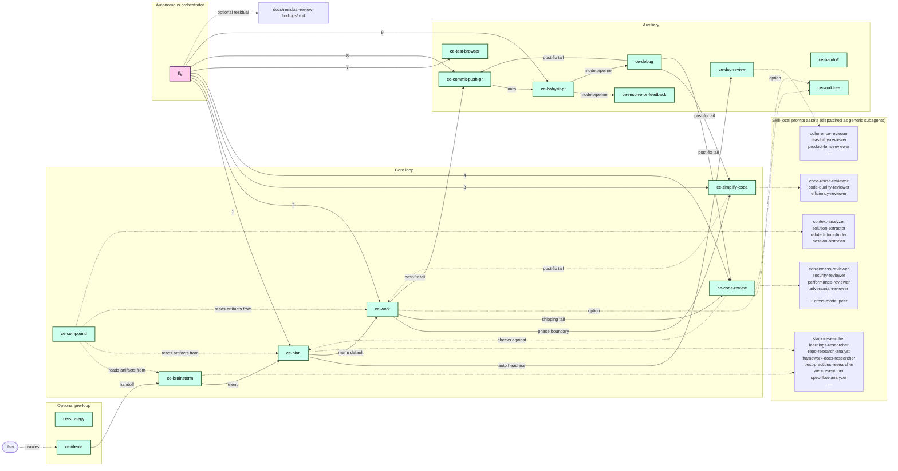
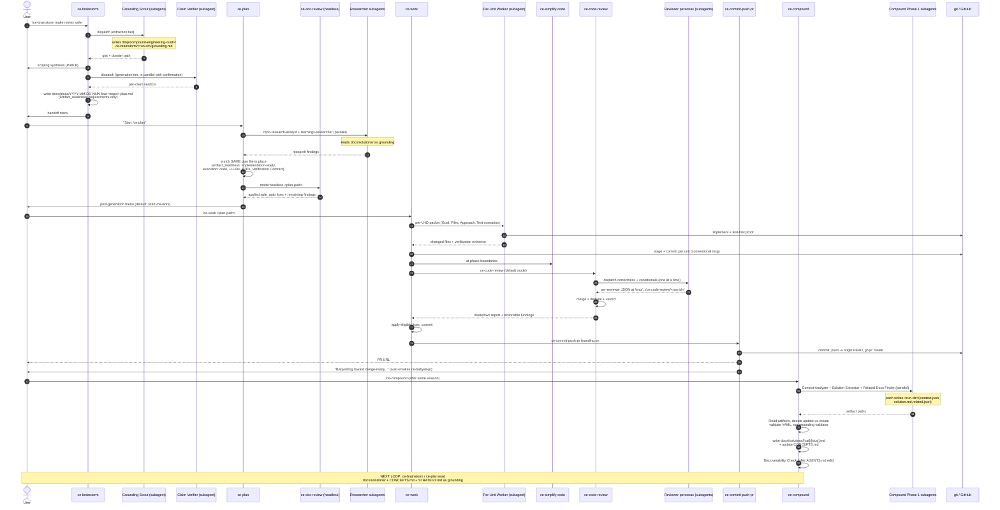

# compound-engineering-plugin Harness Analysis

**Analyzed**: 2026-07-17
**Frozen commit**: [03603fa80061eb329fb6027df0c18415809bcccf](https://github.com/everyinc/compound-engineering-plugin/tree/03603fa80061eb329fb6027df0c18415809bcccf)
**GitHub**: https://github.com/everyinc/compound-engineering-plugin
**Version studied**: 3.19.0 ([`plugin.json:4`](https://github.com/everyinc/compound-engineering-plugin/blob/03603fa80061eb329fb6027df0c18415809bcccf/plugin.json#L4))

## Executive Summary

- **There are no standalone agents.** The plugin ships 31 *skills* (slash commands) and **zero** standalone agent definitions ([`README.md:206`](https://github.com/everyinc/compound-engineering-plugin/blob/03603fa80061eb329fb6027df0c18415809bcccf/README.md#L206)). Every specialist persona — reviewer, researcher, scout — is a **skill-local prompt asset** (a `.md` file under `skills/<skill>/references/agents/` or `…/personas/`) that the owning skill reads and seeds into a *generic* host-provided subagent at dispatch time ([`CONCEPTS.md:14-17`](https://github.com/everyinc/compound-engineering-plugin/blob/03603fa80061eb329fb6027df0c18415809bcccf/CONCEPTS.md#L14-L17), [`AGENTS.md:245-256`](https://github.com/everyinc/compound-engineering-plugin/blob/03603fa80061eb329fb6027df0c18415809bcccf/AGENTS.md#L245-L256)).
- **The recommended loop is `ideate → brainstorm → plan → work → simplify → code-review → compound`** ([`README.md:123-136`](https://github.com/everyinc/compound-engineering-plugin/blob/03603fa80061eb329fb6027df0c18415809bcccf/README.md#L123-L136)). One artifact (`docs/plans/YYYY-MM-DD-NNN-<type>-<topic>-plan.md`) is the durable spine: `ce-brainstorm` writes it as `requirements-only`, `ce-plan` enriches it in place to `implementation-ready`, `ce-work` reads it and derives task progress from git, `ce-code-review` checks the diff against it, `ce-compound` feeds learnings back into `docs/solutions/` that the next brainstorm reads as grounding.
- **Everything is prompt-driven.** Almost no code runs user-facing behavior: only the small loader at [`.opencode/plugins/compound-engineering.js`](https://github.com/everyinc/compound-engineering-plugin/blob/03603fa80061eb329fb6027df0c18415809bcccf/.opencode/plugins/compound-engineering.js) and [`.pi/extensions/compound-engineering.ts`](https://github.com/everyinc/compound-engineering-plugin/blob/03603fa80061eb329fb6027df0c18415809bcccf/.pi/extensions/compound-engineering.ts) (which just register `skills/` as a skills directory), a handful of bundled `scripts/` (Python/Bash helpers like `review-scope.py`, `pr-snapshot`, `validate-frontmatter.py`), and the `src/` CLI which is repo-self-maintenance only (the Claude-plugin → other-harness *converter*). No `.ts` file implements user skill behavior.
- **One harness, many install surfaces.** The same `skills/` directory is shipped to Claude Code, Cursor, Codex, OpenCode, Pi, Antigravity (`agy`), Kimi, Cline, Grok, Devin, Copilot, Qwen, Factory Droid — each via a small per-target manifest in `.<target>-plugin/` or a native install contract. The skill content is identical across all of them; only the manifest differs ([`README.md:246-455`](https://github.com/everyinc/compound-engineering-plugin/blob/03603fa80061eb329fb6027df0c18415809bcccf/README.md#L246-L455)).
- **`/lfg` is the autopilot.** It runs the entire pipeline hands-off: plan → work → simplify → code review + apply fixes → browser test → commit/push/PR → babysit CI to green ([`skills/lfg/SKILL.md`](https://github.com/everyinc/compound-engineering-plugin/blob/03603fa80061eb329fb6027df0c18415809bcccf/skills/lfg/SKILL.md)). The pipeline-mode `mode:return-to-caller` / `mode:pipeline` / `mode:headless` tokens let skills be invoked by orchestrators non-interactively while remaining interactive when called directly by the user.

## Repo Layout (relevant parts)

```
compound-engineering-plugin/
├── skills/                     ← THE plugin: 31 skill folders, each a self-contained unit
│   ├── ce-brainstorm/
│   │   ├── SKILL.md            ← skill orchestrator prompt (44 KB)
│   │   ├── references/         ← late-loaded prompt assets (synthesis-summary.md, …)
│   │   │   └── agents/         ← skill-local "specialist" prompt assets (slack-researcher.md)
│   │   └── scripts/            ← bundled helper scripts (visual-probe-server.js)
│   ├── ce-plan/ … ce-work/ … ce-code-review/ … lfg/ …
│   └── <each skill mirrors this shape>
├── plugin.json                 ← root antigravity-format manifest
├── .claude-plugin/             ← Claude Code plugin manifest + marketplace
├── .codex-plugin/              ← Codex plugin manifest (skills: ./skills/)
├── .cursor-plugin/             ← Cursor marketplace + plugin
├── .opencode/                  ← OpenCode entry (registers skills dir)
│   └── plugins/compound-engineering.js
├── .pi/extensions/             ← Pi extension entry (registers skills dir)
├── .agy/  .cline/  .devin-plugin/  .grok-plugin/  .kimi-plugin/  ← other target manifests
├── .compound-engineering/      ← TEMPLATE for the user's per-repo local config (config.local.example.yaml)
├── docs/                       ← end-user-facing skill docs + repo's own plans/solutions/etc.
│   └── skills/<skill>.md       ← human-facing doc per skill
├── src/                        ← the Claude→other-target CONVERTER CLI (repo-self-maintenance only)
├── AGENTS.md (≡ CLAUDE.md)     ← AUTHORING instructions for this repo (NOT user-runtime)
├── CONCEPTS.md                 ← domain glossary; *content* also useful as an example for users
└── README.md                   ← canonical user-facing install + workflow doc
```

Two important distinctions:
- **`skills/`** is the plugin. Everything else either installs it (`.opencode/`, `.pi/`, `.<target>-plugin/`), maintains it (`src/`, `AGENTS.md`, `tests/`), documents it (`README.md`, `docs/skills/`), or is an example/template (`.compound-engineering/config.local.example.yaml`).
- **`.compound-engineering/`** in *this* repo is only a config *example*. End users create `.compound-engineering/config.local.yaml` in *their* repo to set per-project preferences like output format and product-pulse source (see [`.compound-engineering/config.local.example.yaml`](https://github.com/everyinc/compound-engineering-plugin/blob/03603fa80061eb329fb6027df0c18415809bcccf/.compound-engineering/config.local.example.yaml)).

## Q1 — Recommended User-Facing Flow(s)

The harness is explicit and opinionated about the recommended loop. The README introduces it as the "core loop is six steps" ([`README.md:123-136`](https://github.com/everyinc/compound-engineering-plugin/blob/03603fa80061eb329fb6027df0c18415809bcccf/README.md#L123-L136)):

> Plan thoroughly before writing code with `/ce-brainstorm` and `/ce-plan` using one readiness-based plan artifact · Review to catch issues and calibrate judgment with `/ce-code-review` and `/ce-doc-review` · Codify knowledge so it is reusable with `/ce-compound` · Keep quality high so future changes are easy.
>
> — [`README.md:110-113`](https://github.com/everyinc/compound-engineering-plugin/blob/03603fa80061eb329fb6027df0c18415809bcccf/README.md#L110-L113)

### Primary flow — the standard feature loop (interactive)

```
/ce-ideate        ← OPTIONAL, only when you don't yet know what to build
   │
   ▼
/ce-brainstorm <idea>      → writes docs/plans/YYYY-MM-DD-NNN-<type>-<topic>-plan.md
   │                         (artifact_readiness: requirements-only, product_contract_source: ce-brainstorm)
   ▼
/ce-plan                   → enriches the SAME plan file in place
   │                         (artifact_readiness: implementation-ready, execution: code)
   │                         (also runs ce-doc-review in headless mode automatically at the end)
   ▼
/ce-work                   → executes the plan: creates branch/worktree, derives tasks from U-IDs,
   │                         commits per unit, runs verification, ends with ce-simplify-code + ce-code-review
   ▼
/ce-simplify-code          ← also invoked automatically by ce-work at phase boundaries
   ▼
/ce-code-review            → multi-persona review of the branch diff against the plan
   ▼
/ce-commit-push-pr         → commits, pushes, opens PR with adaptive description
   ▼
/ce-compound               → writes docs/solutions/[category]/[slug].md so the next loop starts smarter
```

Verified chain references:
- README's "Standard feature loop" example ([`README.md:165-174`](https://github.com/everyinc/compound-engineering-plugin/blob/03603fa80061eb329fb6027df0c18415809bcccf/README.md#L165-L174))
- `docs/skills/README.md` core-loop diagram ([`docs/skills/README.md:11-25`](https://github.com/everyinc/compound-engineering-plugin/blob/03603fa80061eb329fb6027df0c18415809bcccf/docs/skills/README.md#L11-L25))
- `ce-plan` Phase 5.4 default-recommended next step is `/ce-work` ([`skills/ce-plan/SKILL.md:780-783`](https://github.com/everyinc/compound-engineering-plugin/blob/03603fa80061eb329fb6027df0c18415809bcccf/skills/ce-plan/SKILL.md#L780-L783))

### Autonomous flow — `/lfg`

When the user wants hands-off "ship to a green PR," they start with `/ce-brainstorm` to anchor real requirements, then run `/lfg`:

```
/ce-brainstorm <description>
/lfg
```

`/lfg` runs 10 steps in order, each invoking a child skill ([`skills/lfg/SKILL.md:15-87`](https://github.com/everyinc/compound-engineering-plugin/blob/03603fa80061eb329fb6027df0c18415809bcccf/skills/lfg/SKILL.md#L15-L87)):

1. `ce-plan <args>` (writes the implementation-ready plan)
2. `ce-work mode:return-to-caller <plan-path>` (implement + local verify only; returns structured envelope)
3. `ce-simplify-code` (refine branch diff before review)
4. `ce-code-review mode:agent plan:<plan-path>` (report-only JSON; never edits tree)
5. Apply eligible review fixes (load `references/review-followup.md`) + commit
6. Autonomous residual handoff — file review-findings-not-applied into tracker and `docs/residual-review-findings/<branch>.md`
7. `ce-test-browser mode:pipeline`
8. `ce-commit-push-pr mode:pipeline branding:on` (commits, pushes, opens PR)
9. `ce-babysit-pr mode:pipeline <pr-url>` (watches CI, fixes via `ce-debug`, resolves comments via `ce-resolve-pr-feedback`)
10. Emit `<promise>DONE</promise>`

### Bug-shaped flow — instead of brainstorm→plan→work

When the input is broken behavior rather than a feature ([`README.md:185-191`](https://github.com/everyinc/compound-engineering-plugin/blob/03603fa80061eb329fb6027df0c18415809bcccf/README.md#L185-L191)):

```
/ce-debug <symptom or #issue>
   → reproduce → trace causal chain → fix it now / diagnosis only / rethink via ce-brainstorm
/ce-code-review     ← optional, ce-debug offers it in its post-fix tail
/ce-compound        ← if the lesson generalizes, ce-debug offers it
```

### Verdict flow — `/ce-pov`

When the question is "should we adopt X?" rather than "scope Y" — `ce-brainstorm` will detect the *verdict shape* and offer an interactive handoff to `ce-pov` rather than continuing ([`skills/ce-brainstorm/SKILL.md:108-114`](https://github.com/everyinc/compound-engineering-plugin/blob/03603fa80061eb329fb6027df0c18415809bcccf/skills/ce-brainstorm/SKILL.md#L108-L114)).

### On-demand skills (not part of any chain)

These are reached for when a specific need arises ([`README.md:138-150`](https://github.com/everyinc/compound-engineering-plugin/blob/03603fa80061eb329fb6027df0c18415809bcccf/README.md#L138-L150)):

- `/ce-explain` — personal learning artifact for a concept/diff/recap
- `/ce-doc-review` — review a plan or requirements doc with reviewer personas (also called by `ce-plan` headlessly)
- `/ce-pov` — decisive verdict on adoption / document / approaches
- `/ce-optimize` — metric-driven iterative optimization loops
- `/ce-handoff` — create a session handoff or resume from any continuity source
- `/ce-worktree` — ensure work happens in an isolated git worktree (also offered by `ce-work` and `ce-code-review`)
- `/ce-commit`, `/ce-commit-push-pr`, `/ce-babysit-pr`, `/ce-resolve-pr-feedback` — git-workflow primitives
- `/ce-test-browser`, `/ce-test-xcode`, `/ce-dogfood`, `/ce-polish` — test/polish tools
- `/ce-strategy`, `/ce-product-pulse`, `/ce-sweep`, `/ce-compound-refresh` — strategy/feedback/outer-loop anchors
- `/ce-promote`, `/ce-proof`, `/ce-riffrec-feedback-analysis` — collaboration & content

## Q2 — Artifacts

Artifacts are organized by *durability* — durable decision artifacts go in tracked `docs/`, ephemeral scratch goes under `/tmp/compound-engineering-<uid>/<skill>/`. This is codified in [`AGENTS.md:41-53`](https://github.com/everyinc/compound-engineering-plugin/blob/03603fa80061eb329fb6027df0c18415809bcccf/AGENTS.md#L41-L53).

### Durable artifacts (in your project's repo)

| Artifact | Path | Written by | Read by | Format / contract |
|---|---|---|---|---|
| **Unified plan** (the central spine) | `docs/plans/YYYY-MM-DD-NNN-<type>-<topic>-plan.{md,html}` | `ce-brainstorm` (requirements-only) → `ce-plan` enriches in place to implementation-ready | `ce-plan` (resume/deepen), `ce-work` (execute U-IDs), `ce-code-review` (verify completeness), `ce-doc-review` (review lenses) | `artifact_contract: ce-unified-plan/v1`, `artifact_readiness: requirements-only \| implementation-ready`, `execution: code \| knowledge-work`. Verified at [`AGENTS.md:319`](https://github.com/everyinc/compound-engineering-plugin/blob/03603fa80061eb329fb6027df0c18415809bcccf/AGENTS.md#L319), [`skills/ce-brainstorm/SKILL.md:309`](https://github.com/everyinc/compound-engineering-plugin/blob/03603fa80061eb329fb6027df0c18415809bcccf/skills/ce-brainstorm/SKILL.md#L309), [`skills/ce-plan/SKILL.md:691`](https://github.com/everyinc/compound-engineering-plugin/blob/03603fa80061eb329fb6027df0c18415809bcccf/skills/ce-plan/SKILL.md#L691) |
| **Solution doc / Learning** | `docs/solutions/[category]/[slug].md` | `ce-compound` (only the orchestrator writes product files) | `ce-plan`'s `learnings-researcher`, `ce-ideate`, `ce-debug`, `ce-brainstorm`'s grounding scouts | YAML frontmatter (`module`, `tags`, `problem_type`, `date`), bug-track or knowledge-track sections. Verified at [`AGENTS.md:321`](https://github.com/everyinc/compound-engineering-plugin/blob/03603fa80061eb329fb6027df0c18415809bcccf/AGENTS.md#L321), [`skills/ce-compound/SKILL.md:91-100`](https://github.com/everyinc/compound-engineering-plugin/blob/03603fa80061eb329fb6027df0c18415809bcccf/skills/ce-compound/SKILL.md#L91-L100) |
| **Residual review findings** | `docs/residual-review-findings/<branch-or-head-sha>.md` | `lfg` step 6, or `ce-debug` Phase 4 when accepting residuals | (Human; durable record of unresolved code-review findings) | Markdown section with severity, file:line, title, ticket link. Verified at [`skills/lfg/SKILL.md:53-62`](https://github.com/everyinc/compound-engineering-plugin/blob/03603fa80061eb329fb6027df0c18415809bcccf/skills/lfg/SKILL.md#L53-L62) |
| **Strategy doc** | `STRATEGY.md` (repo root) | `ce-strategy` | Read as grounding by `ce-ideate`, `ce-brainstorm`, `ce-plan` | Short structured anchor (problem / approach / who-for / metrics / tracks). Verified at [`skills/ce-strategy/SKILL.md:11`](https://github.com/everyinc/compound-engineering-plugin/blob/03603fa80061eb329fb6027df0c18415809bcccf/skills/ce-strategy/SKILL.md#L11) |
| **Vocabulary / glossary** | `CONCEPTS.md` (repo root) | Seeded by `ce-compound` (Phase 2.4) and `ce-compound-refresh`; *also* lightly appended by `ce-brainstorm`/`ce-plan` for resolved terms | Every grounding scout | Glossary only, no implementation specifics. Verified at [`skills/ce-compound/SKILL.md:338-358`](https://github.com/everyinc/compound-engineering-plugin/blob/03603fa80061eb329fb6027df0c18415809bcccf/skills/ce-compound/SKILL.md#L338-L358), [`CONCEPTS.md:1-4`](https://github.com/everyinc/compound-engineering-plugin/blob/03603fa80061eb329fb6027df0c18415809bcccf/CONCEPTS.md#L1-L4) |
| **Ideation doc** | `docs/ideation/*.{md,html}` (or CE temp if dir absent) | `ce-ideate` | `ce-brainstorm` handoff | Ranked candidates with rejection rationale. Verified at [`skills/ce-ideate/SKILL.md:18`](https://github.com/everyinc/compound-engineering-plugin/blob/03603fa80061eb329fb6027df0c18415809bcccf/skills/ce-ideate/SKILL.md#L18) |
| **Product pulse report** | `docs/pulse-reports/...` | `ce-product-pulse` | (Human; feeds back into ideation) | Time-windowed report on usage/perf/errors |
| **Explainer** | `docs/explainers/YYYY-MM-DD-<concept-slug>.md` (only when `pr_teaching_archive: true`) | `ce-commit-push-pr` (archive step), `ce-explain` (user-named destination) | (Human) | YAML frontmatter + teaching content. Verified at [`skills/ce-commit-push-pr/SKILL.md:120-127`](https://github.com/everyinc/compound-engineering-plugin/blob/03603fa80061eb329fb6027df0c18415809bcccf/skills/ce-commit-push-pr/SKILL.md#L120-L127) |
| **Legacy brainstorm requirements** | `docs/brainstorms/*-requirements.{md,html}` | (Legacy output of older `ce-brainstorm` versions — *new* runs no longer write here) | `ce-plan` reads as legacy origin | Verified at [`AGENTS.md:320`](https://github.com/everyinc/compound-engineering-plugin/blob/03603fa80061eb329fb6027df0c18415809bcccf/AGENTS.md#L320), [`skills/ce-brainstorm/SKILL.md:90`](https://github.com/everyinc/compound-engineering-plugin/blob/03603fa80061eb329fb6027df0c18415809bcccf/skills/ce-brainstorm/SKILL.md#L90) |
| **Specs (this repo only)** | `docs/specs/` | (Maintainer-authored) | `src/` converter | Target-platform format specs |

### Ephemeral artifacts (OS temp, never tracked)

| Artifact | Path | Written by | Purpose |
|---|---|---|---|
| **Run dir for a skill invocation** | `/tmp/compound-engineering-<effective-uid>/<skill-name>/<run-id>/` | Every long-running skill (`ce-compound`, `ce-code-review`, `ce-brainstorm`, `ce-explain`, …) | Per-run scratch; isolated by OS user; chmod 0700 |
| **Grounding dossier** | `<run-dir>/grounding.md` | `ce-brainstorm` Phase 1.1 scout (extraction-tier subagent) | Verbatim quotes with `file:line` pointers; ~150 lines |
| **Per-reviewer JSON** | `/tmp/.../ce-code-review/<run-id>/<reviewer>.json` + `report.md` + `metadata.json` | `ce-code-review` Stage 4 (each persona subagent writes one) | Audit trail of a review |
| **Solution-doc drafts** | `<run-dir>/context.json`, `solution.md`, `related.json`, `session-history.md` | `ce-compound` Phase 1 subagents | Each scout writes full output to disk; orchestrator Reads them back. This works around the "subagent returns only summary" issue. Verified at [`skills/ce-compound/SKILL.md:144-152`](https://github.com/everyinc/compound-engineering-plugin/blob/03603fa80061eb329fb6027df0c18415809bcccf/skills/ce-compound/SKILL.md#L144-L152) |
| **Session handoff** | `/tmp/compound-engineering-<uid>/ce-handoff/<repo-namespace>/<topic>.md` (default managed store) or user-chosen destination | `ce-handoff` | Immutable continuity snapshot. Verified at [`skills/ce-handoff/SKILL.md:38-50`](https://github.com/everyinc/compound-engineering-plugin/blob/03603fa80061eb329fb6027df0c18415809bcccf/skills/ce-handoff/SKILL.md#L38-L50) |
| **Babysit state** | `/tmp/.../ce-babysit-pr/<host>-<owner>-<repo>-<N>/` | `ce-babysit-pr` | Per-PR resumable watch state |

The path-resolution contract is explicit and important: every skill that needs scratch space sets `SCRATCH_ROOT="/tmp/compound-engineering-$(id -u)"` with symlink + ownership guards, then `chmod 700` per-run subdirs (e.g., ce-brainstorm, ce-handoff, ce-babysit-pr, ce-compound, ce-code-review). Many skills — ce-strategy, ce-commit, ce-worktree, ce-setup, … — do not. Example: [`skills/ce-brainstorm/SKILL.md:183-192`](https://github.com/everyinc/compound-engineering-plugin/blob/03603fa80061eb329fb6027df0c18415809bcccf/skills/ce-brainstorm/SKILL.md#L183-L192).

### Per-repo configuration (not really an "artifact" but load-bearing)

`.compound-engineering/config.local.yaml` — gitignored per-checkout preferences (output formats, product-pulse settings, babysit opt-out, etc.). Template at [`.compound-engineering/config.local.example.yaml`](https://github.com/everyinc/compound-engineering-plugin/blob/03603fa80061eb329fb6027df0c18415809bcccf/.compound-engineering/config.local.example.yaml). `ce-setup` creates this file and ensures it's gitignored.

## Q3 — Agent-by-Agent Breakdown

**Critical reframing**: this harness has **no standalone agents**. The unit of analysis is the *skill* (a user-invoked slash command), and each skill *dispatches generic subagents* seeded with skill-local prompt assets. So this section is organized by skill, and the "subagents" each skill dispatches are listed within.

### Skill: `ce-ideate` (pre-loop, optional)

- **File**: [`skills/ce-ideate/SKILL.md`](https://github.com/everyinc/compound-engineering-plugin/blob/03603fa80061eb329fb6027df0c18415809bcccf/skills/ce-ideate/SKILL.md) (402 lines)
- **Purpose**: Generate and critically rank grounded ideas *before* brainstorm. Answers "what's worth exploring?" — **not** requirements, plans, or code ([`skills/ce-ideate/SKILL.md:13-18`](https://github.com/everyinc/compound-engineering-plugin/blob/03603fa80061eb329fb6027df0c18415809bcccf/skills/ce-ideate/SKILL.md#L13-L18)).
- **Inputs**: optional focus hint (concept, path, constraint, or `surprise me`/`github issues`).
- **Outputs**: `docs/ideation/*.{md,html}` (HTML is the default for ideation, opposite of plan/brainstorm); then hands the strongest survivor to `ce-brainstorm`.
- **Dispatches (via references/agents/, model-tiered)**:
  - **Extraction tier** — grounding scouts (cheap)
  - **Generation tier** — evidence-driven ideation frames + basis-verification
  - **Ceiling tier** — cross-cutting synthesis, final arbitration (inherits orchestrator model)
- **What stays in main skill**: subject-identification, mode classification (repo-grounded / elsewhere-software / elsewhere-non-software), surprise-me routing, final ranking and rejection rationale.

### Skill: `ce-strategy` (anchor)

- **File**: [`skills/ce-strategy/SKILL.md`](https://github.com/everyinc/compound-engineering-plugin/blob/03603fa80061eb329fb6027df0c18415809bcccf/skills/ce-strategy/SKILL.md)
- **Purpose**: Create or maintain `STRATEGY.md` — short durable product anchor (problem / approach / who / metrics / tracks) read as grounding by `ce-ideate`/`ce-brainstorm`/`ce-plan`.
- **Dispatches**: none. Pure interview between skill and user, plus reading the existing `STRATEGY.md`.
- **Outputs**: `STRATEGY.md` at repo root.

### Skill: `ce-brainstorm` (loop step 1)

- **File**: [`skills/ce-brainstorm/SKILL.md`](https://github.com/everyinc/compound-engineering-plugin/blob/03603fa80061eb329fb6027df0c18415809bcccf/skills/ce-brainstorm/SKILL.md) (325 lines)
- **Purpose**: Collaborative dialogue to define WHAT to build. Writes the **requirements-only unified plan** ([`skills/ce-brainstorm/SKILL.md:11-13`](https://github.com/everyinc/compound-engineering-plugin/blob/03603fa80061eb329fb6027df0c18415809bcccf/skills/ce-brainstorm/SKILL.md#L11-L13)).
- **Inputs**: feature description (in-prompt or supplied by `ce-ideate` handoff or `lfg`); optional `output:html`.
- **Outputs**: `docs/plans/YYYY-MM-DD-NNN-<type>-<topic>-plan.{md,html}` with frontmatter `artifact_contract: ce-unified-plan/v1`, `artifact_readiness: requirements-only`, `product_contract_source: ce-brainstorm`.
- **Dispatches (skill-local prompts — `slack-researcher.md` plus inline scout/verifier prompts seeded from `references/model-tiers.md`)**:
  - **`slack-researcher.md`** (opt-in, mid-tier) — organizational context from Slack; only persona file in `references/agents/`
  - **Grounding scout** (extraction-tier, dispatched in background during Phase 1.2/1.3) — inline persona defined in `SKILL.md` + tier spec at `references/model-tiers.md:5`; writes `<run-dir>/grounding.md` with verbatim quotes
  - **Claim verifier** (generation-tier, Phase 2.6) — inline persona defined in `SKILL.md` + tier spec at `references/model-tiers.md:6`; verifies the doc's checkable claims against the tree, returns per-claim verdicts
- **What stays in main skill**: scope assessment, one-question-at-a-time dialogue, synthesis-summary confirmation, writing the plan to disk, vocabulary capture for `CONCEPTS.md`, handoff menu (calls `ce-plan` on user choice).
- **Handoff**: Phase 4 reads `references/handoff.md`; offers `Start /ce-plan` (default), or other options based on context.

### Skill: `ce-plan` (loop step 2)

- **File**: [`skills/ce-plan/SKILL.md`](https://github.com/everyinc/compound-engineering-plugin/blob/03603fa80061eb329fb6027df0c18415809bcccf/skills/ce-plan/SKILL.md) (816 lines — the longest skill)
- **Purpose**: Enrich the same unified plan artifact with HOW to build it. Adds Planning Contract, Implementation Units (U-IDs), Verification Contract, Definition of Done, Key Technical Decisions.
- **Inputs**: feature description, requirements-only plan path, or `deepen`/`resume` intent on an existing plan.
- **Outputs**: enriches the *same file* to `artifact_readiness: implementation-ready`, `execution: code`. Then auto-runs `ce-doc-review mode:headless` against the plan, then presents the post-generation handoff menu.
- **Dispatches (skill-local prompts under `references/agents/`)** — full research roster:
  - **`repo-research-analyst.md`** — scope-aware codebase research (patterns, architecture, conventions, issues, templates)
  - **`learnings-researcher.md`** — searches `docs/solutions/` for institutional knowledge
  - **`framework-docs-researcher.md`** + **`best-practices-researcher.md`** — external docs (implementation-guidance intent)
  - **`web-researcher.md`** — landscape/option-discovery intent
  - **`spec-flow-analyzer.md`** — Standard/Deep plans, missing edge cases
  - **`agent-native-planning-strategist.md`** — conditional, when the work touches agent surfaces
  - **`slack-researcher.md`** — opt-in
  - **`architecture-strategist.md`, `data-migration-reviewer.md`, `deployment-verification-agent.md`, `git-history-analyzer.md`, `pattern-recognition-specialist.md`, `data-integrity-guardian.md`, `framework-docs-researcher.md`, `performance-oracle.md`, `security-sentinel.md`** — deepening pass (Phase 5.3) section-to-agent mapping
- **What stays in main skill**: domain routing (software vs. universal-planning), approach-altitude detection, the post-generation menu (Phase 5.4) routing to `/ce-work`, `/goal`, "Create Issue", `ce-proof`, "Open in browser" (and menu option 3 "Decide on the review's open items" re-invokes `ce-doc-review` *interactively* — i.e., without `mode:headless` — for a guided walkthrough of the actionable findings the pre-menu headless run left open) ([`skills/ce-plan/SKILL.md:776-798`](https://github.com/everyinc/compound-engineering-plugin/blob/03603fa80061eb329fb6027df0c18415809bcccf/skills/ce-plan/SKILL.md#L776-L798)).

### Skill: `ce-work` (loop step 3)

- **File**: [`skills/ce-work/SKILL.md`](https://github.com/everyinc/compound-engineering-plugin/blob/03603fa80061eb329fb6027df0c18415809bcccf/skills/ce-work/SKILL.md)
- **Purpose**: Execute an implementation-ready plan end-to-end. Reads the plan, creates branch/worktree, dispatches subagents per Implementation Unit, commits per unit, runs tests continuously, simplifies, then reviews.
- **Inputs**: plan path (defaults to newest implementation-ready plan), bare prompt, or `mode:return-to-caller <plan-path>` for orchestrators like `lfg`.
- **Outputs**: code changes + incremental commits per U-ID. **Does NOT edit the plan body** — "the plan is a decision artifact; progress lives in git" ([`skills/ce-work/SKILL.md:73`](https://github.com/everyinc/compound-engineering-plugin/blob/03603fa80061eb329fb6027df0c18415809bcccf/skills/ce-work/SKILL.md#L73)).
- **Dispatches**:
  - **Per-unit worker subagents** (generic) — each gets a bounded unit packet (Goal Capsule, DoD, the unit's section, Verification Contract, R/F/AE/KTD excerpts). Workers never commit in shared-workspace mode; orchestrator owns commits. In harness-native isolation (Claude Code `Agent isolation:"worktree"`, Codex `spawn_agent`), workers may commit on their own branches which the orchestrator merges.
  - **`figma-design-sync.md`** (skill-local prompt) — UI work with Figma designs
- **Engine selection** (Phase 1 Step 4): inline/subagent (default), `goal-mode`, or `dynamic-workflow` (Codex `create_goal`, Claude Code via prompt-emission only). See [`references/execution-engines.md`](https://github.com/everyinc/compound-engineering-plugin/blob/03603fa80061eb329fb6027df0c18415809bcccf/skills/ce-work/references/execution-engines.md).
- **Standalone shipping tail** (Phase 3-4): invoke `ce-code-review` → load `references/review-findings-followup.md` → apply eligible fixes → Residual Work Gate. Read [`references/shipping-workflow.md`](https://github.com/everyinc/compound-engineering-plugin/blob/03603fa80061eb329fb6027df0c18415809bcccf/skills/ce-work/references/shipping-workflow.md).

### Skill: `ce-simplify-code`

- **File**: [`skills/ce-simplify-code/SKILL.md`](https://github.com/everyinc/compound-engineering-plugin/blob/03603fa80061eb329fb6027df0c18415809bcccf/skills/ce-simplify-code/SKILL.md)
- **Purpose**: Refine recently changed code for clarity, reuse, quality, efficiency while preserving behavior.
- **Dispatches (3 parallel mid-tier reviewers from `references/personas/`)**: `code-reuse-reviewer.md`, `code-quality-reviewer.md`, `efficiency-reviewer.md`.
- **Behavior-preservation contract**: every fix must preserve same output/error/side-effects/ordering. Never simplify away safety checks.

### Skill: `ce-code-review`

- **File**: [`skills/ce-code-review/SKILL.md`](https://github.com/everyinc/compound-engineering-plugin/blob/03603fa80061eb329fb6027df0c18415809bcccf/skills/ce-code-review/SKILL.md) (541 lines)
- **Purpose**: Structured multi-persona code review. **Report-only by default** — never edits the tree unless `apply:local` is explicit.
- **Inputs**: blank (current branch), PR number/URL, branch, or `base:<ref>`. Tokens: `mode:agent`, `apply:local`, `plan:<path>`, `depth:full|auto`, `grouping:auto|off|always`.
- **Outputs**: markdown report (default) or JSON (`mode:agent`), plus run artifacts at `/tmp/.../ce-code-review/<run-id>/`.
- **Reviewer roster** (selected by Stage 3, dispatched one at a time in foreground):
  - **Always-on**: `correctness-reviewer`
  - **Standards-conditional**: `project-standards-reviewer` (only when applicable `AGENTS.md`/`CLAUDE.md` found)
  - **Generic conditional**: `testing-reviewer`, `maintainability-reviewer`, `agent-native-reviewer`, `learnings-researcher`
  - **Cross-cutting**: `security-reviewer`, `performance-reviewer`, `api-contract-reviewer`, `data-migration-reviewer`, `reliability-reviewer`, `adversarial-reviewer` (or cross-model peer), `previous-comments-reviewer`
  - **Stack-specific**: `julik-frontend-races-reviewer`, `swift-ios-reviewer`
  - **CE-conditional**: `deployment-verification-agent`
- **Cross-model adversarial peer** (Stage 3d): when `adversarial` is selected and scope is local, starts a detached peer job via a sanctioned peer CLI (configured externally). If it starts, it replaces the in-process `adversarial-reviewer`. See `references/cross-model-review.md`. Concept defined at [`CONCEPTS.md:90-94`](https://github.com/everyinc/compound-engineering-plugin/blob/03603fa80061eb329fb6027df0c18415809bcccf/CONCEPTS.md#L90-L94).
- **What stays in main skill**: scope detection (`local-aligned`/`pr-remote`/`branch-remote`/standalone), intent discovery, plan discovery, persona selection, dispatch orchestration, finding merge/dedup, action routing, report rendering. Stage 5c `apply:local` is the only path that mutates the tree.
- **Quick Review Short-Circuit**: if user says "quick"/"fast"/"light" and `mode:agent` is not active, runs the harness's built-in code review and stops.

### Skill: `ce-doc-review`

- **File**: [`skills/ce-doc-review/SKILL.md`](https://github.com/everyinc/compound-engineering-plugin/blob/03603fa80061eb329fb6027df0c18415809bcccf/skills/ce-doc-review/SKILL.md)
- **Purpose**: Review requirements or plan documents through multi-persona analysis. Auto-applies `safe_auto` fixes; remaining findings route through interactive walkthrough or headless report.
- **Inputs**: document path or `mode:headless <path>`. **Markdown-only today** — HTML plans get a format-gate skip.
- **Dispatches (from `references/personas/` — 8 files)**: `coherence-reviewer`, `feasibility-reviewer` (always-on); plus `product-lens`, `design-lens`, `security-lens`, `scope-guardian`, `adversarial-document`, `whole-doc-reviewer` (conditional on document content).
- **Important**: invoked headlessly from `ce-plan` Phase 5.3.8 against every markdown plan, automatically.

### Skill: `ce-debug`

- **File**: [`skills/ce-debug/SKILL.md`](https://github.com/everyinc/compound-engineering-plugin/blob/03603fa80061eb329fb6027df0c18415809bcccf/skills/ce-debug/SKILL.md)
- **Purpose**: Systematic bug diagnosis with a causal-chain gate. Optionally fixes test-first.
- **Inputs**: issue ref (`#123`, `org/repo#123`, URL), stack trace, test path, or broken-behavior description.
- **Outputs**: `## Debug Summary` (problem / root cause / recommended tests / fix / prevention / confidence). On fix: invokes `ce-simplify-code` → `ce-code-review` → `ce-commit-push-pr` with `branding:on`. On "diagnosis only": stops.
- **Dispatches**: optional read-only parallel sub-agents when hypotheses are evidence-bottlenecked across independent subsystems.
- **Pipeline mode** (`mode:pipeline`): conservative defaults, fix convergent bugs, defer divergent ones, structured return.

### Skill: `ce-compound` (loop step 5 — the "compound")

- **File**: [`skills/ce-compound/SKILL.md`](https://github.com/everyinc/compound-engineering-plugin/blob/03603fa80061eb329fb6027df0c18415809bcccf/skills/ce-compound/SKILL.md) (very large; 700+ lines)
- **Purpose**: Document a solved problem as a Learning in `docs/solutions/`. The "compound" — next time, the planner finds this doc and skips the research.
- **Inputs**: optional brief context, optional `mode:headless`, optional `depth:lightweight|full`.
- **Outputs**: `docs/solutions/[category]/[slug].md` (the only product deliverable). Side effects: `CONCEPTS.md` updates, optional `AGENTS.md`/`CLAUDE.md` discoverability edit (Full interactive, with consent).
- **Dispatches (Phase 1, parallel — each writes a scratch artifact)**:
  - **Context Analyzer** → `<run-dir>/context.json` (frontmatter skeleton, category, filename, track)
  - **Solution Extractor** → `<run-dir>/solution.md` (the doc-body prose)
  - **Related Docs Finder** → `<run-dir>/related.json` (links, refresh candidates, overlap assessment)
  - **Session Historian** (Full only, automatic probe) → `<run-dir>/session-history.md`. Uses bundled scripts under `scripts/session-history/` (`discover-sessions.sh`, `extract-metadata.py`, `extract-skeleton.py`, `extract-errors.py`).
- **What stays in main skill (Phase 2 orchestrator)**: reads each artifact back, decides update-vs-create from overlap, assembles the doc, validates YAML frontmatter (`scripts/validate-frontmatter.py`), runs mechanical claims check (`scripts/validate-doc-claims.py`), dispatches one semantic grounding validator subagent (Phase 2.45), Discoverability Check (Phase 3 optional).

### Skill: `lfg` (autonomous orchestrator)

- **File**: [`skills/lfg/SKILL.md`](https://github.com/everyinc/compound-engineering-plugin/blob/03603fa80061eb329fb6027df0c18415809bcccf/skills/lfg/SKILL.md)
- **Purpose**: Full hands-off shipping pipeline. Pushes and opens a PR without stopping.
- **Invokes child skills in order**: `ce-plan` → `ce-work mode:return-to-caller` → `ce-simplify-code` → `ce-code-review mode:agent plan:<path>` → (apply fixes) → (residual handoff) → `ce-test-browser mode:pipeline` → `ce-commit-push-pr mode:pipeline branding:on` → `ce-babysit-pr mode:pipeline <url>`.
- **What stays in main skill**: gate checks between steps, settled-decision tracking, structured residual recording, DONE emission.

### Skill: `ce-babysit-pr`

- **File**: [`skills/ce-babysit-pr/SKILL.md`](https://github.com/everyinc/compound-engineering-plugin/blob/03603fa80061eb329fb6027df0c18415809bcccf/skills/ce-babysit-pr/SKILL.md) (224 lines)
- **Purpose**: Continuously watch an open GitHub PR toward merge-ready. Reacts to two independent streams — review comments and CI status.
- **Dispatches**: `ce-resolve-pr-feedback` (for comments) and `ce-debug` (for CI failures) — both in `mode:pipeline`. Never merges.
- **State**: per-PR resumable state at `/tmp/.../ce-babysit-pr/<host>-<owner>-<repo>-<N>/`. Bundled `python3 scripts/pr-snapshot` does no-agent-token polling and emits a single wake sentinel.

### Other skills (summary)

| Skill | Purpose | Dispatches |
|---|---|---|
| `ce-commit` | One well-crafted commit | None |
| `ce-commit-push-pr` | Commit, push, open PR with adaptive description + concept-teaching section | Reads `references/pr-description-writing.md`; auto-invokes `ce-babysit-pr` by default |
| `ce-resolve-pr-feedback` | Resolve PR review feedback (GitHub only, incl. GHE) | Fixer subagent from `references/agents/pr-comment-resolver.md` |
| `ce-worktree` | Ensure work happens in an isolated git worktree | Detects existing isolation; prefers native harness worktree tool |
| `ce-pov` | Decisive POV on adoption / document / approaches | Optional named-peer or `oracle` panel via cross-model pass |
| `ce-explain` | Personal teaching artifact (concept/diff/recap) + optional check-in | Work-recap scout (extraction-tier); optionally routes findings to `ce-ideate`/`ce-simplify-code` |
| `ce-handoff` | Create session handoff or resume from any continuity source | None (orchestration only) |
| `ce-optimize` | Metric-driven iterative optimization loops | Three-tier evaluation, parallel experiments |
| `ce-product-pulse` | Time-windowed report on usage/performance/errors → `docs/pulse-reports/` | `disable-model-invocation: true` (manual only) |
| `ce-sweep` | Recurring feedback sweep (Slack/GitHub issues); emits `lfg`-ready rolling plan | `disable-model-invocation: true` |
| `ce-compound-refresh` | Maintain `docs/solutions/` over time (Keep/Update/Consolidate/Replace/Delete) | Personas for review |
| `ce-promote` | Draft announcement copy (X, LinkedIn, email, changelog) | Optional Spiral CLI for voice-matching; `disable-model-invocation: true` |
| `ce-proof` | Publish/view/comment/edit via [Proof](https://www.proofeditor.ai) editor | Hosted v3 web API |
| `ce-test-browser` | End-to-end browser tests via host-native browser or `agent-browser` fallback | — |
| `ce-test-xcode` | Build + test iOS apps on simulator via XcodeBuildMCP | `disable-model-invocation: true` |
| `ce-dogfood` | Hands-off diff-scoped browser QA of active branch | Autonomous small fixes; `disable-model-invocation: true` |
| `ce-polish` | Conversational UX polish (dev server + browser iterate) | `disable-model-invocation: true` |
| `ce-riffrec-feedback-analysis` | Convert Riffrec recordings into structured feedback | `ce-brainstorm` handoff option |
| `ce-setup` | Health check + repo-local config | Runs bundled `scripts/check-health` |

### Mermaid: Agent Call Graph

This shows how skills call other skills (solid arrow = direct skill invocation from orchestrator; dotted arrow = dispatch of generic subagent seeded with skill-local prompt asset). "GA" = generic subagent.



### Mermaid: End-to-End Standard Workflow (with artifact paths)



## Q4 — Implementation Layer Breakdown

| Behavior | Layer | File | Notes |
|---|---|---|---|
| Core loop ordering (brainstorm→plan→work→review→compound) | **LLM prompt** | [`README.md:123`](https://github.com/everyinc/compound-engineering-plugin/blob/03603fa80061eb329fb6027df0c18415809bcccf/README.md#L123), [`docs/skills/README.md:11`](https://github.com/everyinc/compound-engineering-plugin/blob/03603fa80061eb329fb6027df0c18415809bcccf/docs/skills/README.md#L11) | Expressed as documentation + skill descriptions; the model decides routing |
| Slash command surface (`/ce-brainstorm`, `/lfg`, …) | **Skill** (frontmatter) | each `skills/<name>/SKILL.md` YAML frontmatter `name:`, `description:`, `argument-hint:` | Skill descriptions are how the host's skill loader auto-activates them. 7 skills have `disable-model-invocation: true` (manual only) |
| `ce-brainstorm` Phase 0–4 workflow | **LLM prompt** | [`skills/ce-brainstorm/SKILL.md`](https://github.com/everyinc/compound-engineering-plugin/blob/03603fa80061eb329fb6027df0c18415809bcccf/skills/ce-brainstorm/SKILL.md) (325 lines) | Pure prompt; no code backing except helper scripts |
| Grounding scout / claim verifier / Slack researcher | **Specialist prompt asset** (LLM prompt) | `SKILL.md` inline + `references/agents/slack-researcher.md` + `references/model-tiers.md` | Only `slack-researcher.md` exists in `references/agents/`; the scout and verifier are inline personas in `SKILL.md` with their tier spec at `references/model-tiers.md:5-6`. The skill seeds a *generic* subagent at dispatch time. **No standalone agent definition** is registered with the host. |
| `ce-plan` research dispatch (repo / learnings / framework / web / spec-flow) | **Specialist prompt asset** | `skills/ce-plan/references/agents/*.md` (16 files) | Same pattern — generic subagent + local prompt |
| `ce-code-review` reviewer personas | **Specialist prompt asset** | `skills/ce-code-review/references/personas/*.md` (16 files) | Same pattern |
| `ce-code-review` scope/lite-eligibility helper | **Code** | `skills/ce-code-review/scripts/review-scope.py` | Deterministic signal computation (executable-line count, endpoint detection, lite-eligibility fail-closed) |
| `ce-code-review` cross-model adversarial peer | **Code (external peer CLI)** | `skills/ce-code-review/references/cross-model-review.md` + `scripts/cross-model-adversarial-review.sh` | Detached job via sanctioned peer route (provider-configured). Returns model-identity receipt. |
| `ce-code-review` severity P0–P3 + `autofix_class` | **LLM prompt** (rubric) | `skills/ce-code-review/SKILL.md` + `references/action-class-rubric.md` | Anchored confidence rubric in CONCEPTS.md ([`CONCEPTS.md:98-114`](https://github.com/everyinc/compound-engineering-plugin/blob/03603fa80061eb329fb6027df0c18415809bcccf/CONCEPTS.md#L98-L114)) |
| `ce-work` engine selection (inline / goal-mode / dynamic-workflow) | **LLM prompt** + harness probe | `skills/ce-work/references/execution-engines.md` | Probes host for `create_goal` (Codex) etc. |
| `ce-work` per-U-ID worker dispatch + parallel safety check | **LLM prompt** | `skills/ce-work/SKILL.md` Phase 1 Step 4 | File-overlap + environment-singleton reasoning |
| `ce-compound` doc assembly, overlap, grounding validation | **LLM prompt** + Code helpers | `skills/ce-compound/SKILL.md` + `scripts/validate-frontmatter.py`, `scripts/validate-doc-claims.py` | Validators are pure-Python stdlib |
| `ce-compound` session-history discovery | **Code** | `skills/ce-compound/scripts/session-history/{discover-sessions.sh,extract-metadata.py,extract-skeleton.py,extract-errors.py}` | Cross-platform (Claude Code, Codex, Cursor, Pi) session search |
| `ce-babysit-pr` watch loop | **Code** (Python) + LLM prompt | `skills/ce-babysit-pr/scripts/pr-snapshot` (snapshot + watch + mark) + SKILL.md | Background change-detector emits one wake sentinel; tick reasoning stays in the skill |
| `ce-resolve-pr-feedback` GraphQL ops | **Code** (shell scripts) | `skills/ce-resolve-pr-feedback/scripts/{get-pr-comments,get-thread-for-comment,reply-to-pr-thread,resolve-pr-thread}` | Pipe `gh api graphql`; GitHub only |
| `ce-commit-push-pr` PR-body composition | **LLM prompt** (reference) | `skills/ce-commit-push-pr/references/pr-description-writing.md` | Body must be written to temp file, then `gh pr create --body-file` ([`skills/ce-commit-push-pr/SKILL.md:138-149`](https://github.com/everyinc/compound-engineering-plugin/blob/03603fa80061eb329fb6027df0c18415809bcccf/skills/ce-commit-push-pr/SKILL.md#L138-L149)) |
| `ce-handoff` managed-store path resolution | **Code** (inline bash) | `skills/ce-handoff/SKILL.md:38-50` | `SCRATCH_ROOT="/tmp/compound-engineering-$(id -u)"` + symlink/ownership guards |
| `ce-setup` health check | **Code** | `skills/ce-setup/scripts/check-health` | Bundled shell script |
| `ce-visual-probes` (brainstorm/plan) interactive shape probe | **Code** | `skills/ce-brainstorm/scripts/visual-probe-server.js` | Local HTTP server for visual mockups |
| Output-format resolution (md vs html) per skill | **LLM prompt** (precedence rules) | each skill's SKILL.md Phase 0.0 + config read | Precedence: in-prompt > user-stated preference > `.compound-engineering/config.local.yaml` > default |
| **OpenCode plugin loader** (registers `skills/` dir) | **Code** | [`.opencode/plugins/compound-engineering.js`](https://github.com/everyinc/compound-engineering-plugin/blob/03603fa80061eb329fb6027df0c18415809bcccf/.opencode/plugins/compound-engineering.js) (17 lines) | Pushes `skills/` into `config.skills.paths` |
| **Pi extension loader** | **Code** | [`.pi/extensions/compound-engineering.ts`](https://github.com/everyinc/compound-engineering-plugin/blob/03603fa80061eb329fb6027df0c18415809bcccf/.pi/extensions/compound-engineering.ts) (12 lines) | `resources_discover` hook returns skill paths |
| **Cline skills installer** (symlinks `skills/` into `~/.cline/skills/`) | **Code** | `.cline/scripts/install-skills.sh` | Per-project or global; skips `disable-model-invocation: true` by default |
| **Claude Code / Cursor / Codex / Grok / Kimi / Devin plugin manifests** | **Config** | `.<target>-plugin/plugin.json` + `marketplace.json` | Per-target manifest pointing at `skills/` (no code) |
| **Converter CLI** (Claude plugin → other target formats) | **Code** | `src/index.ts` + `src/converters/`, `src/targets/{codex,opencode,pi,antigravity,kiro,managed-artifacts}.ts` | **Repo-self-maintenance only.** Not invoked at user-runtime. |
| **Release validation** | **Code** | `scripts/release/{preview,sync-metadata,validate}.ts` + `tests/release-metadata.test.ts` | CI-only; verifies plugin/marketplace consistency |
| **Repo's own `AGENTS.md`/`CONCEPTS.md`** | **LLM prompt** (authoring context) | root files | Authoring instructions for the *plugin's own* development — not loaded by user-runtime skills (explicitly stated at [`AGENTS.md:106-107`](https://github.com/everyinc/compound-engineering-plugin/blob/03603fa80061eb329fb6027df0c18415809bcccf/AGENTS.md#L106-L107)) |

### How `skills/` differs from `.compound-engineering/`

- **`skills/`** — the actual plugin. Each subdirectory is a self-contained skill: `SKILL.md` (orchestrator prompt), `references/` (late-loaded prompts), `references/agents/` or `references/personas/` (specialist prompt assets), `scripts/` (bundled helpers), `assets/` (templates). **Self-contained**: a SKILL.md may only reference files within its own directory tree ([`AGENTS.md:257-275`](https://github.com/everyinc/compound-engineering-plugin/blob/03603fa80061eb329fb6027df0c18415809bcccf/AGENTS.md#L257-L275)).
- **`.compound-engineering/`** — *not* implementation at all. In this repo it's just `config.local.example.yaml`, a template. In *user* repos, the user creates `.compound-engineering/config.local.yaml` (gitignored) to set per-project preferences. No code, no skill content — pure project-local config consumed by skills at Phase 0.0.

The same split applies across targets: `.opencode/`, `.pi/`, `.cline/`, `.codex-plugin/`, etc. each contain only the **install contract** (loader script + manifest) for that target — the skill content itself always lives in `skills/` and is referenced from there.

## Open Questions / Uncertainties

- **Subagent type names.** I read the SKILL.md orchestrator prompts carefully; the harness is emphatic that specialist personas are *skill-local prompt assets* and that callers "must not dispatch standalone agents by type/name" ([`skills/ce-compound/SKILL.md:474`](https://github.com/everyinc/compound-engineering-plugin/blob/03603fa80061eb329fb6027df0c18415809bcccf/skills/ce-compound/SKILL.md#L474), [`skills/ce-code-review/SKILL.md:131`](https://github.com/everyinc/compound-engineering-plugin/blob/03603fa80061eb329fb6027df0c18415809bcccf/skills/ce-code-review/SKILL.md#L131)). The host's subagent primitive is the *generic* subagent (`Agent`/`Task` in Claude Code, `spawn_agent` in Codex). I did not exhaustively verify that *every* persona file is identical in shape to `correctness-reviewer.md`; some may carry different output schemas.
- **`ce-babysit-pr` watch-loop mechanics.** The skill is explicit that it uses background polling via `pr-snapshot watch` plus a host-specific "background-and-wake" capability (Claude Code `Bash` + `Monitor`, Cursor `Shell` + `notify_on_output`, Grok `get_command_or_subagent_output`, etc.). I did not verify each host's specific primitive — the skill itself owns the host-capability probe ([`skills/ce-babysit-pr/SKILL.md:70-77`](https://github.com/everyinc/compound-engineering-plugin/blob/03603fa80061eb329fb6027df0c18415809bcccf/skills/ce-babysit-pr/SKILL.md#L70-L77)).
- **Cross-model adversarial peer route.** I read the routing logic in `ce-code-review` SKILL.md Stage 3d, but the actual provider/route configuration lives in `references/cross-model-review.md` which I did not read in full. It is configured externally and "sanctioned" by the host (a `cross-model-adversarial-review.sh` script is referenced).
- **`ce-pov` cross-model panel.** I did not read `ce-pov/references/cross-model-panel.md` in full — just the SKILL.md. The `oracle` peer and named-peer panel dispatch similarly depends on external provider config.
- **Pipeline-mode contract nuances.** I read the `mode:return-to-caller`, `mode:pipeline`, and `mode:headless` semantics from the orchestrator side (lfg, ce-babysit-pr) and from the skills' own Mode sections. I did not exhaustively read `references/pipeline-mode.md` in `ce-debug` or `references/watch-loop.md` in `ce-babysit-pr`, so finer-grained stop conditions may be missed.
- **Codex `create_goal` / `update_goal` mechanism.** `ce-work` and `ce-plan` reference a `create_goal` tool as Codex's goal-mode primitive. The actual contract for that primitive lives with Codex, not in this repo.
- **`ce-compound` Phase 3 "Optional Enhancement".** I read Phase 1, Phase 2, Phase 2.4, Phase 2.45, Phase 2.5, Discoverability Check, but did not read the Phase 3 reviews (performance, security, data-integrity, simplification) in full — they are explicitly skipped in headless mode.

## References

All accessed 2026-07-17 against frozen commit `03603fa80061eb329fb6027df0c18415809bcccf`.

- [README.md](https://github.com/everyinc/compound-engineering-plugin/blob/03603fa80061eb329fb6027df0c18415809bcccf/README.md) — install + workflow + skill inventory
- [CONCEPTS.md](https://github.com/everyinc/compound-engineering-plugin/blob/03603fa80061eb329fb6027df0c18415809bcccf/CONCEPTS.md) — domain glossary (Pipeline, Learning, Evidence dossier, Model tier, Reviewer persona, Confidence anchor, Autofix class, Session-settled decision, Beta skill, …)
- [AGENTS.md](https://github.com/everyinc/compound-engineering-plugin/blob/03603fa80061eb329fb6027df0c18415809bcccf/AGENTS.md) — repo authoring instructions (scratch-space policy, file-reference tiers, skill-loading rules)
- [docs/skills/README.md](https://github.com/everyinc/compound-engineering-plugin/blob/03603fa80061eb329fb6027df0c18415809bcccf/docs/skills/README.md) — user-facing skill catalog
- [plugin.json](https://github.com/everyinc/compound-engineering-plugin/blob/03603fa80061eb329fb6027df0c18415809bcccf/plugin.json) — root manifest (antigravity schema)
- [package.json](https://github.com/everyinc/compound-engineering-plugin/blob/03603fa80061eb329fb6027df0c18415809bcccf/package.json) — Pi/OpenCode entry points, release scripts
- [.opencode/plugins/compound-engineering.js](https://github.com/everyinc/compound-engineering-plugin/blob/03603fa80061eb329fb6027df0c18415809bcccf/.opencode/plugins/compound-engineering.js) — OpenCode skills-dir loader
- [.pi/extensions/compound-engineering.ts](https://github.com/everyinc/compound-engineering-plugin/blob/03603fa80061eb329fb6027df0c18415809bcccf/.pi/extensions/compound-engineering.ts) — Pi skills-dir loader
- [.codex-plugin/plugin.json](https://github.com/everyinc/compound-engineering-plugin/blob/03603fa80061eb329fb6027df0c18415809bcccf/.codex-plugin/plugin.json) — Codex manifest (`"skills": "./skills/"`)
- [.cline/INSTALL.md](https://github.com/everyinc/compound-engineering-plugin/blob/03603fa80061eb329fb6027df0c18415809bcccf/.cline/INSTALL.md) — Cline skills discovery
- [.compound-engineering/config.local.example.yaml](https://github.com/everyinc/compound-engineering-plugin/blob/03603fa80061eb329fb6027df0c18415809bcccf/.compound-engineering/config.local.example.yaml) — per-project config template
- [skills/ce-brainstorm/SKILL.md](https://github.com/everyinc/compound-engineering-plugin/blob/03603fa80061eb329fb6027df0c18415809bcccf/skills/ce-brainstorm/SKILL.md)
- [skills/ce-plan/SKILL.md](https://github.com/everyinc/compound-engineering-plugin/blob/03603fa80061eb329fb6027df0c18415809bcccf/skills/ce-plan/SKILL.md)
- [skills/ce-work/SKILL.md](https://github.com/everyinc/compound-engineering-plugin/blob/03603fa80061eb329fb6027df0c18415809bcccf/skills/ce-work/SKILL.md)
- [skills/ce-code-review/SKILL.md](https://github.com/everyinc/compound-engineering-plugin/blob/03603fa80061eb329fb6027df0c18415809bcccf/skills/ce-code-review/SKILL.md)
- [skills/ce-compound/SKILL.md](https://github.com/everyinc/compound-engineering-plugin/blob/03603fa80061eb329fb6027df0c18415809bcccf/skills/ce-compound/SKILL.md)
- [skills/ce-debug/SKILL.md](https://github.com/everyinc/compound-engineering-plugin/blob/03603fa80061eb329fb6027df0c18415809bcccf/skills/ce-debug/SKILL.md)
- [skills/ce-doc-review/SKILL.md](https://github.com/everyinc/compound-engineering-plugin/blob/03603fa80061eb329fb6027df0c18415809bcccf/skills/ce-doc-review/SKILL.md)
- [skills/ce-ideate/SKILL.md](https://github.com/everyinc/compound-engineering-plugin/blob/03603fa80061eb329fb6027df0c18415809bcccf/skills/ce-ideate/SKILL.md)
- [skills/ce-simplify-code/SKILL.md](https://github.com/everyinc/compound-engineering-plugin/blob/03603fa80061eb329fb6027df0c18415809bcccf/skills/ce-simplify-code/SKILL.md)
- [skills/ce-strategy/SKILL.md](https://github.com/everyinc/compound-engineering-plugin/blob/03603fa80061eb329fb6027df0c18415809bcccf/skills/ce-strategy/SKILL.md)
- [skills/ce-handoff/SKILL.md](https://github.com/everyinc/compound-engineering-plugin/blob/03603fa80061eb329fb6027df0c18415809bcccf/skills/ce-handoff/SKILL.md)
- [skills/ce-worktree/SKILL.md](https://github.com/everyinc/compound-engineering-plugin/blob/03603fa80061eb329fb6027df0c18415809bcccf/skills/ce-worktree/SKILL.md)
- [skills/ce-commit-push-pr/SKILL.md](https://github.com/everyinc/compound-engineering-plugin/blob/03603fa80061eb329fb6027df0c18415809bcccf/skills/ce-commit-push-pr/SKILL.md)
- [skills/ce-setup/SKILL.md](https://github.com/everyinc/compound-engineering-plugin/blob/03603fa80061eb329fb6027df0c18415809bcccf/skills/ce-setup/SKILL.md)
- [skills/ce-explain/SKILL.md](https://github.com/everyinc/compound-engineering-plugin/blob/03603fa80061eb329fb6027df0c18415809bcccf/skills/ce-explain/SKILL.md)
- [skills/ce-resolve-pr-feedback/SKILL.md](https://github.com/everyinc/compound-engineering-plugin/blob/03603fa80061eb329fb6027df0c18415809bcccf/skills/ce-resolve-pr-feedback/SKILL.md)
- [skills/ce-babysit-pr/SKILL.md](https://github.com/everyinc/compound-engineering-plugin/blob/03603fa80061eb329fb6027df0c18415809bcccf/skills/ce-babysit-pr/SKILL.md)
- [skills/lfg/SKILL.md](https://github.com/everyinc/compound-engineering-plugin/blob/03603fa80061eb329fb6027df0c18415809bcccf/skills/lfg/SKILL.md)
- [skills/ce-code-review/references/personas/correctness-reviewer.md](https://github.com/everyinc/compound-engineering-plugin/blob/03603fa80061eb329fb6027df0c18415809bcccf/skills/ce-code-review/references/personas/correctness-reviewer.md) — example persona structure
- [skills/ce-plan/references/agents/repo-research-analyst.md](https://github.com/everyinc/compound-engineering-plugin/blob/03603fa80061eb329fb6027df0c18415809bcccf/skills/ce-plan/references/agents/repo-research-analyst.md) — example specialist prompt asset
- [docs/skills/ce-compound.md](https://github.com/everyinc/compound-engineering-plugin/blob/03603fa80061eb329fb6027df0c18415809bcccf/docs/skills/ce-compound.md) — user-facing doc for ce-compound

## Revision History

- **2026-07-17** — Addressed verifier feedback: fixed 3 MAJOR + 7 MINOR issues (ce-brainstorm persona split, removed 2 bad mermaid edges, README line citation, ce-compound line citation, malformed mermaid edges, SCRATCH_ROOT scope, missing ce-doc-review persona, Compound reads-artifacts relabel, ce-plan menu clarification).
