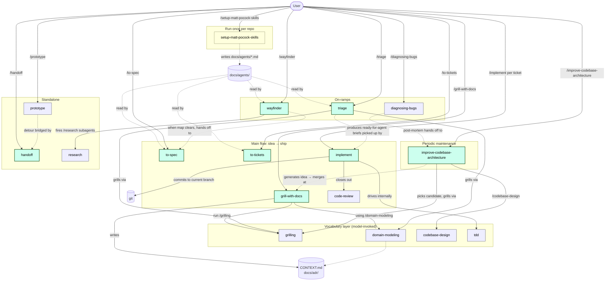
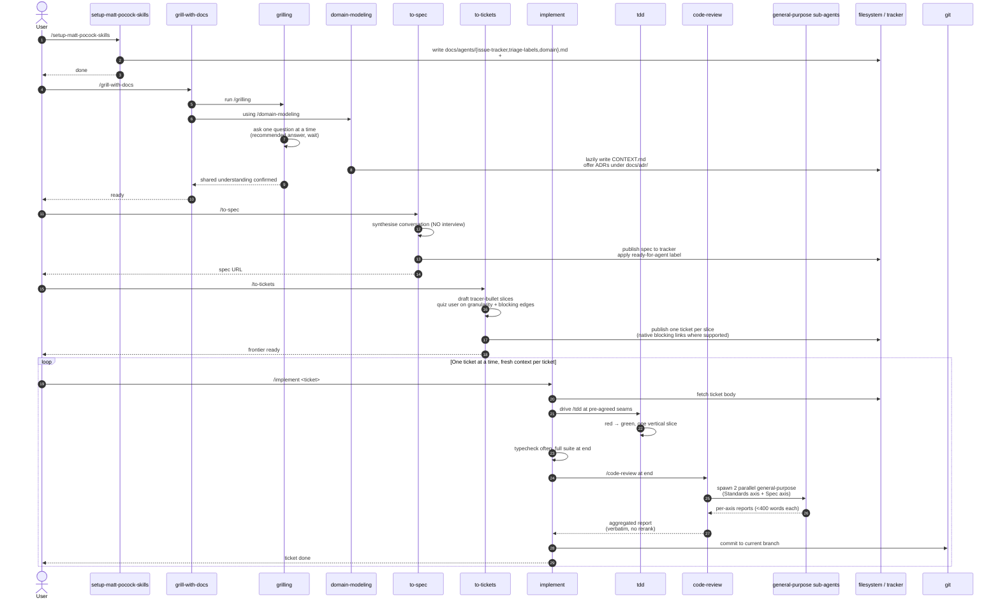

# mattpocock/skills Harness Analysis

**Analyzed**: 2026-07-18
**Frozen commit**: [9603c1cc8118d08bc1b3bf34cf714f62178dea3b](https://github.com/mattpocock/skills/tree/9603c1cc8118d08bc1b3bf34cf714f62178dea3b)
**GitHub**: https://github.com/mattpocock/skills
**Version studied**: 1.1.0 ([`package.json:3`](https://github.com/mattpocock/skills/blob/9603c1cc8118d08bc1b3bf34cf714f62178dea3b/package.json#L3)) with plugin manifest at 1.2.0 ([`.claude-plugin/plugin.json:3`](https://github.com/mattpocock/skills/blob/9603c1cc8118d08bc1b3bf34cf714f62178dea3b/.claude-plugin/plugin.json#L3)). The mismatch is real: the working tree carries a pending minor bump (`ship-as-claude-plugin`, `codex-skill-metadata`, `prototype-primary-source`, `wayfinder-research-subagents`, `yagni-scope-improve-architecture`) staged via nine unreleased changesets in `.changeset/`. See *Open Questions*.

## Executive Summary

- **The harness is a single Claude Code plugin plus a skills.sh installer.** All 22 promoted skills live as folders under `skills/{engineering,productivity}/<name>/SKILL.md` ([`.claude-plugin/plugin.json:21-44`](https://github.com/mattpocock/skills/blob/9603c1cc8118d08bc1b3bf34cf714f62178dea3b/.claude-plugin/plugin.json#L21-L44)). Every skill ships dual manifests: Claude Code frontmatter in `SKILL.md` and Codex UI/policy metadata in a sibling `agents/openai.yaml` ([`.changeset/codex-skill-metadata.md`](https://github.com/mattpocock/skills/blob/9603c1cc8118d08bc1b3bf34cf714f62178dea3b/.changeset/codex-skill-metadata.md), [`.agents/invocation.md:5-10`](https://github.com/mattpocock/skills/blob/9603c1cc8118d08bc1b3bf34cf714f62178dea3b/.agents/invocation.md#L5-L10)). The repo is its own single-plugin marketplace ([`.claude-plugin/marketplace.json`](https://github.com/mattpocock/skills/blob/9603c1cc8118d08bc1b3bf34cf714f62178dea3b/.claude-plugin/marketplace.json)). There are **zero** TypeScript agents, hooks, or runtime code files — every user-facing behaviour is an LLM prompt in a `SKILL.md` plus real bash scripts (`scripts/link-skills.sh`, `scripts/list-skills.sh`) and skill-local `template.sh` files (`diagnosing-bugs/scripts/hitl-loop.template.sh`, `in-progress/wizard/template.sh`).

- **The recommended user-facing flow is one main chain — `grill-with-docs → to-spec → to-tickets → implement → code-review` — fed by two on-ramps (`triage`, `diagnosing-bugs`) and one heavy-lift on-ramp (`wayfinder`).** The router is `/ask-matt`, which codifies the entire map in its `SKILL.md` body ([`skills/engineering/ask-matt/SKILL.md:14-78`](https://github.com/mattpocock/skills/blob/9603c1cc8118d08bc1b3bf34cf714f62178dea3b/skills/engineering/ask-matt/SKILL.md#L14-L78)). README's headline answer is *quickstart → `/setup-matt-pocock-skills` → go* ([`README.md:25-41`](https://github.com/mattpocock/skills/blob/9603c1cc8118d08bc1b3bf34cf714f62178dea3b/README.md#L25-L41)). Notably, **there is no autopilot/`/lfg` equivalent** — the user drives every step by typing the next slash command.

- **One prerequisite config, written once, read everywhere.** `/setup-matt-pocock-skills` is a run-once skill that writes `docs/agents/{issue-tracker,domain,triage-labels}.md` plus an `## Agent skills` pointer block into whichever of `CLAUDE.md`/`AGENTS.md` exists, and **every** downstream skill (hard-dependency trio `to-tickets`/`to-spec`/`triage`, plus `wayfinder`, `code-review`) resolves "the issue tracker" through that pointer rather than a hard-coded path — an invariant that was broken once and re-litigated in `CHANGELOG.md` as `d869d45` ([`skills/engineering/to-tickets/SKILL.md:11`](https://github.com/mattpocock/skills/blob/9603c1cc8118d08bc1b3bf34cf714f62178dea3b/skills/engineering/to-tickets/SKILL.md#L11), [`.agents/adr/0001` family](https://github.com/mattpocock/skills/blob/9603c1cc8118d08bc1b3bf34cf714f62178dea3b/.agents/adr/0001-explicit-setup-pointer-only-for-hard-dependencies.md)). Per [`.agents/adr/0001`](https://github.com/mattpocock/skills/blob/9603c1cc8118d08bc1b3bf34cf714f62178dea3b/.agents/adr/0001-explicit-setup-pointer-only-for-hard-dependencies.md) the pointer is only added to skills where output is wrong without it (hard deps), not those that merely sharpen output (soft deps like `tdd`, `diagnosing-bugs`, `prototype`).

- **No standalone agents; inter-skill orchestration is by slash-command prose, not sub-agent calls targeting other skills.** One skill's `SKILL.md` says verbatim *"Run a `/grilling` session, using the `/domain-modeling` skill."* ([`skills/engineering/grill-with-docs/SKILL.md:7`](https://github.com/mattpocock/skills/blob/9603c1cc8118d08bc1b3bf34cf714f62178dea3b/skills/engineering/grill-with-docs/SKILL.md#L7)) — never a `task(subagent_type=…)` call targeting another *skill*. **Four** skills do dispatch host-native sub-agents for parallel/explore work: `code-review` (two parallel `general-purpose` for Standards + Spec axes, [`skills/engineering/code-review/SKILL.md:60`](https://github.com/mattpocock/skills/blob/9603c1cc8118d08bc1b3bf34cf714f62178dea3b/skills/engineering/code-review/SKILL.md#L60)), `wayfinder` (background `/research` sub-agents for AFK research tickets, [`skills/engineering/wayfinder/SKILL.md:115`](https://github.com/mattpocock/skills/blob/9603c1cc8118d08bc1b3bf34cf714f62178dea3b/skills/engineering/wayfinder/SKILL.md#L115)), `improve-codebase-architecture` (a typed `Explore` sub-agent to walk the codebase, [`skills/engineering/improve-codebase-architecture/SKILL.md:27`](https://github.com/mattpocock/skills/blob/9603c1cc8118d08bc1b3bf34cf714f62178dea3b/skills/engineering/improve-codebase-architecture/SKILL.md#L27)), and `codebase-design` via its disclosed `DESIGN-IT-TWICE.md` reference (3+ parallel sub-agents for interface design, [`skills/engineering/codebase-design/DESIGN-IT-TWICE.md:21`](https://github.com/mattpocock/skills/blob/9603c1cc8118d08bc1b3bf34cf714f62178dea3b/skills/engineering/codebase-design/DESIGN-IT-TWICE.md#L21)). Two foundational "vocabulary" skills (`grilling`, `domain-modeling`, `codebase-design`) are reached both by user invocation and by being *named inside* the orchestrator skills that need them.

- **The user-invoked vs. model-invoked split is the architecture.** [`.agents/invocation.md:3-12`](https://github.com/mattpocock/skills/blob/9603c1cc8118d08bc1b3bf34cf714f62178dea3b/.agents/invocation.md#L3-L12) and [`skills/productivity/writing-great-skills/SKILL.md:13-21`](https://github.com/mattpocock/skills/blob/9603c1cc8118d08bc1b3bf34cf714f62178dea3b/skills/productivity/writing-great-skills/SKILL.md#L13-L21) codify the rule: **a user-invoked skill may invoke model-invoked skills, but never another user-invoked one**. This is mechanically enforced by `disable-model-invocation: true` in Claude frontmatter paired with `policy.allow_implicit_invocation: false` in `agents/openai.yaml`. The router `/ask-matt` exists explicitly to relieve the cognitive load of remembering 13 user-invoked skills — that cognitive load is the cost of the user-invoked decision.

- **ADR-anchored, changeset-driven self-improvement loop.** The harness maintains its own design memory in `.agents/adr/` (2 ADRs), captures pending intent in `.changeset/*.md` (9 changesets queued for the next release), and ships a `Release` GitHub Action that runs `changesets/action@v1` on every push to `main` to auto-open a "Version skills" PR (`.github/workflows/release.yml`). `CLAUDE.md` (the repo's self-dev contract) adds re-sync rules: any new/renamed/removed promoted skill must (a) re-sync its docs page ([`.agents/writing-docs.md:7`](https://github.com/mattpocock/skills/blob/9603c1cc8118d08bc1b3bf34cf714f62178dea3b/.agents/writing-docs.md#L7)), (b) update the plugin manifest ([`CLAUDE.md:10`](https://github.com/mattpocock/skills/blob/9603c1cc8118d08bc1b3bf34cf714f62178dea3b/CLAUDE.md#L10)), and (c) update `ask-matt`'s map ([`CLAUDE.md:22`](https://github.com/mattpocock/skills/blob/9603c1cc8118d08bc1b3bf34cf714f62178dea3b/CLAUDE.md#L22)). This is the *harness's* self-improvement loop; per-repo learning is delegated to the user's own ADR directory.

## Repo Layout (relevant parts)

```text
mattpocock-skills/
├── skills/                          ← THE plugin: 41 SKILL.md folders in 6 buckets
│   ├── engineering/  (17 promoted)  ← daily code work; ships in plugin
│   │   ├── README.md                ← bucket README; User-invoked / Model-invoked split
│   │   ├── ask-matt/SKILL.md           ← THE router — flow map for the whole set
│   │   ├── setup-matt-pocock-skills/   ← run-once per-repo config writer
│   │   │   ├── SKILL.md
│   │   │   ├── issue-tracker-{github,gitlab,local}.md  ← seed templates
│   │   │   ├── domain.md, triage-labels.md
│   │   │   └── agents/openai.yaml
│   │   ├── grill-with-docs/SKILL.md    ← 7-line orchestrator → /grilling + /domain-modeling
│   │   ├── triage/{SKILL.md, AGENT-BRIEF.md, OUT-OF-SCOPE.md}
│   │   ├── to-spec/SKILL.md            ← conversation → spec (no interview)
│   │   ├── to-tickets/SKILL.md         ← spec → tracer-bullet tickets with blocking edges
│   │   ├── implement/SKILL.md          ← 15-line orchestrator → /tdd + /code-review
│   │   ├── wayfinder/SKILL.md          ← huge-fog-on-ramp; creates decision tickets
│   │   ├── improve-codebase-architecture/{SKILL.md, HTML-REPORT.md}
│   │   ├── tdd/{SKILL.md, tests.md, mocking.md}
│   │   ├── code-review/SKILL.md        ← 2 parallel general-purpose sub-agents
│   │   ├── diagnosing-bugs/{SKILL.md, scripts/hitl-loop.template.sh}
│   │   ├── prototype/{SKILL.md, LOGIC.md, UI.md}
│   │   ├── research/SKILL.md           ← background-agent research
│   │   ├── domain-modeling/{SKILL.md, ADR-FORMAT.md, CONTEXT-FORMAT.md}
│   │   ├── codebase-design/{SKILL.md, DEEPENING.md, DESIGN-IT-TWICE.md}
│   │   └── resolving-merge-conflicts/SKILL.md
│   ├── productivity/  (5 promoted)   ← daily non-code workflow
│   │   ├── README.md
│   │   ├── grill-me/SKILL.md           ← 7-line → /grilling (no docs)
│   │   ├── grilling/SKILL.md           ← THE shared interview primitive
│   │   ├── handoff/SKILL.md            ← conversation → OS-temp handoff doc
│   │   ├── teach/{SKILL.md, MISSION/LEARNING-RECORD/RESOURCES/GLOSSARY-FORMAT.md}
│   │   └── writing-great-skills/{SKILL.md, GLOSSARY.md}  ← meta-skill
│   ├── in-progress/  (9 un-shipped)  ← drafts; excluded from plugin & README
│   │   ├── loop-me, wizard, claude-handoff, to-questionnaire,
│   │   ├── batch-grill-me, setup-ts-deep-modules,
│   │   └── writing-beats, writing-fragments, writing-shape  (writing triplet)
│   ├── misc/  (4 un-shipped)         ← kept-around, rarely used
│   │   ├── git-guardrails-claude-code/{SKILL.md, scripts/block-dangerous-git.sh}
│   │   ├── migrate-to-shoehorn, scaffold-exercises, setup-pre-commit
│   ├── personal/  (2 un-shipped)     ← Matt's own workflow
│   │   └── edit-article, obsidian-vault
│   └── deprecated/  (4 un-shipped)   ← superseded or removed
│       ├── design-an-interface  (folded into codebase-design/DESIGN-IT-TWICE.md)
│       ├── qa                   (replaced by triage + implement)
│       ├── request-refactor-plan (folded into improve-codebase-architecture)
│       └── ubiquitous-language  (folded into domain-modeling)
├── docs/                            ← HUMAN-FACING docs; mirror skills/{engineering,productivity}/
│   ├── engineering/<skill>.md       ← published at https://aihero.dev/skills-<name>
│   └── productivity/<skill>.md      ← never relative links; every link is absolute
├── .agents/                         ← repo-self-dev docs (NOT user-runtime)
│   ├── invocation.md                ← the user-invoked/model-invoked contract
│   ├── writing-docs.md              ← the docs-page contract
│   └── adr/
│       ├── 0001-explicit-setup-pointer-only-for-hard-dependencies.md
│       └── 0002-ship-as-a-claude-code-plugin.md
├── .changeset/                      ← 9 pending changesets; auto-PR via changesets/action
│   ├── config.json                  ← private package, version+tag, GitHub changelog
│   ├── README.md                    ← stock changesets boilerplate
│   └── *.md                         ← one per unreleased change
├── .claude-plugin/                  ← Claude Code plugin manifests
│   ├── plugin.json                  ← 22-entry skills array, version 1.2.0
│   └── marketplace.json             ← self-marketplace: one plugin entry
├── .github/workflows/release.yml    ← changesets/action@v1 → "chore: version skills" PR
├── scripts/
│   ├── link-skills.sh               ← maintainer-only: symlink skills/ → ~/.claude/skills + ~/.agents/skills
│   └── list-skills.sh               ← find skills -name SKILL.md, sorted
├── CLAUDE.md                        ← repo-self-dev contract (24 lines)
├── AGENTS.md → CLAUDE.md            ← symlink so Codex reads the same instructions
├── CONTEXT.md                       ← THIS repo's own domain glossary (issue tracker, issue, decision ticket, triage role)
├── CHANGELOG.md                     ← changeset-generated release history (1.0.0 → 1.1.0)
├── README.md                        ← canonical user-facing install + workflow
├── package.json                     ← npm@10.9.4, private, name=mattpocock-skills@1.1.0
└── LICENSE                          ← MIT
```

Three distinctions to keep straight:

1. `skills/` **is** the plugin. Everything else either installs it (`.claude-plugin/`, `scripts/link-skills.sh`), maintains it (`.agents/`, `.changeset/`, `CLAUDE.md`, `.github/workflows/release.yml`), documents it (`README.md`, `docs/`), or is the repo's own dogfooding (`CONTEXT.md`, the `AGENTS.md → CLAUDE.md` symlink).
2. The `in-progress/`, `misc/`, `personal/`, `deprecated/` buckets **do not ship**. `.claude-plugin/plugin.json`'s `skills` array names exactly the 22 promoted skills across `engineering/` and `productivity/` ([`.claude-plugin/plugin.json:21-44`](https://github.com/mattpocock/skills/blob/9603c1cc8118d08bc1b3bf34cf714f62178dea3b/.claude-plugin/plugin.json#L21-L44)); `scripts/link-skills.sh` skips only `deprecated/` ([`scripts/link-skills.sh:25`](https://github.com/mattpocock/skills/blob/9603c1cc8118d08bc1b3bf34cf714f62178dea3b/scripts/link-skills.sh#L25)) but the README and plugin manifest are the authoritative promoted set.
3. `docs/` mirrors `skills/{engineering,productivity}/` exactly. Every promoted skill earns a page at `docs/<bucket>/<skill>.md` published to `https://aihero.dev/skills-<skill-name>`; non-promoted skills get no page ([`.agents/writing-docs.md:3-7`](https://github.com/mattpocock/skills/blob/9603c1cc8118d08bc1b3bf34cf714f62178dea3b/.agents/writing-docs.md#L3-L7)).

## Q1 — Recommended User-Facing Flow(s)

### Install + bootstrap (the universal precondition)

From the README's "Quickstart (30-second setup)" ([`README.md:25-41`](https://github.com/mattpocock/skills/blob/9603c1cc8118d08bc1b3bf34cf714f62178dea3b/README.md#L25-L41)):

> 1. Run the skills.sh installer: `npx skills@latest add mattpocock/skills`
> 2. Pick the skills you want, and which coding agents you want to install them on. **Make sure you select `/setup-matt-pocock-skills`**.
> 3. Run `/setup-matt-pocock-skills` in your agent. It will:
>    - Ask you which issue tracker you want to use (GitHub, Linear, or local files)
>    - Ask you what labels you apply to tickets when you triage them (`/triage` uses labels)
>    - Ask you where you want to save any docs we create
> 4. Bam - you're ready to go.

Two install paths exist ([`README.md:42-67`](https://github.com/mattpocock/skills/blob/9603c1cc8118d08bc1b3bf34cf714f62178dea3b/README.md#L42-L67)):

- **skills.sh** (`npx skills@latest add mattpocock/skills`) — copies editable skill files into the user's project; user-owned, harness-agnostic.
- **Claude Code plugin** (`/plugin marketplace add mattpocock/skills` → `/plugin install mattpocock-skills@mattpocock`) — managed, read-only, always-current bundle. Native Codex plugin is deferred per [`.agents/adr/0002-ship-as-a-claude-code-plugin.md`](https://github.com/mattpocock/skills/blob/9603c1cc8118d08bc1b3bf34cf714f62178dea3b/.agents/adr/0002-ship-as-a-claude-code-plugin.md).

Both paths terminate in **`/setup-matt-pocock-skills` once per repo**, which writes three config files under `docs/agents/` and an `## Agent skills` pointer block into whichever of `CLAUDE.md`/`AGENTS.md` exists ([`skills/engineering/setup-matt-pocock-skills/SKILL.md:84-112`](https://github.com/mattpocock/skills/blob/9603c1cc8118d08bc1b3bf34cf714f62178dea3b/skills/engineering/setup-matt-pocock-skills/SKILL.md#L84-L112)).

### The main flow — idea → ship

The router `/ask-matt` documents it most precisely ([`skills/engineering/ask-matt/SKILL.md:14-32`](https://github.com/mattpocock/skills/blob/9603c1cc8118d08bc1b3bf34cf714f62178dea3b/skills/engineering/ask-matt/SKILL.md#L14-L32)). Quote:

> 1. **`/grill-with-docs`** — sharpen the idea by interview. Start here when you **have a codebase**: it's stateful, retaining what it learns in `CONTEXT.md` and ADRs.
> 2. **Branch — can you settle every question in conversation?** If a question needs a runnable answer … detour through a prototype, bridged by **`/handoff`** in both directions
> 3. **Branch — is this a multi-session build?**
>    - **Yes** → **`/to-spec`** (turn the thread into a spec), then **`/to-tickets`** to split it into tracer-bullet tickets … kick off **`/implement`** per ticket, **clearing context between each one**.
>    - **No** → **`/implement`** right here, in the same context window.
>
> Either way, **`/implement`** builds each issue by driving **`/tdd`** internally — one red-green slice at a time — then closes out by running **`/code-review`** … before committing.

> **Context hygiene:** Keep steps 1–3 in **one unbroken context window** … Each `/implement` then starts fresh, working from the ticket.

The canonical chain, written verbatim in six docs pages, is:

```
grill-with-docs → to-spec → to-tickets → implement → code-review
```

([`docs/engineering/grill-with-docs.md:47`](https://github.com/mattpocock/skills/blob/9603c1cc8118d08bc1b3bf34cf714f62178dea3b/docs/engineering/grill-with-docs.md#L47), [`docs/engineering/to-tickets.md:53`](https://github.com/mattpocock/skills/blob/9603c1cc8118d08bc1b3bf34cf714f62178dea3b/docs/engineering/to-tickets.md#L53), [`docs/engineering/implement.md:36`](https://github.com/mattpocock/skills/blob/9603c1cc8118d08bc1b3bf34cf714f62178dea3b/docs/engineering/implement.md#L36), [`docs/engineering/tdd.md:44`](https://github.com/mattpocock/skills/blob/9603c1cc8118d08bc1b3bf34cf714f62178dea3b/docs/engineering/tdd.md#L44), [`docs/engineering/code-review.md:44`](https://github.com/mattpocock/skills/blob/9603c1cc8118d08bc1b3bf34cf714f62178dea3b/docs/engineering/code-review.md#L44), [`docs/engineering/to-spec.md:56`](https://github.com/mattpocock/skills/blob/9603c1cc8118d08bc1b3bf34cf714f62178dea3b/docs/engineering/to-spec.md#L56))

### On-ramp: bugs and requests piling up → `/triage`

[`skills/engineering/ask-matt/SKILL.md:38-41`](https://github.com/mattpocock/skills/blob/9603c1cc8118d08bc1b3bf34cf714f62178dea3b/skills/engineering/ask-matt/SKILL.md#L38-L41) — `triage` moves issues through a state machine (5 canonical state roles × 2 category roles) and emits `ready-for-agent` briefs that `implement` later picks up. Distinct from `to-tickets` because tickets it produced are already agent-ready and **should not be re-triaged**.

### On-ramp: something's broken → `/diagnosing-bugs`

[`skills/engineering/ask-matt/SKILL.md:43`](https://github.com/mattpocock/skills/blob/9603c1cc8118d08bc1b3bf34cf714f62178dea3b/skills/engineering/ask-matt/SKILL.md#L43). The skill refuses to theorise until it has a **tight feedback loop** — one command that goes red on *this* bug ([`skills/engineering/diagnosing-bugs/SKILL.md:12-60`](https://github.com/mattpocock/skills/blob/9603c1cc8118d08bc1b3bf34cf714f62178dea3b/skills/engineering/diagnosing-bugs/SKILL.md#L12-L60)). Post-mortem hands off to `/improve-codebase-architecture` when the real finding is that there's no good seam to lock the bug down.

### On-ramp: huge and foggy → `/wayfinder`

[`skills/engineering/ask-matt/SKILL.md:45-46`](https://github.com/mattpocock/skills/blob/9603c1cc8118d08bc1b3bf34cf714f62178dea3b/skills/engineering/ask-matt/SKILL.md#L45-L46). For efforts too big for one session. Charts a **shared map** of **decision tickets** on the issue tracker, resolved one per session. **Plans, doesn't build**: produces decisions, not deliverables. When the map clears, merges onto the main flow at **`/to-spec`** (not `/implement` directly — that "skips the collapse and throws the linked detail away").

### Codebase health — periodic maintenance

[`skills/engineering/ask-matt/SKILL.md:49-52`](https://github.com/mattpocock/skills/blob/9603c1cc8118d08bc1b3bf34cf714f62178dea3b/skills/engineering/ask-matt/SKILL.md#L49-L52). `/improve-codebase-architecture` scans for deepening opportunities (YAGNI-scoped to recently-changed code per [`.changeset/yagni-scope-improve-architecture.md`](https://github.com/mattpocock/skills/blob/9603c1cc8118d08bc1b3bf34cf714f62178dea3b/.changeset/yagni-scope-improve-architecture.md)), presents an HTML report in OS temp dir, then grills through whichever one the user picks. Generates an idea that merges onto the main flow at `/grill-with-docs`.

### Crossing sessions

- `/handoff` — compacts the conversation into a markdown file saved to OS temp dir, **outside** the workspace. Forks; you open a fresh session and reference the file. ([`skills/productivity/handoff/SKILL.md:8`](https://github.com/mattpocock/skills/blob/9603c1cc8118d08bc1b3bf34cf714f62178dea3b/skills/productivity/handoff/SKILL.md#L8), [`skills/engineering/ask-matt/SKILL.md:63`](https://github.com/mattpocock/skills/blob/9603c1cc8118d08bc1b3bf34cf714f62178dea3b/skills/engineering/ask-matt/SKILL.md#L63))
- `/compact` (built-in) — stays in the same conversation. Use between phases, not mid-phase.

### Standalone skills

[`skills/engineering/ask-matt/SKILL.md:67-74`](https://github.com/mattpocock/skills/blob/9603c1cc8118d08bc1b3bf34cf714f62178dea3b/skills/engineering/ask-matt/SKILL.md#L67-L74): `/grill-me` (no codebase state), `/prototype` (throwaway code that answers a design question), `/research` (background-agent primary-source investigation), `/teach` (multi-session learning workspace), `/writing-great-skills` (meta-skill).

### Vocabulary layer underneath

[`skills/engineering/ask-matt/SKILL.md:55-59`](https://github.com/mattpocock/skills/blob/9603c1cc8118d08bc1b3bf34cf714f62178dea3b/skills/engineering/ask-matt/SKILL.md#L55-L59). `/domain-modeling` (the glossary/ADR discipline) and `/codebase-design` (the deep-module vocabulary) are *referenced by name inside other skills* — never via deep paths, per the prose-invocation rule at [`.agents/invocation.md:14-16`](https://github.com/mattpocock/skills/blob/9603c1cc8118d08bc1b3bf34cf714f62178dea3b/.agents/invocation.md#L14-L16).

### Mermaid: recommended user flow



Notes on the diagram:

- **Solid arrow** = direct skill invocation (slash-command prose in the orchestrator's `SKILL.md`).
- **Dotted arrow** = artifact write/read or handoff (no code call).
- The user types *every* solid-arrowed user-invoked skill. The only automatic dispatch is `implement` driving `tdd`/`code-review` internally (still prose, not a tool call), and `wayfinder` firing `/research` *subagents* in parallel ([`skills/engineering/wayfinder/SKILL.md:115`](https://github.com/mattpocock/skills/blob/9603c1cc8118d08bc1b3bf34cf714f62178dea3b/skills/engineering/wayfinder/SKILL.md#L115)).
- There is **no `/lfg`-style autopilot**. The user is the loop driver.

## Q2 — Artifacts

The harness writes a small, deliberate set of artifacts. There is no single rooted workspace like `.omo/`; artifacts land in either the project's own conventions (`CONTEXT.md`, `docs/adr/`, `.scratch/`, the issue tracker) or the OS temp directory (handoffs, the architecture HTML report).

### Per-repo configuration artifacts (written once by `/setup-matt-pocock-skills`)

| Path | Written by | Read by | Purpose |
|------|-----------|---------|---------|
| `docs/agents/issue-tracker.md` | `setup-matt-pocock-skills` from seed templates [`issue-tracker-{github,gitlab,local}.md`](https://github.com/mattpocock/skills/blob/9603c1cc8118d08bc1b3bf34cf714f62178dea3b/skills/engineering/setup-matt-pocock-skills/issue-tracker-github.md) | `to-spec`, `to-tickets`, `triage`, `wayfinder`, `code-review` | Tracker workflow: `gh` / `glab` / `.scratch/` / "other"; includes "Wayfinding operations" section consumed by wayfinder. Verified at [`skills/engineering/setup-matt-pocock-skills/SKILL.md:40-49`](https://github.com/mattpocock/skills/blob/9603c1cc8118d08bc1b3bf34cf714f62178dea3b/skills/engineering/setup-matt-pocock-skills/SKILL.md#L40-L49), [`skills/engineering/wayfinder/SKILL.md:25`](https://github.com/mattpocock/skills/blob/9603c1cc8118d08bc1b3bf34cf714f62178dea3b/skills/engineering/wayfinder/SKILL.md#L25). |
| `docs/agents/triage-labels.md` | `setup-matt-pocock-skills` (only when `triage` skill is installed) from seed [`triage-labels.md`](https://github.com/mattpocock/skills/blob/9603c1cc8118d08bc1b3bf34cf714f62178dea3b/skills/engineering/setup-matt-pocock-skills/triage-labels.md) | `triage` | Maps 5 canonical role names → actual tracker label strings. Verified at [`skills/engineering/setup-matt-pocock-skills/SKILL.md:51-57`](https://github.com/mattpocock/skills/blob/9603c1cc8118d08bc1b3bf34cf714f62178dea3b/skills/engineering/setup-matt-pocock-skills/SKILL.md#L51-L57). |
| `docs/agents/domain.md` | `setup-matt-pocock-skills` from seed [`domain.md`](https://github.com/mattpocock/skills/blob/9603c1cc8118d08bc1b3bf34cf714f62178dea3b/skills/engineering/setup-matt-pocock-skills/domain.md) | every skill that explores the codebase | Layout of `CONTEXT.md` / `CONTEXT-MAP.md` / `docs/adr/`; "read silently if absent". Verified at [`skills/engineering/setup-matt-pocock-skills/domain.md:5-11`](https://github.com/mattpocock/skills/blob/9603c1cc8118d08bc1b3bf34cf714f62178dea3b/skills/engineering/setup-matt-pocock-skills/domain.md#L5-L11). |
| `## Agent skills` block in `CLAUDE.md` (or `AGENTS.md`) | `setup-matt-pocock-skills` | every skill (loaded as repo instructions) | One-line summaries + pointers to `docs/agents/*.md`. Verified at [`skills/engineering/setup-matt-pocock-skills/SKILL.md:84-100`](https://github.com/mattpocock/skills/blob/9603c1cc8118d08bc1b3bf34cf714f62178dea3b/skills/engineering/setup-matt-pocock-skills/SKILL.md#L84-L100). |

### Domain-model artifacts (written lazily during `/grill-with-docs` and `/domain-modeling`)

| Path | Written by | Read by | Format / contract |
|------|-----------|---------|---------|
| `CONTEXT.md` (repo root, or `src/<context>/CONTEXT.md` in multi-context) | `grill-with-docs`, `domain-modeling`, `improve-codebase-architecture` | every exploring skill — read silently if absent | Glossary only — no implementation details. Verified at [`skills/engineering/domain-modeling/SKILL.md:11-22,60-64`](https://github.com/mattpocock/skills/blob/9603c1cc8118d08bc1b3bf34cf714f62178dea3b/skills/engineering/domain-modeling/SKILL.md#L11-L22). |
| `CONTEXT-MAP.md` (root; only in multi-context monorepos) | `setup-matt-pocock-skills` flagging it; `domain-modeling` per-context | multi-context-aware skills | Points at per-context `CONTEXT.md`. Verified at [`skills/engineering/domain-modeling/SKILL.md:24-38`](https://github.com/mattpocock/skills/blob/9603c1cc8118d08bc1b3bf34cf714f62178dea3b/skills/engineering/domain-modeling/SKILL.md#L24-L38). |
| `docs/adr/0001-<slug>.md` | `domain-modeling`, `grill-with-docs`, `improve-codebase-architecture` (offered sparingly) | `to-spec`, `to-tickets`, `tdd`, `diagnosing-bugs`, `code-review`, `prototype`, `improve-codebase-architecture` | ADR format defined in [`skills/engineering/domain-modeling/ADR-FORMAT.md`](https://github.com/mattpocock/skills/blob/9603c1cc8118d08bc1b3bf34cf714f62178dea3b/skills/engineering/domain-modeling/ADR-FORMAT.md); offered only when "hard to reverse + surprising + real trade-off" — [`skills/engineering/domain-modeling/SKILL.md:66-74`](https://github.com/mattpocock/skills/blob/9603c1cc8118d08bc1b3bf34cf714f62178dea3b/skills/engineering/domain-modeling/SKILL.md#L66-L74). |

### Issue-tracker artifacts (depends on which tracker `/setup-matt-pocock-skills` configured)

| Path / tracker object | Written by | Read by | Format / contract |
|------|-----------|---------|---------|
| GitHub/GitLab/Linear issue (the spec) | `to-spec` (publishes spec body, applies `ready-for-agent` label) | `to-tickets` (referenced as parent), `implement` (originating issue) | Template at [`skills/engineering/to-spec/SKILL.md:21-73`](https://github.com/mattpocock/skills/blob/9603c1cc8118d08bc1b3bf34cf714f62178dea3b/skills/engineering/to-spec/SKILL.md#L21-L73). |
| GitHub/GitLab/Linear sub-issue (the ticket) | `to-tickets` (publishes one per tracer-bullet slice, native blocking links where supported) | `implement` (works the frontier one ticket at a time) | Template at [`skills/engineering/to-tickets/SKILL.md:84-103`](https://github.com/mattpocock/skills/blob/9603c1cc8118d08bc1b3bf34cf714f62178dea3b/skills/engineering/to-tickets/SKILL.md#L84-L103). |
| `.scratch/<feature>/spec.md` | `to-spec` on local-markdown tracker | `to-tickets` | Per [`skills/engineering/setup-matt-pocock-skills/issue-tracker-local.md:7-9`](https://github.com/mattpocock/skills/blob/9603c1cc8118d08bc1b3bf34cf714f62178dea3b/skills/engineering/setup-matt-pocock-skills/issue-tracker-local.md#L7-L9). |
| `.scratch/<feature>/issues/<NN>-<slug>.md` | `to-tickets` on local-markdown tracker | `implement` | One file per ticket, never a combined file. Per [`skills/engineering/setup-matt-pocock-skills/issue-tracker-local.md:9`](https://github.com/mattpocock/skills/blob/9603c1cc8118d08bc1b3bf34cf714f62178dea3b/skills/engineering/setup-matt-pocock-skills/issue-tracker-local.md#L9), [`skills/engineering/to-tickets/SKILL.md:62`](https://github.com/mattpocock/skills/blob/9603c1cc8118d08bc1b3bf34cf714f62178dea3b/skills/engineering/to-tickets/SKILL.md#L62). |
| `## Agent Brief` comment on an issue/PR | `triage` (when promoting to `ready-for-agent`) | `implement` (the originating-issue contract) | Format at [`skills/engineering/triage/AGENT-BRIEF.md:41-68`](https://github.com/mattpocock/skills/blob/9603c1cc8118d08bc1b3bf34cf714f62178dea3b/skills/engineering/triage/AGENT-BRIEF.md#L41-L68). **Every** triage comment opens with `> *This was generated by AI during triage.*` ([`skills/engineering/triage/SKILL.md:13-17`](https://github.com/mattpocock/skills/blob/9603c1cc8118d08bc1b3bf34cf714f62178dea3b/skills/engineering/triage/SKILL.md#L13-L17)). |
| `.out-of-scope/<concept>.md` | `triage` (only on rejected *enhancement*, never bug, never already-implemented) | `triage` Step 1 (redundancy/prior-rejection check) | One file per concept; format at [`skills/engineering/triage/OUT-OF-SCOPE.md:23-54`](https://github.com/mattpocock/skills/blob/9603c1cc8118d08bc1b3bf34cf714f62178dea3b/skills/engineering/triage/OUT-OF-SCOPE.md#L23-L54). |
| `wayfinder:map` issue + child `wayfinder:<type>` tickets | `wayfinder` chart-the-map mode | `wayfinder` work-through-the-map mode; `to-spec` (handoff) | Map body template at [`skills/engineering/wayfinder/SKILL.md:31-53`](https://github.com/mattpocock/skills/blob/9603c1cc8118d08bc1b3bf34cf714f62178dea3b/skills/engineering/wayfinder/SKILL.md#L31-L53). Tracker-specific recipes in `issue-tracker-{github,gitlab,local}.md` "Wayfinding operations" sections ([`skills/engineering/setup-matt-pocock-skills/issue-tracker-github.md:36-45`](https://github.com/mattpocock/skills/blob/9603c1cc8118d08bc1b3bf34cf714f62178dea3b/skills/engineering/setup-matt-pocock-skills/issue-tracker-github.md#L36-L45)). |

### Ephemeral artifacts (OS temp, never tracked)

| Path | Written by | Read by | Purpose |
|------|-----------|---------|---------|
| OS temp dir handoff file | `handoff` | the next fresh session (the user references it manually) | Conversation compaction; saved *outside* the workspace. Verified at [`skills/productivity/handoff/SKILL.md:8`](https://github.com/mattpocock/skills/blob/9603c1cc8118d08bc1b3bf34cf714f62178dea3b/skills/productivity/handoff/SKILL.md#L8). |
| `<tmpdir>/architecture-review-<timestamp>.html` | `improve-codebase-architecture` | the user (opens in their browser) | Self-contained HTML report of deepening opportunities; Tailwind + Mermaid via CDN; never lands in the repo. Verified at [`skills/engineering/improve-codebase-architecture/SKILL.md:39`](https://github.com/mattpocock/skills/blob/9603c1cc8118d08bc1b3bf34cf714f62178dea3b/skills/engineering/improve-codebase-architecture/SKILL.md#L39). |
| `prototype/<name>` branch | `prototype` (committed there; main branch keeps only the validated decision) | user, future session via context pointer | Prototype is a *primary source* now, not delete-on-sight. Verified at [`skills/engineering/prototype/SKILL.md:21`](https://github.com/mattpocock/skills/blob/9603c1cc8118d08bc1b3bf34cf714f62178dea3b/skills/engineering/prototype/SKILL.md#L21) and [`.changeset/prototype-primary-source.md`](https://github.com/mattpocock/skills/blob/9603c1cc8118d08bc1b3bf34cf714f62178dea3b/.changeset/prototype-primary-source.md). |
| `research/<name>` branch | `wayfinder` chart-the-map step 5 fires `/research` subagents | the ticket's resolution comment | Captures cited Markdown research findings on a throwaway branch. Verified at [`skills/engineering/wayfinder/SKILL.md:115`](https://github.com/mattpocock/skills/blob/9603c1cc8118d08bc1b3bf34cf714f62178dea3b/skills/engineering/wayfinder/SKILL.md#L115). |
| Background-agent research output (path per repo convention) | `research` (model-invoked) | user, or merged into main flow at `/grill-with-docs` | Single cited Markdown file; "save it where the repo already keeps such notes". Verified at [`skills/engineering/research/SKILL.md:12`](https://github.com/mattpocock/skills/blob/9603c1cc8118d08bc1b3bf34cf714f62178dea3b/skills/engineering/research/SKILL.md#L12). |

### `teach` workspace (only when `/teach` is invoked)

[`skills/productivity/teach/SKILL.md:11-20`](https://github.com/mattpocock/skills/blob/9603c1cc8118d08bc1b3bf34cf714f62178dea3b/skills/productivity/teach/SKILL.md#L11-L20) lists: `MISSION.md`, `./reference/*.html`, `RESOURCES.md`, `./learning-records/*.md`, `./lessons/*.html`, `./assets/*`, `NOTES.md`. Created lazily in the *current directory* — the user is expected to dedicate a workspace to the topic.

### Key writers and readers at a glance

- **`setup-matt-pocock-skills`** writes `docs/agents/*.md` + `## Agent skills` block; reads `git remote`, existing `CONTEXT.md`/`CONTEXT-MAP.md`, `.scratch/`, monorepo signals, and whether `triage` is installed.
- **`grill-with-docs`** writes `CONTEXT.md` (lazily, on term resolution) and offers ADRs to `docs/adr/`. Reads nothing durable on first run; reads `CONTEXT.md`/ADRs on subsequent runs.
- **`to-spec` / `to-tickets` / `triage`** read `docs/agents/issue-tracker.md` + `docs/agents/triage-labels.md` and write to the configured tracker. The hard-dependency trio per [`.agents/adr/0001`](https://github.com/mattpocock/skills/blob/9603c1cc8118d08bc1b3bf34cf714f62178dea3b/.agents/adr/0001-explicit-setup-pointer-only-for-hard-dependencies.md).
- **`wayfinder`** reads `docs/agents/issue-tracker.md`'s "Wayfinding operations" section; writes `wayfinder:map` + child tickets + resolution comments.
- **`implement`** reads tickets from the tracker; writes code + commits to current branch; reads nothing else durable.
- **`code-review`** reads the diff since a fixed point, any standards docs, and any spec it can find; writes a markdown report to chat.

## Q3 — Agent Inventory

There are **no standalone agents**. The 22 promoted skills are the unit of analysis. Per [`.agents/invocation.md`](https://github.com/mattpocock/skills/blob/9603c1cc8118d08bc1b3bf34cf714f62178dea3b/.agents/invocation.md), skills split on the **invocation** axis:

- **User-invoked** (13): `disable-model-invocation: true` + `policy.allow_implicit_invocation: false`. Reachable only when the human types the name. The 13 are `ask-matt`, `grill-with-docs`, `grill-me`, `handoff`, `implement`, `improve-codebase-architecture`, `setup-matt-pocock-skills`, `teach`, `to-spec`, `to-tickets`, `triage`, `wayfinder`, `writing-great-skills`.
- **Model-invoked** (9): the default — reachable by user *or* model. The 9 are `code-review`, `codebase-design`, `diagnosing-bugs`, `domain-modeling`, `grilling`, `prototype`, `research`, `resolving-merge-conflicts`, `tdd`.

The cardinal rule ([`.agents/invocation.md:8`](https://github.com/mattpocock/skills/blob/9603c1cc8118d08bc1b3bf34cf714f62178dea3b/.agents/invocation.md#L8)):

> A user-invoked skill may invoke model-invoked skills, but it can never reach another user-invoked skill.

### Skill: `ask-matt` (the router, user-invoked)

- **File**: [`skills/engineering/ask-matt/SKILL.md`](https://github.com/mattpocock/skills/blob/9603c1cc8118d08bc1b3bf34cf714f62178dea3b/skills/engineering/ask-matt/SKILL.md) (78 lines)
- **Purpose**: Pure router. "You don't remember every skill, so ask." Maps a situation to the right flow. **Does no work itself.** ([`docs/engineering/ask-matt.md:17`](https://github.com/mattpocock/skills/blob/9603c1cc8118d08bc1b3bf34cf714f62178dea3b/docs/engineering/ask-matt.md#L17))
- **Delegates**: none directly — it orients the user, who then invokes the next skill themselves. References every user-invoked skill by name in its body.
- **Why it exists**: User-invoked skills carry zero **context load** (their `description` is hidden from the model) but cost **cognitive load** — *you* are the index. `ask-matt` is the cure for that piled-up cognitive load. ([`skills/productivity/writing-great-skills/SKILL.md:16-20`](https://github.com/mattpocock/skills/blob/9603c1cc8118d08bc1b3bf34cf714f62178dea3b/skills/productivity/writing-great-skills/SKILL.md#L16-L20))

### Skill: `setup-matt-pocock-skills` (run-once, user-invoked)

- **File**: [`skills/engineering/setup-matt-pocock-skills/SKILL.md`](https://github.com/mattpocock/skills/blob/9603c1cc8118d08bc1b3bf34cf714f62178dea3b/skills/engineering/setup-matt-pocock-skills/SKILL.md) (116 lines); docs page at [`docs/engineering/setup-matt-pocock-skills.md`](https://github.com/mattpocock/skills/blob/9603c1cc8118d08bc1b3bf34cf714f62178dea3b/docs/engineering/setup-matt-pocock-skills.md) (43 lines) carries the "three decisions" framing.
- **Purpose**: Explore the repo (`git remote`, existing `CONTEXT.md`/`CONTEXT-MAP.md`, `.scratch/`, monorepo signals, whether `triage` is installed), then interview the user across 3 sections (issue tracker / triage labels / domain docs), each leading with a recommended answer, then write `docs/agents/*.md` + `## Agent skills` block in `CLAUDE.md`/`AGENTS.md`.
- **Delegates**: none.
- **Inputs**: the repo's filesystem.
- **Outputs**: 3 config files (`docs/agents/issue-tracker.md` from one of the three seed templates [`issue-tracker-github.md`](https://github.com/mattpocock/skills/blob/9603c1cc8118d08bc1b3bf34cf714f62178dea3b/skills/engineering/setup-matt-pocock-skills/issue-tracker-github.md), [`issue-tracker-gitlab.md`](https://github.com/mattpocock/skills/blob/9603c1cc8118d08bc1b3bf34cf714f62178dea3b/skills/engineering/setup-matt-pocock-skills/issue-tracker-gitlab.md), [`issue-tracker-local.md`](https://github.com/mattpocock/skills/blob/9603c1cc8118d08bc1b3bf34cf714f62178dea3b/skills/engineering/setup-matt-pocock-skills/issue-tracker-local.md); `docs/agents/triage-labels.md`; `docs/agents/domain.md`) + a pointer block. The hard-dependency config that every other downstream skill resolves through.

### Skill: `grill-with-docs` (chain entry, user-invoked)

- **File**: [`skills/engineering/grill-with-docs/SKILL.md`](https://github.com/mattpocock/skills/blob/9603c1cc8118d08bc1b3bf34cf714f62178dea3b/skills/engineering/grill-with-docs/SKILL.md) — **7 lines**.
- **Body**: literally `Run a /grilling session, using the /domain-modeling skill.`
- **Delegates**: `/grilling` + `/domain-modeling` (both model-invoked).
- **Why this design**: the *only* thing it does is bundle the two model-invoked vocabulary skills with state. The state lives in `CONTEXT.md` and `docs/adr/`, which `domain-modeling` writes inline as decisions land. This is the canonical example of "user-invoked skill orchestrating model-invoked skills".

### Skill: `grilling` (the shared primitive, model-invoked)

- **File**: [`skills/productivity/grilling/SKILL.md`](https://github.com/mattpocock/skills/blob/9603c1cc8118d08bc1b3bf34cf714f62178dea3b/skills/productivity/grilling/SKILL.md) (12 lines)
- **Purpose**: Interview the user relentlessly, one question at a time, with a recommended answer per question. Walk the decision tree dependency-first. **Split facts (look them up) from decisions (the user's)** — never answer a decision for them. Do not act until the user confirms shared understanding.
- **Delegates**: none directly, but every grilling-using skill effectively *becomes* this skill's loop when its orchestrator fires it.
- **Confirmation gate** ([`CHANGELOG.md:13-17`](https://github.com/mattpocock/skills/blob/9603c1cc8118d08bc1b3bf34cf714f62178dea3b/CHANGELOG.md#L13-L17)): the v1.1.0 rework added an explicit stop-gate — "won't enact the plan until you confirm the shared understanding has been reached". This was added because another skill (`wayfinder`) was reported to grill *itself* instead of the human; the fix was to split facts/decisions explicitly.

### Skill: `domain-modeling` (vocabulary, model-invoked)

- **File**: [`skills/engineering/domain-modeling/SKILL.md`](https://github.com/mattpocock/skills/blob/9603c1cc8118d08bc1b3bf34cf714f62178dea3b/skills/engineering/domain-modeling/SKILL.md) (74 lines)
- **Purpose**: The *active* discipline of building a project's domain model: challenge fuzzy terms against the glossary, stress-test relationships with edge-case scenarios, update `CONTEXT.md` inline, offer ADRs sparingly (only when hard-to-reverse + surprising + real-trade-off).
- **Delegates**: none. But its output (`CONTEXT.md`/ADRs) is read silently by *every* exploring skill.
- **Distinction** ([`.agents/invocation.md:18-20`](https://github.com/mattpocock/skills/blob/9603c1cc8118d08bc1b3bf34cf714f62178dea3b/.agents/invocation.md#L18-L20)): merely *reading* `CONTEXT.md` is not this skill — it's a one-line habit. `domain-modeling` is only for when you're *changing* the model.

### Skill: `codebase-design` (vocabulary, model-invoked)

- **File**: [`skills/engineering/codebase-design/SKILL.md`](https://github.com/mattpocock/skills/blob/9603c1cc8118d08bc1b3bf34cf714f62178dea3b/skills/engineering/codebase-design/SKILL.md) (114 lines) + `DEEPENING.md`, `DESIGN-IT-TWICE.md`.
- **Purpose**: The deep-module vocabulary — **module, interface, implementation, depth, seam, adapter, leverage, locality**. Used wherever code is being designed or restructured.
- **Delegates**: `DESIGN-IT-TWICE.md` describes a parallel-sub-agent pattern for designing the interface several radically different ways.
- **Consumers**: `tdd` (uses seam vocabulary), `improve-codebase-architecture` (uses deep/shallow vocabulary + deletion test), `setup-ts-deep-modules` (in-progress; uses the deep-module shape).

### Skill: `triage` (issue-tracker state machine, user-invoked)

- **File**: [`skills/engineering/triage/SKILL.md`](https://github.com/mattpocock/skills/blob/9603c1cc8118d08bc1b3bf34cf714f62178dea3b/skills/engineering/triage/SKILL.md) (112 lines) + `AGENT-BRIEF.md`, `OUT-OF-SCOPE.md`.
- **Purpose**: Move issues (and external PRs, when configured) through 5 canonical state roles × 2 categoryroles. Recommends, then waits. Verifies before briefing. Optional grilling.
- **Delegates**: `/grilling` + `/domain-modeling` together at step 4 (the "grill if needed" branch).
- **Hard dependency**: `docs/agents/issue-tracker.md` + `docs/agents/triage-labels.md` per [`.agents/adr/0001`](https://github.com/mattpocock/skills/blob/9603c1cc8118d08bc1b3bf34cf714f62178dea3b/.agents/adr/0001-explicit-setup-pointer-only-for-hard-dependencies.md).
- **Writes**: agent briefs on the tracker, `.out-of-scope/<concept>.md` files for rejected enhancements.

### Skill: `to-spec` (chain step 2, user-invoked)

- **File**: [`skills/engineering/to-spec/SKILL.md`](https://github.com/mattpocock/skills/blob/9603c1cc8118d08bc1b3bf34cf714f62178dea3b/skills/engineering/to-spec/SKILL.md) (75 lines)
- **Defining constraint** ([`docs/engineering/...`](https://github.com/mattpocock/skills/blob/9603c1cc8118d08bc1b3bf34cf714f62178dea3b/docs/engineering/to-spec.md)): **does not interview**. Synthesises what's already in the conversation. This is the one-line "defining constraint" the docs page leads with.
- **Delegates**: none.
- **Hard dependency**: the issue tracker config.
- **Writes**: one spec published to the tracker with `ready-for-agent` label.

### Skill: `to-tickets` (chain step 3, user-invoked)

- **File**: [`skills/engineering/to-tickets/SKILL.md`](https://github.com/mattpocock/skills/blob/9603c1cc8118d08bc1b3bf34cf714f62178dea3b/skills/engineering/to-tickets/SKILL.md) (107 lines)
- **Purpose**: Break a plan/spec/conversation into **tracer-bullet vertical slices**, each declaring its **blocking edges**. Slices cut schema→API→UI→tests; sized to one fresh context window. **Wide refactors are the exception** — sliced as expand–contract.
- **Delegates**: none.
- **Hard dependency**: the issue tracker config.
- **Publishing**: one file per ticket under `.scratch/<feature>/issues/<NN>-<slug>.md` locally; one issue per ticket on a real tracker, with native blocking/sub-issue relationships where supported.
- **Handoff** (final line of body): *"Work the frontier one ticket at a time with `/implement`, clearing context between tickets."*

### Skill: `implement` (chain step 4, user-invoked)

- **File**: [`skills/engineering/implement/SKILL.md`](https://github.com/mattpocock/skills/blob/9603c1cc8118d08bc1b3bf34cf714f62178dea3b/skills/engineering/implement/SKILL.md) — **15 lines**.
- **Purpose**: Build the work described by a spec or set of tickets. Drive `/tdd` at pre-agreed seams. Typecheck regularly. Run full suite once at end. Close with `/code-review`. Commit to current branch.
- **Delegates**: `/tdd` internally + `/code-review` at the end (both model-invoked — the only chain step that delegates to two skills inline).
- **Soft dependency**: project's domain glossary + ADRs (per [`.agents/adr/0001`](https://github.com/mattpocock/skills/blob/9603c1cc8118d08bc1b3bf34cf714f62178dea3b/.agents/adr/0001-explicit-setup-pointer-only-for-hard-dependencies.md), degrade gracefully without them).

### Skill: `tdd` (model-invoked reference)

- **File**: [`skills/engineering/tdd/SKILL.md`](https://github.com/mattpocock/skills/blob/9603c1cc8118d08bc1b3bf34cf714f62178dea3b/skills/engineering/tdd/SKILL.md) (36 lines) + `tests.md`, `mocking.md`.
- **Purpose**: Reference for the red→green loop (refactor removed in v1.1 — moved to `code-review`). Anti-patterns (implementation-coupled, tautological, horizontal-slicing). **Seam** as leading word — test only at pre-agreed seams, confirmed with the user before any test is written.
- **Delegates**: none. Driven *by* `implement` internally.

### Skill: `code-review` (model-invoked, the chain step 5)

- **File**: [`skills/engineering/code-review/SKILL.md`](https://github.com/mattpocock/skills/blob/9603c1cc8118d08bc1b3bf34cf714f62178dea3b/skills/engineering/code-review/SKILL.md) (89 lines)
- **Purpose**: Two-axis review of the diff since a fixed point — **Standards** (documented standards + a Fowler smell baseline) and **Spec** (does it match the originating issue/PRD?). **The only skill that dispatches parallel generic sub-agents.**
- **Delegates**: two `general-purpose` sub-agents in parallel, one per axis ([`skills/engineering/code-review/SKILL.md:60`](https://github.com/mattpocock/skills/blob/9603c1cc8118d08bc1b3bf34cf714f62178dea3b/skills/engineering/code-review/SKILL.md#L60)). Each gets the diff, the standards/baseline or spec, and a <400-word brief.
- **Aggregation**: presents both reports verbatim under `## Standards` / `## Spec`. **Never merges or reranks** — the two axes are deliberately separate so neither masks the other.
- **Smell baseline**: 12 Fowler smells inlined as a fixed baseline alongside whatever the repo documents. Two binding rules: documented repo standard overrides baseline; every smell reported as a judgement call. Second-sourced in [`CHANGELOG.md:11`](https://github.com/mattpocock/skills/blob/9603c1cc8118d08bc1b3bf34cf714f62178dea3b/CHANGELOG.md#L11) (v1.1.0 release notes).

### Skill: `diagnosing-bugs` (model-invoked on-ramp)

- **File**: [`skills/engineering/diagnosing-bugs/SKILL.md`](https://github.com/mattpocock/skills/blob/9603c1cc8118d08bc1b3bf34cf714f62178dea3b/skills/engineering/diagnosing-bugs/SKILL.md) (134 lines) + `scripts/hitl-loop.template.sh`.
- **Purpose**: 6-phase discipline. Phase 1 (build a tight feedback loop) is the skill. Phases 2-6: reproduce+minimise, hypothesise (3-5 ranked, falsifiable), instrument, fix+regression-test, cleanup+post-mortem.
- **Delegates**: post-mortem hands off to `/improve-codebase-architecture` when no good seam exists.
- **Soft dependency**: `CONTEXT.md` + ADRs.

### Skill: `prototype` (model-invoked standalone)

- **File**: [`skills/engineering/prototype/SKILL.md`](https://github.com/mattpocock/skills/blob/9603c1cc8118d08bc1b3bf34cf714f62178dea3b/skills/engineering/prototype/SKILL.md) (26 lines) + `LOGIC.md`, `UI.md`.
- **Purpose**: Throwaway code that answers a design question. Two branches: LOGIC (terminal app for state) or UI (several variations toggleable from one route). One command to run. No persistence by default. Capture as **primary source** on a `prototype/<name>` branch out of main.
- **Delegates**: none.

### Skill: `research` (model-invoked, background agent)

- **File**: [`skills/engineering/research/SKILL.md`](https://github.com/mattpocock/skills/blob/9603c1cc8118d08bc1b3bf34cf714f62178dea3b/skills/engineering/research/SKILL.md) (12 lines).
- **Purpose**: Spin up a **background agent** that investigates a question against **primary sources** (official docs, source, specs, first-party APIs). Output: single cited Markdown file in the repo's convention.
- **Delegates**: spawns a background agent (host-native).
- **Consumers**: `wayfinder` fires `/research` subagents for each research ticket in chart-the-map step 5.

### Skill: `resolving-merge-conflicts` (model-invoked)

- **File**: [`skills/engineering/resolving-merge-conflicts/SKILL.md`](https://github.com/mattpocock/skills/blob/9603c1cc8118d08bc1b3bf34cf714f62178dea3b/skills/engineering/resolving-merge-conflicts/SKILL.md) (14 lines).
- **Purpose**: See state → find primary sources for each side → resolve hunk by hunk preserving both intents → run automated checks → finish (never `--abort`).

### Skill: `wayfinder` (heavy on-ramp, user-invoked)

- **File**: [`skills/engineering/wayfinder/SKILL.md`](https://github.com/mattpocock/skills/blob/9603c1cc8118d08bc1b3bf34cf714f62178dea3b/skills/engineering/wayfinder/SKILL.md) (128 lines).
- **Purpose**: For efforts too big for one session. Chart a **shared map** (`wayfinder:map` issue) of **decision tickets** (`wayfinder:<type>` child issues) on the tracker; resolve them one at a time until the way to the **destination** is clear. **Plans, doesn't do** — produces decisions, not deliverables.
- **Ticket types** (HITL/AFK): `research` (AFK), `prototype` (HITL), `grilling` (HITL), `task` (HITL or AFK).
- **Delegates**: `/grilling` + `/domain-modeling` to chart the destination; `/research` *subagents* in parallel to burn down research tickets; `prototype` for prototype tickets.
- **Hard dependency**: the issue tracker config's "Wayfinding operations" section.
- **Handoff**: when the map clears, merge onto the main flow at `/to-spec` (which collapses the map's decisions into a buildable plan). Never loop straight into `/implement`.

### Skill: `improve-codebase-architecture` (periodic maintenance, user-invoked)

- **File**: [`skills/engineering/improve-codebase-architecture/SKILL.md`](https://github.com/mattpocock/skills/blob/9603c1cc8118d08bc1b3bf34cf714f62178dea3b/skills/engineering/improve-codebase-architecture/SKILL.md) (71 lines) + `HTML-REPORT.md`.
- **Purpose**: YAGNI-scoped scan (recently-changed code only per [`.changeset/yagni-scope-improve-architecture.md`](https://github.com/mattpocock/skills/blob/9603c1cc8118d08bc1b3bf34cf714f62178dea3b/.changeset/yagni-scope-improve-architecture.md)) for deepening opportunities. Produce HTML report in OS temp dir. User picks one → run `/grilling` + `/domain-modeling` inline.
- **Delegates**: `/codebase-design` (vocabulary), `/grilling` (decision-tree walk), `/domain-modeling` (CONTEXT.md + ADR updates inline).

### Skill: `grill-me` (standalone, user-invoked)

- **File**: [`skills/productivity/grill-me/SKILL.md`](https://github.com/mattpocock/skills/blob/9603c1cc8118d08bc1b3bf34cf714f62178dea3b/skills/productivity/grill-me/SKILL.md) — **7 lines**.
- **Body**: `Run a /grilling session.`
- **Purpose**: the stateless version of `grill-with-docs` — no codebase, no `CONTEXT.md`, no ADRs. For when you want to sharpen a plan that doesn't live in a repo.

### Skill: `handoff` (cross-session, user-invoked)

- **File**: [`skills/productivity/handoff/SKILL.md`](https://github.com/mattpocock/skills/blob/9603c1cc8118d08bc1b3bf34cf714f62178dea3b/skills/productivity/handoff/SKILL.md` (16 lines).
- **Purpose**: Compact current conversation to OS-temp markdown (not the workspace). Includes "suggested skills" section. Redact secrets. Don't duplicate what's already in artifacts (specs, ADRs, commits, diffs).
- **Argument hint**: `"What will the next session be used for?"`

### Skill: `teach` (multi-session workspace, user-invoked)

- **File**: [`skills/productivity/teach/SKILL.md`](https://github.com/mattpocock/skills/blob/9603c1cc8118d08bc1b3bf34cf714f62178dea3b/skills/productivity/teach/SKILL.md) (140 lines) + 4 format files.
- **Purpose**: Teach a concept over multiple sessions using the current directory as a stateful workspace. Files: `MISSION.md`, `./reference/*.html`, `RESOURCES.md`, `./learning-records/*.md`, `./lessons/*.html`, `./assets/*`, `NOTES.md`. Reuse-first: build lessons from `./assets/` components.
- **Delegates**: none.

### Skill: `writing-great-skills` (meta, user-invoked)

- **File**: [`skills/productivity/writing-great-skills/SKILL.md`](https://github.com/mattpocock/skills/blob/9603c1cc8118d08bc1b3bf34cf714f62178dea3b/skills/productivity/writing-great-skills/SKILL.md) (83 lines) + `GLOSSARY.md`.
- **Purpose**: Reference for writing/editing skills — the vocabulary and principles that make a skill predictable. Defines: invocation choice, information hierarchy (in-skill step / in-skill reference / external reference), granularity, leading words, failure modes (premature completion, duplication, sediment, sprawl, no-op, negation).
- **Delegates**: none.

### Non-promoted skills (summary)

| Bucket | Skill | Purpose |
|--------|-------|---------|
| `in-progress/` | `loop-me` | Grill yourself into implementable **workflow** specs over multiple sessions |
| `in-progress/` | `wizard` | Generate a bash wizard (uses bundled `template.sh`) that walks a human through a manual procedure |
| `in-progress/` | `claude-handoff` | Like `handoff`, but launches a background Claude agent via `claude --bg` seeded with the summary |
| `in-progress/` | `to-questionnaire` | Turn a decision you can't answer into a Markdown questionnaire for someone else |
| `in-progress/` | `batch-grill-me` | Like `grill-me`, but asks the whole **frontier** of questions in rounds (frontier = decisions whose prerequisites are settled) |
| `in-progress/` | `setup-ts-deep-modules` | Wire dependency-cruiser so each TS package is a deep module (entry points only); uses `codebase-design` vocabulary |
| `in-progress/` | `writing-beats` | Writing, exploit — assemble raw material into a journey of beats, choose-your-own-adventure |
| `in-progress/` | `writing-fragments` | Writing, explore — mine raw fragments, no structure yet |
| `in-progress/` | `writing-shape` | Writing, exploit — shape raw material into an article paragraph by paragraph |
| `misc/` | `git-guardrails-claude-code` | Set up Claude Code `PreToolUse` hook (bash script) to block dangerous git commands |
| `misc/` | `migrate-to-shoehorn` | Migrate test files from `as` assertions to `@total-typescript/shoehorn` |
| `misc/` | `scaffold-exercises` | Create Total TypeScript course exercise directory structures that pass lint |
| `misc/` | `setup-pre-commit` | Set up Husky + lint-staged + Prettier + typecheck + test pre-commit |
| `personal/` | `edit-article` | Edit and improve article drafts |
| `personal/` | `obsidian-vault` | Search/create notes in Matt's specific Obsidian vault path |
| `deprecated/` | `design-an-interface` | Superseded — folded into `codebase-design/DESIGN-IT-TWICE.md` |
| `deprecated/` | `qa` | Superseded — replaced by `triage` + `implement` |
| `deprecated/` | `request-refactor-plan` | Superseded — folded into `improve-codebase-architecture` |
| `deprecated/` | `ubiquitous-language` | Superseded — folded into `domain-modeling` |

### Mermaid: skill call graph

The architecture is "user-invoked orchestrators delegate by slash-command prose to model-invoked vocabulary skills; four skills also dispatch real sub-agents (`code-review`, `wayfinder`, `improve-codebase-architecture`, and `codebase-design/DESIGN-IT-TWICE.md`)."

```mermaid
flowchart TB
    classDef userInvoked fill:#cfe,stroke:#363,stroke-width:2px,color:#000
    classDef modelInvoked fill:#eef,stroke:#446,stroke-width:1px,color:#000
    classDef subagent fill:#fce,stroke:#636,stroke-dasharray:4 3,color:#000
    classDef artifact fill:#ffd,stroke:#886,color:#000

    User([User])

    subgraph UI["User-invoked (13)"]
    AskMatt[ask-matt<br/>router]:::userInvoked
    Setup[setup-matt-pocock-skills<br/>run-once]:::userInvoked
    GrillDocs[grill-with-docs<br/>7-line orchestrator]:::userInvoked
    GrillMe[grill-me<br/>7-line orchestrator]:::userInvoked
    Triage[triage]:::userInvoked
    ToSpec[to-spec]:::userInvoked
    ToTickets[to-tickets]:::userInvoked
    Impl[implement<br/>15-line orchestrator]:::userInvoked
    Way[wayfinder]:::userInvoked
    Improve[improve-codebase-architecture]:::userInvoked
    Handoff[handoff]:::userInvoked
    Teach[teach]:::userInvoked
    WGS[writing-great-skills<br/>meta]:::userInvoked
    end

    subgraph MI["Model-invoked (9)"]
    Grilling[grilling<br/>the shared interview primitive]:::modelInvoked
    Domain[domain-modeling<br/>CONTEXT.md + ADRs]:::modelInvoked
    Design[codebase-design<br/>deep-module vocabulary]:::modelInvoked
    Tdd[tdd<br/>red-green reference]:::modelInvoked
    CR[code-review<br/>2 parallel sub-agents]:::modelInvoked
    Diag[diagnosing-bugs<br/>6-phase loop]:::modelInvoked
    Proto[prototype<br/>throwaway]:::modelInvoked
    Res[research<br/>background agent]:::modelInvoked
    Resolve[resolving-merge-conflicts]:::modelInvoked
    end

    subgraph Sub["Sub-agent dispatch"]
    Sub1[general-purpose<br/>Standards axis]:::subagent
    Sub2[general-purpose<br/>Spec axis]:::subagent
    Sub3[/research<br/>background/]:::subagent
    ImproveExplore[Explore sub-agent<br/>codebase walk]:::subagent
    DesignTwice[3+ parallel sub-agents<br/>interface design]:::subagent
    end

    User --> AskMatt
    AskMatt -.->|orients to| GrillDocs
    AskMatt -.->|orients to| Triage
    AskMatt -.->|orients to| Way

    User --> Setup
    User --> GrillDocs
    User --> GrillMe
    User --> Triage
    User --> ToSpec
    User --> ToTickets
    User --> Impl
    User --> Way
    User --> Improve
    User --> Handoff
    User --> Teach
    User --> WGS

    GrillDocs -->|"/grilling"| Grilling
    GrillDocs -->|"/domain-modeling"| Domain
    GrillMe -->|"/grilling"| Grilling
    Triage -->|"/grilling + /domain-modeling<br/>(if needed)"| Grilling
    Triage -.-> Domain
    Impl -->|"/tdd at seams"| Tdd
    Impl -->|"/code-review at end"| CR
    Improve -->|"/grilling after pick"| Grilling
    Improve -->|"/domain-modeling inline"| Domain
    Improve -->|"/codebase-design"| Design
    Tdd -.->|uses vocabulary| Design
    Way -->|"/grilling + /domain-modeling<br/>chart destination"| Grilling
    Way -.-> Domain
    Way -->|"/research subagents"| Res
    Way -.->|prototype tickets use| Proto
    Diag -.->|post-mortem →| Improve
    Proto -.->|captured as primary source| Handoff

    CR --> Sub1
    CR --> Sub2
    Res --> Sub3
    Improve --> ImproveExplore
    Design --> DesignTwice
```



Notes on the call graph:

- **Solid arrow** = direct slash-command prose invocation written into the orchestrator's `SKILL.md` body. The user types the orchestrator; the orchestrator then runs the named primitive.
- **Dotted arrow** = vocabulary reference (the skill uses the words; does not invoke).
- The model-invoked skills can also be invoked directly by the user (per the invocation contract), but most often they're invoked via a user-invoked orchestrator.
- Four skills dispatch real host-native sub-agents: `code-review` (two parallel `general-purpose`, [`skills/engineering/code-review/SKILL.md:60`](https://github.com/mattpocock/skills/blob/9603c1cc8118d08bc1b3bf34cf714f62178dea3b/skills/engineering/code-review/SKILL.md#L60)), `wayfinder` (background `/research`, [`skills/engineering/wayfinder/SKILL.md:115`](https://github.com/mattpocock/skills/blob/9603c1cc8118d08bc1b3bf34cf714f62178dea3b/skills/engineering/wayfinder/SKILL.md#L115)), `improve-codebase-architecture` (a typed `Explore` sub-agent, [`skills/engineering/improve-codebase-architecture/SKILL.md:27`](https://github.com/mattpocock/skills/blob/9603c1cc8118d08bc1b3bf34cf714f62178dea3b/skills/engineering/improve-codebase-architecture/SKILL.md#L27)), and `codebase-design` via its disclosed `DESIGN-IT-TWICE.md` reference (3+ parallel sub-agents for interface design, [`skills/engineering/codebase-design/DESIGN-IT-TWICE.md:21`](https://github.com/mattpocock/skills/blob/9603c1cc8118d08bc1b3bf34cf714f62178dea3b/skills/engineering/codebase-design/DESIGN-IT-TWICE.md#L21)). Of these, only `code-review`'s are *generic* (`general-purpose`); the other three use typed or background agents.
- No skill ever calls `task(subagent_type="…")` to invoke another *skill* — there is no equivalent of OpenCode's `task(subagent_type="explore")` pattern for inter-skill delegation. Inter-skill delegation is purely prose (e.g. *"Run a `/grilling` session, using the `/domain-modeling` skill."* at [`skills/engineering/grill-with-docs/SKILL.md:7`](https://github.com/mattpocock/skills/blob/9603c1cc8118d08bc1b3bf34cf714f62178dea3b/skills/engineering/grill-with-docs/SKILL.md#L7)), per the rule at [`.agents/invocation.md:14-16`](https://github.com/mattpocock/skills/blob/9603c1cc8118d08bc1b3bf34cf714f62178dea3b/.agents/invocation.md#L14-L16). The four sub-agent dispatches above (`code-review`, `wayfinder`, `improve-codebase-architecture`, `codebase-design/DESIGN-IT-TWICE.md`) target *host-native* sub-agents for parallel/explore work, not other skills.
- The user-invoked/model-invoked wall ([`.agents/invocation.md:8`](https://github.com/mattpocock/skills/blob/9603c1cc8118d08bc1b3bf34cf714f62178dea3b/.agents/invocation.md#L8)) is what keeps the call graph acyclic and shallow: a user-invoked skill can reach model-invoked ones, but never another user-invoked one — so no orchestrator can recursively fire another orchestrator.

### Mermaid: end-to-end standard workflow (with artifact paths)



## Q4 — Prompt vs Skill vs Command vs Code

| Capability | Classification | Location (permalink) | Notes |
|---|---|---|---|
| The 5-step main chain (grill→spec→tickets→implement→review) | **LLM prompt** (documentation across `SKILL.md` + docs pages) | [`skills/engineering/ask-matt/SKILL.md:14-32`](https://github.com/mattpocock/skills/blob/9603c1cc8118d08bc1b3bf34cf714f62178dea3b/skills/engineering/ask-matt/SKILL.md#L14-L32) | Expressed as documentation; the user drives the chain by typing the next skill. |
| Slash-command surface (`/grill-me`, `/to-spec`, …) | **Skill** (frontmatter `name:`, `description:`, `disable-model-invocation:`) | each `skills/<bucket>/<name>/SKILL.md` | 13 user-invoked (frontmatter `disable-model-invocation: true`); 9 model-invoked. |
| Codex UI/policy metadata | **Skill manifest** (sibling `agents/openai.yaml`) | each `skills/<bucket>/<name>/agents/openai.yaml` | `interface.display_name` + `interface.short_description`; `policy.allow_implicit_invocation: false` for user-invoked. |
| `grill-with-docs` orchestrator body | **LLM prompt** (7 lines) | [`skills/engineering/grill-with-docs/SKILL.md:7`](https://github.com/mattpocock/skills/blob/9603c1cc8118d08bc1b3bf34cf714f62178dea3b/skills/engineering/grill-with-docs/SKILL.md#L7) | `Run a /grilling session, using the /domain-modeling skill.` |
| `grill-me` orchestrator body | **LLM prompt** (7 lines) | [`skills/productivity/grill-me/SKILL.md:7`](https://github.com/mattpocock/skills/blob/9603c1cc8118d08bc1b3bf34cf714f62178dea3b/skills/productivity/grill-me/SKILL.md#L7) | `Run a /grilling session.` |
| `implement` orchestrator body | **LLM prompt** (15 lines) | [`skills/engineering/implement/SKILL.md:7-15`](https://github.com/mattpocock/skills/blob/9603c1cc8118d08bc1b3bf34cf714f62178dea3b/skills/engineering/implement/SKILL.md#L7-L15) | `Use /tdd where possible … Once done, use /code-review …` |
| `grilling` interview loop | **LLM prompt** | [`skills/productivity/grilling/SKILL.md:6-12`](https://github.com/mattpocock/skills/blob/9603c1cc8118d08bc1b3bf34cf714f62178dea3b/skills/productivity/grilling/SKILL.md#L6-L12) | The shared primitive; splits facts/decisions; confirmation gate at end. |
| `domain-modeling` discipline (CONTEXT.md + ADRs) | **LLM prompt** + format files | [`skills/engineering/domain-modeling/SKILL.md`](https://github.com/mattpocock/skills/blob/9603c1cc8118d08bc1b3bf34cf714f62178dea3b/skills/engineering/domain-modeling/SKILL.md) + [`ADR-FORMAT.md`](https://github.com/mattpocock/skills/blob/9603c1cc8118d08bc1b3bf34cf714f62178dea3b/skills/engineering/domain-modeling/ADR-FORMAT.md), [`CONTEXT-FORMAT.md`](https://github.com/mattpocock/skills/blob/9603c1cc8118d08bc1b3bf34cf714f62178dea3b/skills/engineering/domain-modeling/CONTEXT-FORMAT.md) | "Offer ADRs sparingly" is a hard 3-part rule. |
| `codebase-design` deep-module vocabulary | **LLM prompt** + disclosed reference | [`skills/engineering/codebase-design/SKILL.md`](https://github.com/mattpocock/skills/blob/9603c1cc8118d08bc1b3bf34cf714f62178dea3b/skills/engineering/codebase-design/SKILL.md) + [`DEEPENING.md`](https://github.com/mattpocock/skills/blob/9603c1cc8118d08bc1b3bf34cf714f62178dea3b/skills/engineering/codebase-design/DEEPENING.md), [`DESIGN-IT-TWICE.md`](https://github.com/mattpocock/skills/blob/9603c1cc8118d08bc1b3bf34cf714f62178dea3b/skills/engineering/codebase-design/DESIGN-IT-TWICE.md) | Vocabulary *used by name* in `tdd`, `improve-codebase-architecture`. |
| `tdd` red-green reference | **LLM prompt** + disclosed reference | [`skills/engineering/tdd/SKILL.md`](https://github.com/mattpocock/skills/blob/9603c1cc8118d08bc1b3bf34cf714f62178dea3b/skills/engineering/tdd/SKILL.md) + [`tests.md`](https://github.com/mattpocock/skills/blob/9603c1cc8118d08bc1b3bf34cf714f62178dea3b/skills/engineering/tdd/tests.md), [`mocking.md`](https://github.com/mattpocock/skills/blob/9603c1cc8118d08bc1b3bf34cf714f62178dea3b/skills/engineering/tdd/mocking.md) | Reference-only after v1.1.0 rework. |
| `code-review` Standards + Spec axis | **LLM prompt** + **sub-agent dispatch** | [`skills/engineering/code-review/SKILL.md:60`](https://github.com/mattpocock/skills/blob/9603c1cc8118d08bc1b3bf34cf714f62178dea3b/skills/engineering/code-review/SKILL.md#L60) | The **only** chain skill that spawns parallel generic sub-agents. |
| `code-review` Fowler smell baseline (12 smells) | **LLM prompt** (inlined rubric) | [`skills/engineering/code-review/SKILL.md:43-57`](https://github.com/mattpocock/skills/blob/9603c1cc8118d08bc1b3bf34cf714f62178dea3b/skills/engineering/code-review/SKILL.md#L43-L57) | Always-on judgement-call baseline; documented repo standard overrides. |
| `diagnosing-bugs` 6-phase loop | **LLM prompt** | [`skills/engineering/diagnosing-bugs/SKILL.md`](https://github.com/mattpocock/skills/blob/9603c1cc8118d08bc1b3bf34cf714f62178dea3b/skills/engineering/diagnosing-bugs/SKILL.md) | Phase 1 (tight loop) is "the skill". |
| HITL bash loop for `diagnosing-bugs` phase 1 | **Code** (shell template) | [`skills/engineering/diagnosing-bugs/scripts/hitl-loop.template.sh`](https://github.com/mattpocock/skills/blob/9603c1cc8118d08bc1b3bf34cf714f62178dea3b/skills/engineering/diagnosing-bugs/scripts/hitl-loop.template.sh) | Last-resort feedback loop for bugs that need a human click. |
| `wayfinder` chart + work-through-map | **LLM prompt** + **sub-agent dispatch** | [`skills/engineering/wayfinder/SKILL.md:103-128`](https://github.com/mattpocock/skills/blob/9603c1cc8118d08bc1b3bf34cf714f62178dea3b/skills/engineering/wayfinder/SKILL.md#L103-L128) | Fires `/research` subagents in parallel for research tickets. |
| `wayfinder:map` + child tickets + native blocking | **Artifact contract** (tracker-side) | [`skills/engineering/setup-matt-pocock-skills/issue-tracker-github.md:36-45`](https://github.com/mattpocock/skills/blob/9603c1cc8118d08bc1b3bf34cf714f62178dea3b/skills/engineering/setup-matt-pocock-skills/issue-tracker-github.md#L36-L45), [`issue-tracker-local.md:21-30`](https://github.com/mattpocock/skills/blob/9603c1cc8118d08bc1b3bf34cf714f62178dea3b/skills/engineering/setup-matt-pocock-skills/issue-tracker-local.md#L21-L30) | Tracker-specific recipes; wayfinder reads them by name. |
| `triage` agent-brief template | **LLM prompt** (template) | [`skills/engineering/triage/AGENT-BRIEF.md:41-68`](https://github.com/mattpocock/skills/blob/9603c1cc8118d08bc1b3bf34cf714f62178dea3b/skills/engineering/triage/AGENT-BRIEF.md#L41-L68) | Behavioural, durable, no file paths. |
| `triage` out-of-scope KB convention | **LLM prompt** (convention) | [`skills/engineering/triage/OUT-OF-SCOPE.md`](https://github.com/mattpocock/skills/blob/9603c1cc8118d08bc1b3bf34cf714f62178dea3b/skills/engineering/triage/OUT-OF-SCOPE.md) | One file per *concept*, not per issue; only rejected enhancements. |
| `improve-codebase-architecture` HTML report | **LLM prompt** (Tailwind+Mermaid via CDN) | [`skills/engineering/improve-codebase-architecture/HTML-REPORT.md`](https://github.com/mattpocock/skills/blob/9603c1cc8118d08bc1b3bf34cf714f62178dea3b/skills/engineering/improve-codebase-architecture/HTML-REPORT.md) | Written to OS temp, never the repo. |
| `prototype` LOGIC / UI branches | **LLM prompt** (disclosed reference) | [`skills/engineering/prototype/LOGIC.md`](https://github.com/mattpocock/skills/blob/9603c1cc8118d08bc1b3bf34cf714f62178dea3b/skills/engineering/prototype/LOGIC.md), [`UI.md`](https://github.com/mattpocock/skills/blob/9603c1cc8118d08bc1b3bf34cf714f62178dea3b/skills/engineering/prototype/UI.md) | Branch picked from the design question. |
| `research` background agent | **LLM prompt** + host-native background agent dispatch | [`skills/engineering/research/SKILL.md:6-12`](https://github.com/mattpocock/skills/blob/9603c1cc8118d08bc1b3bf34cf714f62178dea3b/skills/engineering/research/SKILL.md#L6-L12) | Primary sources only; cited Markdown output. |
| Plugin manifest | **Manifest** (JSON) | [`.claude-plugin/plugin.json`](https://github.com/mattpocock/skills/blob/9603c1cc8118d08bc1b3bf34cf714f62178dea3b/.claude-plugin/plugin.json) | 22-entry `skills` array, hand-curated. |
| Plugin marketplace | **Manifest** (JSON) | [`.claude-plugin/marketplace.json`](https://github.com/mattpocock/skills/blob/9603c1cc8118d08bc1b3bf34cf714f62178dea3b/.claude-plugin/marketplace.json) | Repo is its own single-plugin marketplace. |
| Maintainer-only dev symlinker | **Code** (bash) | [`scripts/link-skills.sh`](https://github.com/mattpocock/skills/blob/9603c1cc8118d08bc1b3bf34cf714f62178dea3b/scripts/link-skills.sh) | Symlinks `skills/` into `~/.claude/skills` + `~/.agents/skills`; **not a supported installer** (header is explicit). |
| Skill lister | **Code** (bash) | [`scripts/list-skills.sh`](https://github.com/mattpocock/skills/blob/9603c1cc8118d08bc1b3bf34cf714f62178dea3b/scripts/list-skills.sh) | 7-line `find … -name SKILL.md`. |
| `wizard` template library (in-progress) | **Code** (bash) | [`skills/in-progress/wizard/template.sh`](https://github.com/mattpocock/skills/blob/9603c1cc8118d08bc1b3bf34cf714f62178dea3b/skills/in-progress/wizard/template.sh) | Progress UI, cross-platform URL open, `ask_secret`, `write_env`, `gh secret set`. |
| `setup-ts-deep-modules` config template (in-progress) | **Code** (JS config) | [`skills/in-progress/setup-ts-deep-modules/dependency-cruiser.config.cjs`](https://github.com/mattpocock/skills/blob/9603c1cc8118d08bc1b3bf34cf714f62178dea3b/skills/in-progress/setup-ts-deep-modules/dependency-cruiser.config.cjs) | 4 boundary rules for deep modules. |
| `git-guardrails-claude-code` blocking script (misc) | **Code** (bash) | [`skills/misc/git-guardrails-claude-code/scripts/block-dangerous-git.sh`](https://github.com/mattpocock/skills/blob/9603c1cc8118d08bc1b3bf34cf714f62178dea3b/skills/misc/git-guardrails-claude-code/scripts/block-dangerous-git.sh) | Wires a `PreToolUse` hook in `.claude/settings.json`. |
| Release pipeline | **Code** (GitHub Action) | [`.github/workflows/release.yml`](https://github.com/mattpocock/skills/blob/9603c1cc8118d08bc1b3bf34cf714f62178dea3b/.github/workflows/release.yml) | `changesets/action@v1` → "chore: version skills" PR on push to `main`. |
| `AGENTS.md → CLAUDE.md` indirection | **Symlink** | [`AGENTS.md`](https://github.com/mattpocock/skills/blob/9603c1cc8118d08bc1b3bf34cf714f62178dea3b/AGENTS.md) | Per [`.changeset/codex-skill-metadata.md:10`](https://github.com/mattpocock/skills/blob/9603c1cc8118d08bc1b3bf34cf714f62178dea3b/.changeset/codex-skill-metadata.md#L10) — Codex reads the same instructions. |

**Summary**: ~95% of user-facing behavior is **LLM prompt** (the `SKILL.md` body + skill-local disclosed reference files). The remaining ~5% is **code** — almost entirely maintainer-only (`scripts/`, GitHub Actions, in-progress skill template files). There are **no commands** as a separate category — slash commands *are* skills, surfaced via frontmatter. Runtime **sub-agent dispatch** happens in four skills: `code-review` (two parallel `general-purpose`), `wayfinder` (background `/research`), `improve-codebase-architecture` (a typed `Explore` sub-agent), and `codebase-design/DESIGN-IT-TWICE.md` (3+ parallel sub-agents for interface design).

## Q5 — Learning & Memory

The harness persists learning in **two distinct layers**: the user's project (per-repo domain memory) and the harness repo itself (cross-release self-improvement).

### Per-repo learning (the user's project)

| Artifact | Path | Purpose | Supersedes / cleanup |
|----------|------|---------|----------------------|
| Glossary | `CONTEXT.md` (or per-context under `src/<context>/`) | Project's ubiquitous language. Single source of truth for vocabulary. | `domain-modeling` updates inline on every term resolution; never batched. Supersession is in-place edit. |
| Decisions | `docs/adr/0001-<slug>.md` (or `src/<context>/docs/adr/`) | Hard-to-reverse + surprising + real-trade-off decisions. | ADRs are append-only by number; a new decision that overrides an old one is filed as a new ADR that references the old, never an overwrite. |
| Out-of-scope KB | `.out-of-scope/<concept>.md` | Rejected enhancements; one file per concept. | `triage` Step 1 reads these for prior-rejection matching. Maintainer "changes their mind" → *delete* the file (per [`skills/engineering/triage/OUT-OF-SCOPE.md:99-104`](https://github.com/mattpocock/skills/blob/9603c1cc8118d08bc1b3bf34cf714f62178dea3b/skills/engineering/triage/OUT-OF-SCOPE.md#L99-L104)). |
| Triage state | issue labels on the tracker | The 5 canonical state roles. | Transition is in-place relabel; the issue body keeps a comment thread history. |
| Setup config | `docs/agents/*.md` | Tracker + label vocabulary + domain layout. | Re-running `/setup-matt-pocock-skills` is allowed but discouraged; day-to-day edits happen directly to the files. |
| Wayfinder map | `wayfinder:map` issue + child tickets | Shared map of decision tickets. | Closing a ticket = the decision is recorded; graduating fog = clearing the graduated patch from **Not yet specified** so nothing lingers in two places ([`skills/engineering/wayfinder/SKILL.md:84-93`](https://github.com/mattpocock/skills/blob/9603c1cc8118d08bc1b3bf34cf714f62178dea3b/skills/engineering/wayfinder/SKILL.md#L84-L93)). |
| Teach workspace | `MISSION.md`, `learning-records/*.md`, `./lessons/*.html`, `NOTES.md` | Multi-session learning state. | `learning-records/` is append-only-numbered; mission updates add a new learning record capturing the change. |

**How out-of-date info is removed**: there is **no automatic GC**. Cleanup is by skill-specific discipline:

- `domain-modeling` updates `CONTEXT.md` inline when a term is sharpened (in-place edit, not append).
- `triage` Step 1's **redundancy check** can resolve an issue as `wontfix` (already implemented) — but explicitly does *not* write to `.out-of-scope/` for those, keeping the dedup KB clean ([`skills/engineering/triage/SKILL.md:82-83`](https://github.com/mattpocock/skills/blob/9603c1cc8118d08bc1b3bf34cf714f62178dea3b/skills/engineering/triage/SKILL.md#L82-L83)).
- Wayfinder's fog-graduation explicitly clears the graduated patch so it lives only as its new ticket.
- ADR supersession is by new-ADR-references-old, not overwrite.

### Harness self-improvement loop (the `mattpocock/skills` repo itself)

The harness maintains its own learning in three places:

1. **`.agents/adr/`** — architectural decisions about the harness itself. Two ADRs at this commit:
   - [`0001-explicit-setup-pointer-only-for-hard-dependencies.md`](https://github.com/mattpocock/skills/blob/9603c1cc8118d08bc1b3bf34cf714f62178dea3b/.agents/adr/0001-explicit-setup-pointer-only-for-hard-dependencies.md) — splits skills into hard-dependency (include the explicit `/setup-matt-pocock-skills` pointer) vs. soft-dependency (reference glossary/ADRs in vague prose only). Decision rationale: "keeps soft-dependency skills token-light and avoids cargo-culting the setup pointer into places where it isn't load-bearing."
   - [`0002-ship-as-a-claude-code-plugin.md`](https://github.com/mattpocock/skills/blob/9603c1cc8118d08bc1b3bf34cf714f62178dea3b/.agents/adr/0002-ship-as-a-claude-code-plugin.md) — ships the Claude Code plugin, defers the Codex plugin because Codex's plugin manifest only accepts a single path string for `skills` (no array) and drops symlinks on install, so there's no way to express "promoted subset of a bucketed repo" cleanly. Lists *invariants this creates* (every promoted skill appears in `.claude-plugin/plugin.json`'s `skills` array; plugin version tracks `package.json` version).

2. **`.changeset/*.md`** — pending intent. Nine changesets staged for the next release at this commit: `ask-matt-wayfinder-guidance`, `codex-skill-metadata`, `friendlier-setup-and-local-tickets`, `grilling-general-use`, `prototype-primary-source`, `ship-as-claude-plugin`, `wayfinder-decision-tickets`, `wayfinder-research-subagents`, `yagni-scope-improve-architecture`. Each is a one-paragraph "what changed and why", which becomes the CHANGELOG entry when the changeset is consumed.

3. **`CHANGELOG.md`** — released history. Auto-generated from consumed changesets by `changesets/action@v1` running in [`release.yml`](https://github.com/mattpocock/skills/blob/9603c1cc8118d08bc1b3bf34cf714f62178dea3b/.github/workflows/release.yml). Each release merges the pending changesets into a new version section with PR/commit attribution.

### Maintenance rules that keep the harness honest

The repo's `CLAUDE.md` (which doubles as `AGENTS.md` via symlink) defines **four re-sync rules** that fire on any skill add/rename/remove/behaviour-change:

1. **Plugin manifest invariant** ([`CLAUDE.md:10`](https://github.com/mattpocock/skills/blob/9603c1cc8118d08bc1b3bf34cf714f62178dea3b/CLAUDE.md#L10)) — every promoted skill must appear in `.claude-plugin/plugin.json`'s `skills` array; non-promoted must not.
2. **Docs page re-sync** ([`CLAUDE.md:18`](https://github.com/mattpocock/skills/blob/9603c1cc8118d08bc1b3bf34cf714f62178dea3b/CLAUDE.md#L18), [`.agents/writing-docs.md:7`](https://github.com/mattpocock/skills/blob/9603c1cc8118d08bc1b3bf34cf714f62178dea3b/.agents/writing-docs.md#L7)) — promoted skill changes re-sync `docs/<bucket>/<skill>.md`; renames move the file; bucket moves follow the skill; non-promoted skills never earn a page.
3. **Router re-sync** ([`CLAUDE.md:22`](https://github.com/mattpocock/skills/blob/9603c1cc8118d08bc1b3bf34cf714f62178dea3b/CLAUDE.md#L22)) — any user-reachable-skill change triggers an `ask-matt` re-read so the router stays accurate. Quoted: *"a new skill it never mentions, or a stale one it still routes to, is a router that lies."*
4. **Invocation invariant** ([`CLAUDE.md:20`](https://github.com/mattpocock/skills/blob/9603c1cc8118d08bc1b3bf34cf714f62178dea3b/CLAUDE.md#L20)) — every `SKILL.md` is either user-invoked (`disable-model-invocation: true` + `policy.allow_implicit_invocation: false`) or model-invoked; both harnesses in sync.

### How out-of-date harness info is removed

The meta-skill `writing-great-skills` codifies the discipline ([`skills/productivity/writing-great-skills/SKILL.md:53-83`](https://github.com/mattpocock/skills/blob/9603c1cc8118d08bc1b3bf34cf714f62178dea3b/skills/productivity/writing-great-skills/SKILL.md#L53-L83)):

- **Pruning** — single source of truth per meaning; check every line for **relevance**; hunt **no-ops** sentence-by-sentence and delete whole sentences that fail.
- **Sediment** — "stale layers that settle because adding feels safe and removing feels risky. The default fate of any skill without a pruning discipline."
- **Sprawl** — too long even when every line is live; cure is the information ladder (disclose reference behind pointers).

The CHANGELOG itself shows the loop running: deprecated skills (`caveman`, `zoom-out`, `write-a-skill`, `diagnose`→`diagnosing-bugs`, `decision-mapping`→`wayfinder`, `to-prd`→`to-spec`, `to-issues`+`to-plan`→`to-tickets`) are removed or renamed in tracked minor bumps with explicit "Breaking" callouts.

## References

### Top-level repo files

- [`README.md`](https://github.com/mattpocock/skills/blob/9603c1cc8118d08bc1b3bf34cf714f62178dea3b/README.md) — canonical user-facing install + workflow.
- [`CLAUDE.md`](https://github.com/mattpocock/skills/blob/9603c1cc8118d08bc1b3bf34cf714f62178dea3b/CLAUDE.md) — repo self-dev contract (24 lines).
- [`AGENTS.md`](https://github.com/mattpocock/skills/blob/9603c1cc8118d08bc1b3bf34cf714f62178dea3b/AGENTS.md) — symlink to `CLAUDE.md` so Codex reads the same instructions.
- [`CONTEXT.md`](https://github.com/mattpocock/skills/blob/9603c1cc8118d08bc1b3bf34cf714f62178dea3b/CONTEXT.md) — this repo's own domain glossary (issue tracker, issue, decision ticket, triage role).
- [`package.json`](https://github.com/mattpocock/skills/blob/9603c1cc8118d08bc1b3bf34cf714f62178dea3b/package.json) — `mattpocock-skills@1.1.0`, private, changesets scripts only.
- [`CHANGELOG.md`](https://github.com/mattpocock/skills/blob/9603c1cc8118d08bc1b3bf34cf714f62178dea3b/CHANGELOG.md) — changeset-generated release history.

### Plugin + install manifests

- [`.claude-plugin/plugin.json`](https://github.com/mattpocock/skills/blob/9603c1cc8118d08bc1b3bf34cf714f62178dea3b/.claude-plugin/plugin.json) — 22-entry skills array, version 1.2.0.
- [`.claude-plugin/marketplace.json`](https://github.com/mattpocock/skills/blob/9603c1cc8118d08bc1b3bf34cf714f62178dea3b/.claude-plugin/marketplace.json) — repo is its own single-plugin marketplace.

### `.agents/` (repo self-dev docs)

- [`.agents/invocation.md`](https://github.com/mattpocock/skills/blob/9603c1cc8118d08bc1b3bf34cf714f62178dea3b/.agents/invocation.md) — the user-invoked/model-invoked contract.
- [`.agents/writing-docs.md`](https://github.com/mattpocock/skills/blob/9603c1cc8118d08bc1b3bf34cf714f62178dea3b/.agents/writing-docs.md) — the docs-page contract.
- [`.agents/adr/0001-explicit-setup-pointer-only-for-hard-dependencies.md`](https://github.com/mattpocock/skills/blob/9603c1cc8118d08bc1b3bf34cf714f62178dea3b/.agents/adr/0001-explicit-setup-pointer-only-for-hard-dependencies.md) — hard vs. soft dependency split.
- [`.agents/adr/0002-ship-as-a-claude-code-plugin.md`](https://github.com/mattpocock/skills/blob/9603c1cc8118d08bc1b3bf34cf714f62178dea3b/.agents/adr/0002-ship-as-a-claude-code-plugin.md) — Claude plugin now, Codex plugin deferred.

### `.changeset/` (pending intent)

- [`.changeset/config.json`](https://github.com/mattpocock/skills/blob/9603c1cc8118d08bc1b3bf34cf714f62178dea3b/.changeset/config.json) — private package, version+tag, GitHub changelog.
- [`.changeset/ask-matt-wayfinder-guidance.md`](https://github.com/mattpocock/skills/blob/9603c1cc8118d08bc1b3bf34cf714f62178dea3b/.changeset/ask-matt-wayfinder-guidance.md)
- [`.changeset/codex-skill-metadata.md`](https://github.com/mattpocock/skills/blob/9603c1cc8118d08bc1b3bf34cf714f62178dea3b/.changeset/codex-skill-metadata.md)
- [`.changeset/friendlier-setup-and-local-tickets.md`](https://github.com/mattpocock/skills/blob/9603c1cc8118d08bc1b3bf34cf714f62178dea3b/.changeset/friendlier-setup-and-local-tickets.md)
- [`.changeset/grilling-general-use.md`](https://github.com/mattpocock/skills/blob/9603c1cc8118d08bc1b3bf34cf714f62178dea3b/.changeset/grilling-general-use.md)
- [`.changeset/prototype-primary-source.md`](https://github.com/mattpocock/skills/blob/9603c1cc8118d08bc1b3bf34cf714f62178dea3b/.changeset/prototype-primary-source.md)
- [`.changeset/ship-as-claude-plugin.md`](https://github.com/mattpocock/skills/blob/9603c1cc8118d08bc1b3bf34cf714f62178dea3b/.changeset/ship-as-claude-plugin.md)
- [`.changeset/wayfinder-decision-tickets.md`](https://github.com/mattpocock/skills/blob/9603c1cc8118d08bc1b3bf34cf714f62178dea3b/.changeset/wayfinder-decision-tickets.md)
- [`.changeset/wayfinder-research-subagents.md`](https://github.com/mattpocock/skills/blob/9603c1cc8118d08bc1b3bf34cf714f62178dea3b/.changeset/wayfinder-research-subagents.md)
- [`.changeset/yagni-scope-improve-architecture.md`](https://github.com/mattpocock/skills/blob/9603c1cc8118d08bc1b3bf34cf714f62178dea3b/.changeset/yagni-scope-improve-architecture.md)

### Engineering skills (promoted)

- [`skills/engineering/ask-matt/SKILL.md`](https://github.com/mattpocock/skills/blob/9603c1cc8118d08bc1b3bf34cf714f62178dea3b/skills/engineering/ask-matt/SKILL.md) — the router.
- [`skills/engineering/setup-matt-pocock-skills/SKILL.md`](https://github.com/mattpocock/skills/blob/9603c1cc8118d08bc1b3bf34cf714f62178dea3b/skills/engineering/setup-matt-pocock-skills/SKILL.md) — per-repo bootstrap.
- [`skills/engineering/setup-matt-pocock-skills/issue-tracker-github.md`](https://github.com/mattpocock/skills/blob/9603c1cc8118d08bc1b3bf34cf714f62178dea3b/skills/engineering/setup-matt-pocock-skills/issue-tracker-github.md) — GitHub tracker + Wayfinding operations.
- [`skills/engineering/setup-matt-pocock-skills/issue-tracker-gitlab.md`](https://github.com/mattpocock/skills/blob/9603c1cc8118d08bc1b3bf34cf714f62178dea3b/skills/engineering/setup-matt-pocock-skills/issue-tracker-gitlab.md) — GitLab tracker + Wayfinding operations.
- [`skills/engineering/setup-matt-pocock-skills/issue-tracker-local.md`](https://github.com/mattpocock/skills/blob/9603c1cc8118d08bc1b3bf34cf714f62178dea3b/skills/engineering/setup-matt-pocock-skills/issue-tracker-local.md) — local-markdown tracker.
- [`skills/engineering/setup-matt-pocock-skills/domain.md`](https://github.com/mattpocock/skills/blob/9603c1cc8118d08bc1b3bf34cf714f62178dea3b/skills/engineering/setup-matt-pocock-skills/domain.md) — domain docs consumer rules.
- [`skills/engineering/setup-matt-pocock-skills/triage-labels.md`](https://github.com/mattpocock/skills/blob/9603c1cc8118d08bc1b3bf34cf714f62178dea3b/skills/engineering/setup-matt-pocock-skills/triage-labels.md) — label mapping.
- [`skills/engineering/grill-with-docs/SKILL.md`](https://github.com/mattpocock/skills/blob/9603c1cc8118d08bc1b3bf34cf714f62178dea3b/skills/engineering/grill-with-docs/SKILL.md) — 7-line orchestrator.
- [`skills/engineering/triage/SKILL.md`](https://github.com/mattpocock/skills/blob/9603c1cc8118d08bc1b3bf34cf714f62178dea3b/skills/engineering/triage/SKILL.md) — state machine.
- [`skills/engineering/triage/AGENT-BRIEF.md`](https://github.com/mattpocock/skills/blob/9603c1cc8118d08bc1b3bf34cf714f62178dea3b/skills/engineering/triage/AGENT-BRIEF.md) — brief template + good/bad examples.
- [`skills/engineering/triage/OUT-OF-SCOPE.md`](https://github.com/mattpocock/skills/blob/9603c1cc8118d08bc1b3bf34cf714f62178dea3b/skills/engineering/triage/OUT-OF-SCOPE.md) — out-of-scope KB convention.
- [`skills/engineering/to-spec/SKILL.md`](https://github.com/mattpocock/skills/blob/9603c1cc8118d08bc1b3bf34cf714f62178dea3b/skills/engineering/to-spec/SKILL.md) — synthesise, no interview.
- [`skills/engineering/to-tickets/SKILL.md`](https://github.com/mattpocock/skills/blob/9603c1cc8118d08bc1b3bf34cf714f62178dea3b/skills/engineering/to-tickets/SKILL.md) — tracer-bullet slicer.
- [`skills/engineering/implement/SKILL.md`](https://github.com/mattpocock/skills/blob/9603c1cc8118d08bc1b3bf34cf714f62178dea3b/skills/engineering/implement/SKILL.md) — 15-line orchestrator.
- [`skills/engineering/wayfinder/SKILL.md`](https://github.com/mattpocock/skills/blob/9603c1cc8118d08bc1b3bf34cf714f62178dea3b/skills/engineering/wayfinder/SKILL.md) — huge-fog on-ramp.
- [`skills/engineering/improve-codebase-architecture/SKILL.md`](https://github.com/mattpocock/skills/blob/9603c1cc8118d08bc1b3bf34cf714f62178dea3b/skills/engineering/improve-codebase-architecture/SKILL.md) — periodic maintenance.
- [`skills/engineering/tdd/SKILL.md`](https://github.com/mattpocock/skills/blob/9603c1cc8118d08bc1b3bf34cf714f62178dea3b/skills/engineering/tdd/SKILL.md) — red-green reference.
- [`skills/engineering/code-review/SKILL.md`](https://github.com/mattpocock/skills/blob/9603c1cc8118d08bc1b3bf34cf714f62178dea3b/skills/engineering/code-review/SKILL.md) — 2-axis, 2 parallel sub-agents.
- [`skills/engineering/diagnosing-bugs/SKILL.md`](https://github.com/mattpocock/skills/blob/9603c1cc8118d08bc1b3bf34cf714f62178dea3b/skills/engineering/diagnosing-bugs/SKILL.md) — 6-phase loop.
- [`skills/engineering/prototype/SKILL.md`](https://github.com/mattpocock/skills/blob/9603c1cc8118d08bc1b3bf34cf714f62178dea3b/skills/engineering/prototype/SKILL.md) — throwaway design-question code.
- [`skills/engineering/research/SKILL.md`](https://github.com/mattpocock/skills/blob/9603c1cc8118d08bc1b3bf34cf714f62178dea3b/skills/engineering/research/SKILL.md) — background-agent primary-source research.
- [`skills/engineering/domain-modeling/SKILL.md`](https://github.com/mattpocock/skills/blob/9603c1cc8118d08bc1b3bf34cf714f62178dea3b/skills/engineering/domain-modeling/SKILL.md) — glossary + ADR discipline.
- [`skills/engineering/codebase-design/SKILL.md`](https://github.com/mattpocock/skills/blob/9603c1cc8118d08bc1b3bf34cf714f62178dea3b/skills/engineering/codebase-design/SKILL.md) — deep-module vocabulary.
- [`skills/engineering/resolving-merge-conflicts/SKILL.md`](https://github.com/mattpocock/skills/blob/9603c1cc8118d08bc1b3bf34cf714f62178dea3b/skills/engineering/resolving-merge-conflicts/SKILL.md) — hunk-by-hunk, never `--abort`.

### Productivity skills (promoted)

- [`skills/productivity/grill-me/SKILL.md`](https://github.com/mattpocock/skills/blob/9603c1cc8118d08bc1b3bf34cf714f62178dea3b/skills/productivity/grill-me/SKILL.md) — 7-line stateless grilling.
- [`skills/productivity/grilling/SKILL.md`](https://github.com/mattpocock/skills/blob/9603c1cc8118d08bc1b3bf34cf714f62178dea3b/skills/productivity/grilling/SKILL.md) — the shared interview primitive.
- [`skills/productivity/handoff/SKILL.md`](https://github.com/mattpocock/skills/blob/9603c1cc8118d08bc1b3bf34cf714f62178dea3b/skills/productivity/handoff/SKILL.md) — conversation → OS-temp handoff.
- [`skills/productivity/teach/SKILL.md`](https://github.com/mattpocock/skills/blob/9603c1cc8118d08bc1b3bf34cf714f62178dea3b/skills/productivity/teach/SKILL.md) — multi-session teaching workspace.
- [`skills/productivity/writing-great-skills/SKILL.md`](https://github.com/mattpocock/skills/blob/9603c1cc8118d08bc1b3bf34cf714f62178dea3b/skills/productivity/writing-great-skills/SKILL.md) — meta-skill on skill authoring.

### `docs/` (human-facing pages, published to aihero.dev)

- [`docs/engineering/ask-matt.md`](https://github.com/mattpocock/skills/blob/9603c1cc8118d08bc1b3bf34cf714f62178dea3b/docs/engineering/ask-matt.md)
- [`docs/engineering/setup-matt-pocock-skills.md`](https://github.com/mattpocock/skills/blob/9603c1cc8118d08bc1b3bf34cf714f62178dea3b/docs/engineering/setup-matt-pocock-skills.md)
- [`docs/engineering/wayfinder.md`](https://github.com/mattpocock/skills/blob/9603c1cc8118d08bc1b3bf34cf714f62178dea3b/docs/engineering/wayfinder.md)
- [`docs/engineering/grill-with-docs.md`](https://github.com/mattpocock/skills/blob/9603c1cc8118d08bc1b3bf34cf714f62178dea3b/docs/engineering/grill-with-docs.md)
- [`docs/engineering/triage.md`](https://github.com/mattpocock/skills/blob/9603c1cc8118d08bc1b3bf34cf714f62178dea3b/docs/engineering/triage.md)
- [`docs/engineering/to-tickets.md`](https://github.com/mattpocock/skills/blob/9603c1cc8118d08bc1b3bf34cf714f62178dea3b/docs/engineering/to-tickets.md)
- [`docs/engineering/implement.md`](https://github.com/mattpocock/skills/blob/9603c1cc8118d08bc1b3bf34cf714f62178dea3b/docs/engineering/implement.md)

### Scripts + CI

- [`scripts/link-skills.sh`](https://github.com/mattpocock/skills/blob/9603c1cc8118d08bc1b3bf34cf714f62178dea3b/scripts/link-skills.sh) — maintainer-only dev symlinker.
- [`scripts/list-skills.sh`](https://github.com/mattpocock/skills/blob/9603c1cc8118d08bc1b3bf34cf714f62178dea3b/scripts/list-skills.sh) — 7-line `find`.
- [`.github/workflows/release.yml`](https://github.com/mattpocock/skills/blob/9603c1cc8118d08bc1b3bf34cf714f62178dea3b/.github/workflows/release.yml) — changesets/action@v1 → version PR.

## Open Questions / Uncertainties

- **`package.json` says `1.1.0`; plugin manifest says `1.2.0`.** The mismatch is the working tree carrying pending changesets that would have bumped `package.json` to 1.2.0 as part of the release PR. ADR 0002 ([`.agents/adr/0002-ship-as-a-claude-code-plugin.md:28`](https://github.com/mattpocock/skills/blob/9603c1cc8118d08bc1b3bf34cf714f62178dea3b/.agents/adr/0002-ship-as-a-claude-code-plugin.md#L28)) says they "track" — but at this commit, the plugin manifest was bumped ahead of the package.json. The release CI's "chore: version skills" PR is the reconciling step. Treat the *effective* release at this commit as 1.1.0+unreleased (1.2.0 in flight).
- **The "Codex plugin deferred" claim is from ADR 0002, written before the `codex-skill-metadata` changeset landed.** That changeset ([`.changeset/codex-skill-metadata.md`](https://github.com/mattpocock/skills/blob/9603c1cc8118d08bc1b3bf34cf714f62178dea3b/.changeset/codex-skill-metadata.md)) adds `agents/openai.yaml` to every skill so the *skill content* works in Codex via skills.sh — but no native Codex *plugin* manifest exists yet. So the ADR's "deferred" still holds for the plugin surface; only the per-skill Codex metadata gap was closed.
- **I did not exhaustively read every `docs/<bucket>/<skill>.md` page** — 17 of 22 pages. I read the ones load-bearing for flow understanding (`ask-matt`, `setup-matt-pocock-skills`, `wayfinder`, `grill-with-docs`, `triage`, `to-tickets`, `implement`). The rest follow the same template ([`.agents/writing-docs.md:17-64`](https://github.com/mattpocock/skills/blob/9603c1cc8118d08bc1b3bf34cf714f62178dea3b/.agents/writing-docs.md#L17-L64)) and their content is paraphrased from the corresponding `SKILL.md`.
- **The "subagent" terminology is fuzzy here.** When `wayfinder` says "fire a `/research` subagent" ([`skills/engineering/wayfinder/SKILL.md:115`](https://github.com/mattpocock/skills/blob/9603c1cc8118d08bc1b3bf34cf714f62178dea3b/skills/engineering/wayfinder/SKILL.md#L115)), it means "invoke the `/research` skill as a sub-agent" — the host's `task()` tool, seeded with `/research`'s prompt body. Similarly, `code-review`'s two "parallel sub-agents" use the host's `general-purpose` subagent type with the Standards/Spec briefs as prompts ([`skills/engineering/code-review/SKILL.md:60`](https://github.com/mattpocock/skills/blob/9603c1cc8118d08bc1b3bf34cf714f62178dea3b/skills/engineering/code-review/SKILL.md#L60)). These are host-native primitives, not anything this repo defines.
- **`scripts/link-skills.sh` skips only `deprecated/`, not `in-progress/`, `misc/`, or `personal/`** ([`scripts/link-skills.sh:25`](https://github.com/mattpocock/skills/blob/9603c1cc8118d08bc1b3bf34cf714f62178dea3b/scripts/link-skills.sh#L25)). This is intentional — the script is a maintainer-only dev tool for the harness author's own machine, where linking personal/in-progress skills into `~/.claude/skills` is desirable. The *user-facing* installers (`skills.sh`, the plugin) are what gate the promoted set, and they use `.claude-plugin/plugin.json`'s array (plugin) or skills.sh's picker (skills.sh) — not this script.
- **I did not verify the runtime behavior** of any skill — only the prompt content. How a host (Claude Code, Codex) actually dispatches a slash command, parses `disable-model-invocation: true`, or interprets `policy.allow_implicit_invocation: false` is host-side and outside this repo. The repo's contract is *only* the manifest values + the prompt body.
- **The `in-progress/wizard` skill ships a 70+ line bash template (`template.sh`)** that I did not read in full — the SKILL.md describes its API (`stage`, `say`, `open_url`, `ask_secret`, `write_env`, `set_secret`, etc.) accurately enough to characterise the skill; the template is the implementation.
- **`CONTEXT.md` is the repo's *own* glossary** ([`CONTEXT.md`](https://github.com/mattpocock/skills/blob/9603c1cc8118d08bc1b3bf34cf714f62178dea3b/CONTEXT.md)), not a template — it defines *this repo's* ubiquitous language (issue tracker, issue, decision ticket, triage role). This is dogfooding: the harness maintains its own CONTEXT.md the way it asks user projects to. The template for users' `CONTEXT.md` lives at [`skills/engineering/domain-modeling/CONTEXT-FORMAT.md`](https://github.com/mattpocock/skills/blob/9603c1cc8118d08bc1b3bf34cf714f62178dea3b/skills/engineering/domain-modeling/CONTEXT-FORMAT.md).

## Revision History

- **2026-07-18** — Initial analysis at frozen commit `9603c1cc`.

## Revision log

- 2026-07-18 — Revised per verifier report (`/var/folders/kg/49jbvjvs64z976bxfz7w13640000gn/T/opencode/mattpocock-skills-verification.md`): M1 (engineering count 16 → 17), M2 (added `improve-codebase-architecture` and `codebase-design/DESIGN-IT-TWICE.md` to sub-agent inventory + Q3 mermaid), m1–m11 (chain page count 5→6, ADR 0002 L27→L28, link label fix, setup interview rephrase, mermaid arrow solid, vocab +implementation, scripts/templates split, README quote verbatim, paraphrase→verbatim), omissions (GitLab tracker template, setup docs page, CHANGELOG smell source).
