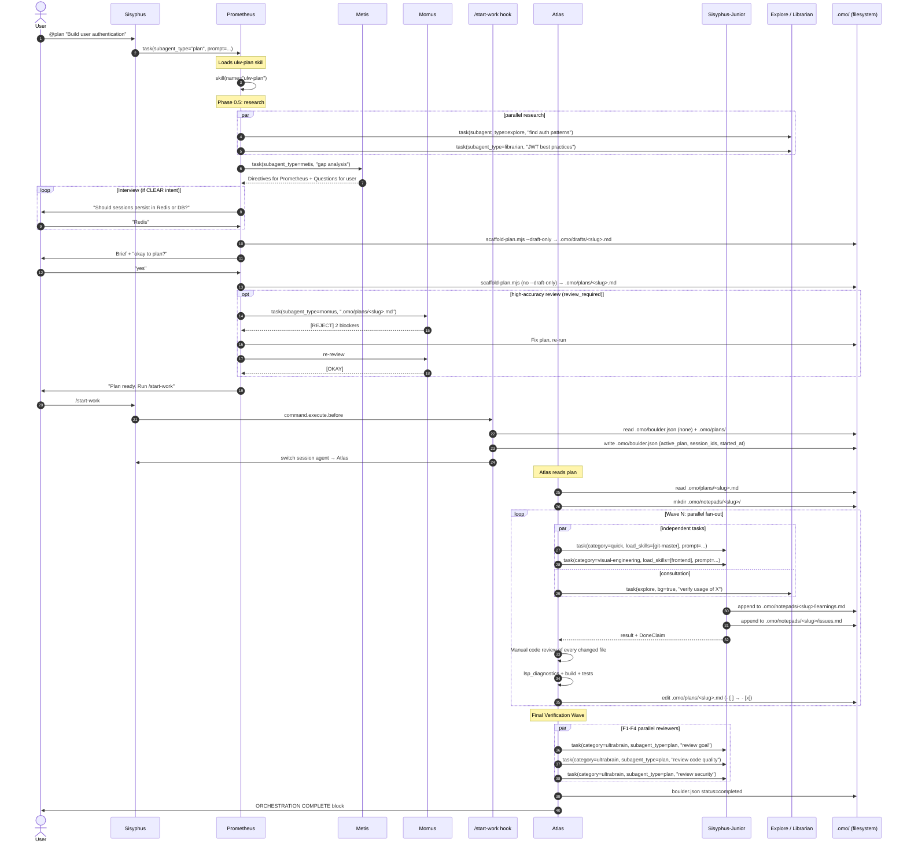

# oh-my-openagent Harness Analysis

**Analyzed**: 2026-07-17
**Frozen commit**: [00235071f5c8fae520cf42ed2ca1430bdfca1e80](https://github.com/code-yeongyu/oh-my-openagent/tree/00235071f5c8fae520cf42ed2ca1430bdfca1e80)
**GitHub**: https://github.com/code-yeongyu/oh-my-openagent
**Version studied**: 4.19.0 ([`package.json:3`](https://github.com/code-yeongyu/oh-my-openagent/blob/00235071f5c8fae520cf42ed2ca1430bdfca1e80/package.json#L3))

## Executive Summary

- **The harness is an OpenCode *plugin*, not a repo of agent markdown.** All 11 agents are built in TypeScript under [`packages/omo-opencode/src/agents/`](https://github.com/code-yeongyu/oh-my-openagent/tree/00235071f5c8fae520cf42ed2ca1430bdfca1e80/packages/omo-opencode/src/agents). 10 of them (sisyphus, hephaestus, oracle, librarian, explore, multimodal-looker, metis, momus, atlas, sisyphus-junior) are registered via `agentSources` in [`builtin-agents.ts`](https://github.com/code-yeongyu/oh-my-openagent/blob/00235071f5c8fae520cf42ed2ca1430bdfca1e80/packages/omo-opencode/src/agents/builtin-agents.ts); **Prometheus is special-cased** — it has no `createPrometheusAgent` factory, and its config is constructed directly during agent-config-handler Phase 3 by [`plugin-handlers/prometheus-agent-config-builder.ts`](https://github.com/code-yeongyu/oh-my-openagent/blob/00235071f5c8fae520cf42ed2ca1430bdfca1e80/packages/omo-opencode/src/plugin-handlers/prometheus-agent-config-builder.ts) (see [`agents/AGENTS.md:12`](https://github.com/code-yeongyu/oh-my-openagent/blob/00235071f5c8fae520cf42ed2ca1430bdfca1e80/packages/omo-opencode/src/agents/AGENTS.md#L12)). The prompts are large model-specific bodies (Sisyphus alone has 11 per-family prompt builders, e.g. [`sisyphus/claude-opus-4-7.ts`](https://github.com/code-yeongyu/oh-my-openagent/blob/00235071f5c8fae520cf42ed2ca1430bdfca1e80/packages/omo-opencode/src/agents/sisyphus/claude-opus-4-7.ts), [`sisyphus/kimi-k3.ts`](https://github.com/code-yeongyu/oh-my-openagent/blob/00235071f5c8fae520cf42ed2ca1430bdfca1e80/packages/omo-opencode/src/agents/sisyphus/kimi-k3.ts), [`sisyphus/gpt-5-5.ts`](https://github.com/code-yeongyu/oh-my-openagent/blob/00235071f5c8fae520cf42ed2ca1430bdfca1e80/packages/omo-opencode/src/agents/sisyphus/gpt-5-5.ts); the directory's `index.ts` is a barrel export, not a prompt builder) plus a few markdown templates in [`packages/prompts-core/prompts/`](https://github.com/code-yeongyu/oh-my-openagent/blob/00235071f5c8fae520cf42ed2ca1430bdfca1e80/packages/prompts-core/prompts) (atlas, prometheus, ultrawork). There is *no* `~/.config/opencode/agents/sisyphus.md` to edit — you tune via `agents.*` config in `oh-my-openagent.jsonc`.
- **The recommended user-facing flow has exactly three modes**, and the docs are explicit about which to pick when ([`docs/guide/orchestration.md:9-26`](https://github.com/code-yeongyu/oh-my-openagent/blob/00235071f5c8fae520cf42ed2ca1430bdfca1e80/docs/guide/orchestration.md#L9-L26)): (1) just prompt normally for simple things, (2) type `ultrawork`/`ulw` for "I'm lazy, figure it out" complex work, (3) `@plan` (or Tab→Prometheus) → answer interview → `/start-work` for precise multi-step work. The default entry point is just **type `ultrawork`** ([`README.md:198-204`](https://github.com/code-yeongyu/oh-my-openagent/blob/00235071f5c8fae520cf42ed2ca1430bdfca1e80/README.md#L198-L204)).
- **Everything goes under `.omo/`.** All durable artifacts — Prometheus plans, Boulder state, notepads, evidence, goal, tasks, rules, team state — live under one rooted `.omo/` directory in the project. Prometheus writes plans; `/start-work` reads them, spawns Atlas, and writes Boulder state; Atlas delegates to Sisyphus-Junior / Oracle / Explore / Librarian and reads/appends wisdom notepads between delegations.
- **`AGENTS.md` and `.opencode/` in *this* repo are mostly harness-self-dev artifacts, not user-flow material.** The project's own root [`AGENTS.md`](https://github.com/code-yeongyu/oh-my-openagent/blob/00235071f5c8fae520cf42ed2ca1430bdfca1e80/AGENTS.md) mandates the `work-with-pr` skill + `opencode-qa`/`codex-qa` skills for any change to the harness itself. The `.opencode/` and `.agents/` directories ship the slash commands and skills the harness uses to develop itself (`/publish`, `/get-unpublished-changes`, `pre-publish-review`, `work-with-pr`, `github-triage`, etc.). The user-facing built-in commands (`/start-work`, `/goal`, `/refactor`, `/handoff`, `/stop-continuation`, `/hyperplan`, `/remove-ai-slops`) are code-generated in [`packages/omo-opencode/src/features/builtin-commands/templates/`](https://github.com/code-yeongyu/oh-my-openagent/blob/00235071f5c8fae520cf42ed2ca1430bdfca1e80/packages/omo-opencode/src/features/builtin-commands/templates/start-work.ts). (`/init-deep` is **not** a template — it ships as a Skill loaded from [`packages/shared-skills/skills/init-deep/SKILL.md`](https://github.com/code-yeongyu/oh-my-openagent/blob/00235071f5c8fae520cf42ed2ca1430bdfca1e80/packages/shared-skills/skills/init-deep/SKILL.md); the test at [`init-deep-migration.test.ts:14`](https://github.com/code-yeongyu/oh-my-openagent/blob/00235071f5c8fae520cf42ed2ca1430bdfca1e80/packages/omo-opencode/src/features/builtin-commands/init-deep-migration.test.ts#L14) explicitly asserts `commands["init-deep"]` is undefined.)
- **Two editions ship from one repo.** **Ultimate** = the OpenCode plugin ([`packages/omo-opencode/`](https://github.com/code-yeongyu/oh-my-openagent/blob/00235071f5c8fae520cf42ed2ca1430bdfca1e80/packages/omo-opencode/src/AGENTS.md)) — 11 agents, 53 active hooks by default (58 composed slots, 62 max with team mode), team-mode, hashline edits, the works. **Light** = `lazycodex-ai` for OpenAI Codex CLI ([`packages/omo-codex/`](https://github.com/code-yeongyu/oh-my-openagent/blob/00235071f5c8fae520cf42ed2ca1430bdfca1e80/packages/omo-codex/AGENTS.md)) — the user-facing [`docs/guide/installation.md:6`](https://github.com/code-yeongyu/oh-my-openagent/blob/00235071f5c8fae520cf42ed2ca1430bdfca1e80/docs/guide/installation.md#L6) lists 8 portable components (`rules`, `comment-checker`, `git-bash`, `lsp`, `ultrawork`, `ulw-loop`, `start-work-continuation`, `telemetry`), but the repo actually ships 14 component directories (`bootstrap`, `codegraph`, `comment-checker`, `git-bash`, `lazycodex-executor-verify`, `lcx`, `lsp`, `rules`, `start-work-continuation`, `teammode`, `telemetry`, `test-support`, `ultrawork`, `ulw-loop`); no agent orchestration either way. This analysis focuses on **Ultimate** because that is the edition that exposes the 11-agent workflow.

## Repo Layout (relevant parts)

```
oh-my-openagent/
├── packages/
│   ├── omo-opencode/                 ← ★ THE OpenCode plugin (Ultimate). Build entry: src/index.ts
│   │   └── src/
│   │       ├── agents/               ← 11 built-in agent definitions (TS, not .md)
│   │       │   ├── builtin-agents.ts     ← registry of 10 agents (agentSources); Prometheus is special-cased in plugin-handlers/
│   │       │   ├── sisyphus*.ts          ← Sisyphus orchestrator (+ 11 model-specific prompt builders under sisyphus/)
│   │       │   ├── hephaestus/           ← Hephaestus deep worker
│   │       │   ├── prometheus/           ← Prometheus planner (loads ulw-plan skill)
│   │       │   ├── atlas/                ← Atlas todo-list orchestrator
│   │       │   ├── oracle.ts             ← read-only architecture consultant
│   │       │   ├── librarian.ts          ← docs/OSS search
│   │       │   ├── explore.ts            ← codebase grep
│   │       │   ├── metis.ts              ← pre-planning gap analyzer
│   │       │   ├── momus.ts              ← plan reviewer
│   │       │   ├── multimodal-looker.ts  ← vision
│   │       │   └── sisyphus-junior/      ← category-spawned task executor
│   │       ├── hooks/                ← 53 active by default / 58 composed slots / 62 max with team mode (5-tier composition)
│   │       │   ├── start-work/       ← detects /start-work, switches session to Atlas, seeds boulder.json
│   │       │   ├── goal/             ← per-session goal continuation
│   │       │   ├── keyword-detector/ ← IntentGate: detects `ultrawork`/`search`/`analyze`/`team`
│   │       │   ├── prometheus-md-only/ ← enforces Prometheus can only edit .omo/*.md
│   │       │   ├── comment-checker/  ← strips AI-slop comments
│   │       │   ├── hashline-*        ← `LINE#ID` content-hashed edits
│   │       │   ├── directory-agents-injector/ ← auto-injects AGENTS.md
│   │       │   ├── rules-injector/   ← auto-injects .omo/rules/*.md
│   │       │   └── … ~50 more
│   │       ├── tools/                ← 14 native tool dirs; LSP via built-in MCP
│   │       ├── features/             ← 23 modules (team-mode, background-agent, builtin-commands, builtin-skills, …)
│   │       │   ├── builtin-commands/templates/  ← /goal /refactor /start-work /handoff /stop-continuation /hyperplan /remove-ai-slops
│   │       │   └── opencode-skill-loader/       ← loads .opencode/skills/ + ~/.config/opencode/skills/
│   │       ├── mcp/                  ← 5 built-in MCPs: websearch, context7, grep_app, lsp, codegraph
│   │       ├── cli/                  ← `oh-my-openagent install|run|doctor|cleanup|…`
│   │       ├── config/schema/        ← Zod v4 schema (37 schema files)
│   │       └── plugin/ plugin-handlers/ ← OpenCode hook handlers + 6-phase config pipeline
│   ├── prompts-core/                 ← prompt MARKDOWN for atlas/prometheus/ultrawork (loaded at runtime)
│   │   └── prompts/
│   │       ├── atlas/{default,gpt,gemini,kimi,kimi-k3,kimi-k2-7,opus-4-7,glm}.md
│   │       ├── prometheus/default.md ← 5 lines; defers to ulw-plan skill
│   │       ├── ultrawork/{default,gpt,gemini,glm,codex,planner}.md
│   │       └── mode/{hyperplan,team}.md
│   ├── shared-skills/                ← cross-harness SKILL.md bundle (shipped to both editions)
│   │   └── skills/
│   │       ├── ulw-plan/SKILL.md     ← Prometheus planning consultant (loaded by Prometheus agent)
│   │       ├── start-work/SKILL.md   ← Atlas execution skill (Codex-flavored)
│   │       ├── ulw-research/         ← maximum-saturation research mode
│   │       ├── init-deep/            ← hierarchical AGENTS.md generator
│   │       ├── refactor/             ← /refactor slash skill
│   │       ├── review-work/          ← 5-parallel-agent post-impl review
│   │       ├── frontend/             ← UI/UX design-first
│   │       ├── git-master/           ← atomic commits, rebase surgery
│   │       ├── ast-grep/             ← structural search/rewrite via `sg`
│   │       ├── debugging/ lsp-setup/ programming/ remove-ai-slops/ ultimate-browsing/ visual-qa/ coding-agent-sessions/
│   ├── skills-loader-core/           ← runtime skill loader + builtin skills (frontend, git-master, playwright, …)
│   ├── omo-codex/                    ← Codex Light edition adapter
│   ├── omo-senpi/ senpi-task/ pi-goal/ pi-webfetch/  ← Pi adapter (local-path Pi package)
│   └── … 19 *-core packages (pure-TS shared logic: hashline-core, lsp-core, tmux-core, rules-engine, …)
├── docs/                             ← USER-FACING docs
│   ├── guide/                        ← overview, installation, orchestration, agent-model-matching, team-mode
│   ├── reference/                    ← features, configuration, cli, omo-json, …
│   └── manifesto.md                  ← philosophy
├── .opencode/                        ← PROJECT-SCOPE (for harness self-dev) — NOT user runtime
│   ├── command/                      ← /publish /get-unpublished-changes /remove-deadcode /security-research /omomomo
│   ├── skills/                       ← work-with-pr, hyperplan, pre-publish-review, github-triage (+ evals)
│   └── AGENTS.md                     ← describes the 5 skills + 5 commands above
├── .agents/                          ← migration target superset of .opencode/ (same content + more)
├── .claude/ .codex/ .cursor/         ← per-harness wiring for self-dev (Claude settings.json, Codex setup.sh, …)
├── .omo/                             ← PROJECT QA evidence + rules (this is the same .omo/ users get at runtime)
│   ├── evidence/<YYYYMMDD>-<slug>/   ← mandatory QA evidence (harness self-dev)
│   └── rules/*.md                    ← project rules auto-injected into agent context
├── AGENTS.md                         ← SELF-DEV contract (391 lines): QA mandate, work-with-pr, PR merge policy
├── README.md                         ← canonical user-facing install + marketing
└── package.json                      ← npm package `oh-my-opencode` with bin aliases `oh-my-openagent`, `omo`, `lazycodex`, `lazycodex-ai` (single package, 5 bin entries)
```

**Three distinctions to keep straight:**

1. `packages/omo-opencode/src/` is the **runtime** — this is what executes when a user installs the plugin. The `.ts` files build the agents, hooks, tools, and commands.
2. `.opencode/` + `.agents/` in *this* repo are **project-self-dev artifacts** — they are picked up *by the harness's own OpenCode sessions* when developing the harness. They are NOT the user-facing built-in commands or skills. The user-facing commands live in code at [`packages/omo-opencode/src/features/builtin-commands/templates/`](https://github.com/code-yeongyu/oh-my-openagent/blob/00235071f5c8fae520cf42ed2ca1430bdfca1e80/packages/omo-opencode/src/features/builtin-commands/templates/start-work.ts).
3. `.omo/` is the **runtime workspace** for the user's project — plans, boulder state, notepads, evidence. In *this* repo it happens to contain evidence of the harness's own QA runs.

## Q1 — Recommended User-Facing Flow(s)

The canonical decision tree is in [`docs/guide/orchestration.md:9-26`](https://github.com/code-yeongyu/oh-my-openagent/blob/00235071f5c8fae520cf42ed2ca1430bdfca1e80/docs/guide/orchestration.md#L9-L26):

> | Complexity            | Approach                  | When to Use                                                                              |
> | --------------------- | ------------------------- | ---------------------------------------------------------------------------------------- |
> | **Simple**            | Just prompt               | Simple tasks, quick fixes, single-file changes                                           |
> | **Complex + Lazy**    | Type `ulw` or `ultrawork` | Complex tasks where explaining context is tedious. Agent figures it out.                 |
> | **Complex + Precise** | `@plan` → `/start-work`   | Precise, multi-step work requiring true orchestration. Prometheus plans, Atlas executes. |

And the README's headline answer is "Install. Type `ultrawork` (or `ulw`). Done." ([`README.md:198-204`](https://github.com/code-yeongyu/oh-my-openagent/blob/00235071f5c8fae520cf42ed2ca1430bdfca1e80/README.md#L198-L204)).

### Flow A — Ultrawork (the default, lazy path)

This is the recommended default for "I have a complex task but I don't want to write a spec." Verified chain:

1. **User types `ultrawork` (or `ulw`)** in OpenCode with the Sisyphus agent selected (default).
2. **IntentGate fires.** The [`keyword-detector`](https://github.com/code-yeongyu/oh-my-openagent/blob/00235071f5c8fae520cf42ed2ca1430bdfca1e80/packages/omo-opencode/src/hooks/keyword-detector) hook catches the keyword on `chat.message` and injects the ultrawork directive into the Sisyphus system prompt for that turn ([`docs/reference/features.md:880`](https://github.com/code-yeongyu/oh-my-openagent/blob/00235071f5c8fae520cf42ed2ca1430bdfca1e80/docs/reference/features.md#L880)).
3. **The ultrawork directive body** is loaded from [`packages/prompts-core/prompts/ultrawork/default.md`](https://github.com/code-yeongyu/oh-my-openagent/blob/00235071f5c8fae520cf42ed2ca1430bdfca1e80/packages/prompts-core/prompts/ultrawork/default.md) (or `gpt.md`/`gemini.md`/`glm.md` based on model family). It is 331 lines and is the source of the "MANDATORY: You MUST say 'ULTRAWORK MODE ENABLED!'" rule plus the entire delegation protocol.
4. **Sisyphus plans → delegates → verifies.** Per the ultrawork directive, Sisyphus MUST call the plan agent (`task(subagent_type="plan", ...)`) for any 2+ step task, then fan out implementation via `task(category="...", load_skills=["..."], run_in_background=true)` to **Sisyphus-Junior**, research via `task(subagent_type="explore"/"librarian", run_in_background=true)`, and architecture consultation via `task(subagent_type="oracle")` ([`packages/prompts-core/prompts/ultrawork/default.md:89-138`](https://github.com/code-yeongyu/oh-my-openagent/blob/00235071f5c8fae520cf42ed2ca1430bdfca1e80/packages/prompts-core/prompts/ultrawork/default.md#L89-L138)).
5. **Sisyphus does NOT touch `.omo/`** in ultrawork mode (no plan file is written). It writes a durable notepad under OS temp dir (`mktemp -t ulw-…`) — see [`ultrawork/default.md:213-228`](https://github.com/code-yeongyu/oh-my-openagent/blob/00235071f5c8fae520cf42ed2ca1430bdfca1e80/packages/prompts-core/prompts/ultrawork/default.md#L213-L228).
6. **Todo Enforcer + Goal continuation** ([`todo-continuation-enforcer`](https://github.com/code-yeongyu/oh-my-openagent/blob/00235071f5c8fae520cf42ed2ca1430bdfca1e80/packages/omo-opencode/src/hooks/todo-continuation-enforcer), [`goal`](https://github.com/code-yeongyu/oh-my-openagent/blob/00235071f5c8fae520cf42ed2ca1430bdfca1e80/packages/omo-opencode/src/hooks/goal)) yank Sisyphus back to work on idle until the contract is satisfied.

> **Net**: `ultrawork` → Sisyphus uses `task(subagent_type="plan")` → fires parallel `explore`/`librarian` → delegates implementation via `task(category=...)` to Sisyphus-Junior → consults Oracle on hard problems → verifies each scenario with both RED→GREEN test proof AND a real-surface QA artifact (curl, browser, tmux). No `.omo/plans/*.md` is produced.

### Flow B — Plan then Execute (precise path, multi-day projects)

This is the recommended flow when the work is large, you want a documented plan, or you need verifiable execution. Verified chain — quoted from [`docs/guide/orchestration.md:401-487`](https://github.com/code-yeongyu/oh-my-openagent/blob/00235071f5c8fae520cf42ed2ca1430bdfca1e80/docs/guide/orchestration.md#L401-L487):

1. **User invokes Prometheus** — either:
   - Press **Tab** in OpenCode → select **Prometheus** → describe work, OR
   - Stay in Sisyphus and type `@plan "<task>"` (convenience shortcut).
2. **Prometheus loads `ulw-plan` skill.** The Prometheus system prompt ([`packages/prompts-core/prompts/prometheus/default.md`](https://github.com/code-yeongyu/oh-my-openagent/blob/00235071f5c8fae520cf42ed2ca1430bdfca1e80/packages/prompts-core/prompts/prometheus/default.md)) is just 5 lines; its first instruction is *"LOAD the ulw-plan skill — call the `skill` tool with `skill(name="ulw-plan")` — and read it before anything else."* The real interview/plan logic lives in [`packages/shared-skills/skills/ulw-plan/SKILL.md`](https://github.com/code-yeongyu/oh-my-openagent/blob/00235071f5c8fae520cf42ed2ca1430bdfca1e80/packages/shared-skills/skills/ulw-plan/SKILL.md).
3. **Prometheus runs scaffold-plan.mjs** to create `.omo/drafts/<slug>.md` (resume-safe draft), interviews the user (or adopts best-practice defaults when intent is fuzzy), and on approval writes **`.omo/plans/<slug>.md`** via the scaffold script without `--draft-only` ([`ulw-plan/SKILL.md:34-44`](https://github.com/code-yeongyu/oh-my-openagent/blob/00235071f5c8fae520cf42ed2ca1430bdfca1e80/packages/shared-skills/skills/ulw-plan/SKILL.md#L34-L44)).
4. **Optional: Momus review loop.** If the user said "high accuracy" or intent was Unclear+non-trivial, Prometheus invokes **Momus** (and Oracle for an independent review) on the plan, loops until both APPROVE, then hands off ([`ulw-plan/SKILL.md:17-32`](https://github.com/code-yeongyu/oh-my-openagent/blob/00235071f5c8fae520cf42ed2ca1430bdfca1e80/packages/shared-skills/skills/ulw-plan/SKILL.md#L17-L32)).
5. **User types `/start-work [plan-name]`.** The [`start-work` hook](https://github.com/code-yeongyu/oh-my-openagent/blob/00235071f5c8fae520cf42ed2ca1430bdfca1e80/packages/omo-opencode/src/hooks/start-work/start-work-hook.ts) fires on `command.execute.before`, reads `.omo/boulder.json` if present (resume) or finds the most recent plan, switches the session agent to **Atlas**, and injects session/worktree context into the template ([`builtin-commands/templates/start-work.ts`](https://github.com/code-yeongyu/oh-my-openagent/blob/00235071f5c8fae520cf42ed2ca1430bdfca1e80/packages/omo-opencode/src/features/builtin-commands/templates/start-work.ts)).
6. **Atlas reads the plan and orchestrates.** Atlas's prompt body is loaded from [`packages/prompts-core/prompts/atlas/default.md`](https://github.com/code-yeongyu/oh-my-openagent/blob/00235071f5c8fae520cf42ed2ca1430bdfca1e80/packages/prompts-core/prompts/atlas/default.md) (502 lines). It fan-outs every non-dependent checkbox in ONE parallel `task()` burst, marks `- [ ]` → `- [x]` in the plan after each task passes verification, and runs a Final Verification Wave (F1-F4 reviewers) before declaring complete.
7. **Atlas delegates implementation** to Sisyphus-Junior (`task(category="...", load_skills=[...])`) and consultation to Oracle/Explore/Librarian. Atlas itself is FORBIDDEN from writing/editing code ([`atlas/default.md:417-434`](https://github.com/code-yeongyu/oh-my-openagent/blob/00235071f5c8fae520cf42ed2ca1430bdfca1e80/packages/prompts-core/prompts/atlas/default.md#L417-L434)).
8. **Wisdom accumulates** under `.omo/notepads/<plan-name>/{learnings,decisions,issues,problems,verification}.md`. Atlas reads them before each delegation and includes content as "Inherited Wisdom" in every task prompt.
9. **Boulder state** in `.omo/boulder.json` tracks `active_plan`, `session_ids`, `started_at`. On the next session, `/start-work` detects the boulder and resumes ([`orchestration.md:461-485`](https://github.com/code-yeongyu/oh-my-openagent/blob/00235071f5c8fae520cf42ed2ca1430bdfca1e80/docs/guide/orchestration.md#L461-L485)).
10. **Boulder-complete nudge.** When every top-level checkbox flips to `- [x]`, the boulder-state hook injects ONE "BOULDER COMPLETE" nudge into Atlas's session; Atlas then prints `ORCHESTRATION COMPLETE` and confirms `status: "completed"` in `boulder.json` ([`atlas/default.md:474-501`](https://github.com/code-yeongyu/oh-my-openagent/blob/00235071f5c8fae520cf42ed2ca1430bdfca1e80/packages/prompts-core/prompts/atlas/default.md#L474-L501)).

### Flow C — Hephaestus (deep-autonomous path)

For deep architectural reasoning or GPT-native autonomous work, switch to **Hephaestus** directly (Tab → Hephaestus). Verified from [`docs/guide/orchestration.md:489-545`](https://github.com/code-yeongyu/oh-my-openagent/blob/00235071f5c8fae520cf42ed2ca1430bdfca1e80/docs/guide/orchestration.md#L489-L545) and [`packages/omo-opencode/src/agents/hephaestus/gpt.ts`](https://github.com/code-yeongyu/oh-my-openagent/blob/00235071f5c8fae520cf42ed2ca1430bdfca1e80/packages/omo-opencode/src/agents/hephaestus/gpt.ts):

- Hephaestus only runs on GPT-5.3-codex/5.4/5.5/5.6 — a hard model guard ([`hephaestus/agent.ts:42-57`](https://github.com/code-yeongyu/oh-my-openagent/blob/00235071f5c8fae520cf42ed2ca1430bdfca1e80/packages/omo-opencode/src/agents/hephaestus/agent.ts#L42-L57)).
- Give it a goal, not a recipe. It self-plans, fires parallel explore/librarian, delegates complex implementation via `task(category=...)`, and verifies with `lsp_diagnostics` + build + tests.
- It does NOT use `.omo/plans/*.md` unless one already exists. It writes progress notes inline.

### Flow D — Init a fresh repo (`/init-deep`)

For the very first step in a new project, run **`/init-deep`** ([`docs/reference/features.md:346-365`](https://github.com/code-yeongyu/oh-my-openagent/blob/00235071f5c8fae520cf42ed2ca1430bdfca1e80/docs/reference/features.md#L346-L365), [`shared-skills/skills/init-deep/SKILL.md`](https://github.com/code-yeongyu/oh-my-openagent/blob/00235071f5c8fae520cf42ed2ca1430bdfca1e80/packages/shared-skills/skills/init-deep/SKILL.md)). It generates hierarchical `AGENTS.md` files (root + complexity-scored subdirectories) that every subsequent agent then auto-reads via the [`directory-agents-injector`](https://github.com/code-yeongyu/oh-my-openagent/blob/00235071f5c8fae520cf42ed2ca1430bdfca1e80/packages/omo-opencode/src/hooks/directory-agents-injector) hook.

### Auxiliary flows

- **`/goal "<objective>"`** — set a persistent thread goal; re-injects a continuation prompt on every `session.idle` until `update_goal({ status: "complete" })` is called ([`builtin-commands/templates/goal.ts`](https://github.com/code-yeongyu/oh-my-openagent/blob/00235071f5c8fae520cf42ed2ca1430bdfca1e80/packages/omo-opencode/src/features/builtin-commands/templates/goal.ts), [`docs/reference/features.md:367-411`](https://github.com/code-yeongyu/oh-my-openagent/blob/00235071f5c8fae520cf42ed2ca1430bdfca1e80/docs/reference/features.md#L367-L411)). Stored in `.omo/goal/<sessionID>.json`. Requires `goal.enabled: true`.
- **`/refactor <target>`** — LSP + ast-grep + TDD refactor command ([`builtin-commands/templates/refactor.ts`](https://github.com/code-yeongyu/oh-my-openagent/blob/00235071f5c8fae520cf42ed2ca1430bdfca1e80/packages/omo-opencode/src/features/builtin-commands/templates/refactor.ts)).
- **`/handoff`** — generate a structured context summary for continuing in a fresh session.
- **`/stop-continuation`** — kill all continuation mechanisms (Goal, todo, Boulder) for this session.
- **`ulw-research`** — explicit keyword that activates a maximum-saturation research swarm (parallel explore+librarian across code/web/docs/OSS, recursive EXPAND loop). Only activates on explicit user demand ([`shared-skills/skills/ulw-research/SKILL.md:1-4`](https://github.com/code-yeongyu/oh-my-openagent/blob/00235071f5c8fae520cf42ed2ca1430bdfca1e80/packages/shared-skills/skills/ulw-research/SKILL.md#L1-L4)).
- **`review-work`** — post-implementation review orchestrator. Fires 5 parallel background sub-agents (3× Oracle for goal/quality/security, 2× unspecified-high for QA + context mining). All must pass for review to pass ([`shared-skills/skills/review-work/SKILL.md:60-72`](https://github.com/code-yeongyu/oh-my-openagent/blob/00235071f5c8fae520cf42ed2ca1430bdfca1e80/packages/shared-skills/skills/review-work/SKILL.md#L60-L72)).
- **`/hyperplan`** — adversarial multi-agent planning via team-mode (5 hostile category members cross-critique; lead synthesizes). Requires `team_mode.enabled: true` ([`.opencode/skills/hyperplan/SKILL.md`](https://github.com/code-yeongyu/oh-my-openagent/blob/00235071f5c8fae520cf42ed2ca1430bdfca1e80/.opencode/skills/hyperplan/SKILL.md), [`builtin-commands/templates/hyperplan.ts`](https://github.com/code-yeongyu/oh-my-openagent/blob/00235071f5c8fae520cf42ed2ca1430bdfca1e80/packages/omo-opencode/src/features/builtin-commands/templates/hyperplan.ts)).
- **`/security-research`** — Team Mode security audit (3 vulnerability hunters + 2 PoC engineers) ([`.agents/command/security-research.md`](https://github.com/code-yeongyu/oh-my-openagent/blob/00235071f5c8fae520cf42ed2ca1430bdfca1e80/.agents/command/security-research.md), [`skills-loader-core/src/features/builtin-skills/skills/security-research.ts`](https://github.com/code-yeongyu/oh-my-openagent/blob/00235071f5c8fae520cf42ed2ca1430bdfca1e80/packages/skills-loader-core/src/features/builtin-skills/skills/security-research.ts)).

## Q2 — Artifacts

Everything user-runtime goes under **`.omo/`** in the user's project. The layout (verified from [`orchestration.md:260-267`](https://github.com/code-yeongyu/oh-my-openagent/blob/00235071f5c8fae520cf42ed2ca1430bdfca1e80/docs/guide/orchestration.md#L260-L267), [`start-work/SKILL.md`](https://github.com/code-yeongyu/oh-my-openagent/blob/00235071f5c8fae520cf42ed2ca1430bdfca1e80/packages/shared-skills/skills/start-work/SKILL.md), [`atlas/default.md:402-405`](https://github.com/code-yeongyu/oh-my-openagent/blob/00235071f5c8fae520cf42ed2ca1430bdfca1e80/packages/prompts-core/prompts/atlas/default.md#L402-L405), [`docs/reference/features.md`](https://github.com/code-yeongyu/oh-my-openagent/blob/00235071f5c8fae520cf42ed2ca1430bdfca1e80/docs/reference/features.md)):

| Path | Written by | Read by | Purpose |
|------|-----------|---------|---------|
| `.omo/drafts/<slug>.md` | Prometheus (via `scaffold-plan.mjs --draft-only`) | Prometheus on resume | Compaction-safe resume point; records `intent`, `review_required`, decisions, approval gate state |
| `.omo/plans/<slug>.md` | Prometheus (via `scaffold-plan.mjs` after approval) | Atlas via `/start-work`; Momus during review | The decision-complete plan: `## Todos` (column-zero `- [ ] N.` rows), `## Final Verification Wave` (`- [ ] F1.` rows), acceptance criteria, QA scenarios |
| `.omo/boulder.json` | `/start-work` hook (work-initializer.ts); Atlas on completion | `/start-work` hook on next session; boulder-complete nudge hook | Tracks `active_work_id`, `works[work_id].{active_plan, session_ids, started_at, plan_name, worktree_path, status}` |
| `.omo/notepads/<plan-name>/learnings.md` | Atlas instructs Sisyphus-Junior to append after each task | Atlas reads before EVERY delegation; passes content as "Inherited Wisdom" | Conventions, patterns, successful approaches discovered during execution |
| `.omo/notepads/<plan-name>/decisions.md` | Same | Same | Architectural choices and rationale |
| `.omo/notepads/<plan-name>/issues.md` | Same | Same | Problems, blockers, gotchas |
| `.omo/notepads/<plan-name>/problems.md` | Same | Same | Unresolved issues, technical debt |
| `.omo/notepads/<plan-name>/verification.md` | Same | Same | Test results, validation outcomes (**NOTE**: the Atlas prompt itself at [`atlas/default.md:236-244`](https://github.com/code-yeongyu/oh-my-openagent/blob/00235071f5c8fae520cf42ed2ca1430bdfca1e80/packages/prompts-core/prompts/atlas/default.md#L236-L244) lists only 4 notepad files — `learnings.md`, `decisions.md`, `issues.md`, `problems.md` — without `verification.md`; the 5th file appears only in [`docs/guide/orchestration.md:260-267`](https://github.com/code-yeongyu/oh-my-openagent/blob/00235071f5c8fae520cf42ed2ca1430bdfca1e80/docs/guide/orchestration.md#L260-L267). The Atlas prompt is authoritative for runtime behavior.) |
| `.omo/start-work/ledger.jsonl` | Atlas appends after each checkbox verification (Codex Light path; the Ultimate path uses the notepad system instead) | Final reporting | One JSON per line: `event`, `plan`, `task`, `session_id`, `commands`, `artifact`, `adversarial_classes`, `cleanup` |
| `.omo/goal/<sessionID>.json` | `create_goal` / `update_goal` tools (registered by the goal hook when `goal.enabled`) | `goal` hook on `session.idle` (re-injects continuation); cleared on `session.deleted` | Per-session objective, status (`active`/`paused`/`complete`), `tokensUsed`, `timeUsedSeconds` |
| `.omo/tasks/<id>.json` | `task_create` / `task_update` tools (gated on `experimental.task_system`) | `task_get` / `task_list` tools | Persistent task graph with `blockedBy`/`blocks` dependencies |
| `.omo/teams/<name>/config.json` | User (or `team_create` from a spec) | team-mode tool family | Team spec: `lead`, `members[]` (each `kind: "subagent_type"` or `kind: "category"`) |
| `.omo/teams/<name>/state.json` | team-mode event handlers | `team_status` | Runtime state |
| `.omo/teams/<name>/mailbox/` | `team_send_message` | Members poll on `mailbox_poll_interval_ms` | Peer-to-peer messages |
| `.omo/teams/<name>/tasklist.jsonl` | `team_task_create` / `team_task_update` | `team_task_list` | Shared task list with file-locked claims |
| `.omo/teams/<name>/worktrees/` | `team_create` when per-member worktree configured | Members run inside their worktree | Per-member git worktrees |
| `.omo/ulw-loop/` | ulw-loop state engine | ulw-loop continuation hook | Durable multi-goal orchestration state |
| `.omo/rules/*.md` | User (project rules) | [`rules-injector`](https://github.com/code-yeongyu/oh-my-openagent/blob/00235071f5c8fae520cf42ed2ca1430bdfca1e80/packages/omo-opencode/src/hooks/rules-injector) hook auto-injects into agent context when `globs` match | Conditional rules (frontmatter `globs`/`alwaysApply`) |
| `.omo/evidence/<YYYYMMDD>-<slug>/` | Skill-driven QA scripts (e.g. `opencode-qa`, `codex-qa`, `work-with-pr`) | Reviewer (e.g. `pre-publish-review`, `work-with-pr`) | Plain files: what was tested, what was observed, why it is enough, what was omitted |
| `.omo/session-work/` | Background agents (when project AGENTS.md mandates it) | Main agent | Scratch space for clones, downloaded docs (project rule can force this instead of `/tmp`) |
| `AGENTS.md` (per directory) | User | [`directory-agents-injector`](https://github.com/code-yeongyu/oh-my-openagent/blob/00235071f5c8fae520cf42ed2ca1430bdfca1e80/packages/omo-opencode/src/hooks/directory-agents-injector) hook walks file→root and injects every `AGENTS.md` it finds | Hierarchical project context — `/init-deep` generates these |

**Key writers and readers at a glance:**

- **Prometheus** writes `.omo/drafts/*.md` and `.omo/plans/*.md`; reads none (only its draft on resume).
- **Metis** reads the user's request; writes nothing (read-only).
- **Momus** reads `.omo/plans/*.md`; writes nothing (verdict-only).
- **`/start-work` hook** reads `.omo/boulder.json` + `.omo/plans/`; writes `.omo/boulder.json`; switches session agent to Atlas.
- **Atlas** reads `.omo/plans/*.md` + `.omo/notepads/<plan>/*.md`; writes plan checkboxes (`- [ ]`→`- [x]`) and notepad entries via delegated subagents.
- **Sisyphus-Junior** (delegated by Atlas) reads inherited wisdom from notepads; appends findings back to notepads; never reads the plan directly.
- **Goal hook** reads/writes `.omo/goal/<sessionID>.json`.

## Q3 — Agent-by-Agent Breakdown

The 11 built-in agents are registered in [`packages/omo-opencode/src/agents/builtin-agents.ts`](https://github.com/code-yeongyu/oh-my-openagent/blob/00235071f5c8fae520cf42ed2ca1430bdfca1e80/packages/omo-opencode/src/agents/builtin-agents.ts) and typed in [`packages/omo-opencode/src/agents/types.ts`](https://github.com/code-yeongyu/oh-my-openagent/blob/00235071f5c8fae520cf42ed2ca1430bdfca1e80/packages/omo-opencode/src/agents/types.ts). The canonical primary-agent cycle order is **Sisyphus → Hephaestus → Prometheus → Atlas** ([`docs/reference/features.md:9`](https://github.com/code-yeongyu/oh-my-openagent/blob/00235071f5c8fae520cf42ed2ca1430bdfca1e80/docs/reference/features.md#L9), enforced by `installAgentSortShim` per [`AGENTS.md:258`](https://github.com/code-yeongyu/oh-my-openagent/blob/00235071f5c8fae520cf42ed2ca1430bdfca1e80/AGENTS.md#L258)).

### Agent: Sisyphus (primary orchestrator)

- **File**: [`packages/omo-opencode/src/agents/sisyphus.ts`](https://github.com/code-yeongyu/oh-my-openagent/blob/00235071f5c8fae520cf42ed2ca1430bdfca1e80/packages/omo-opencode/src/agents/sisyphus.ts) (10 lines, metadata) + factory in [`sisyphus-agent-factory.ts`](https://github.com/code-yeongyu/oh-my-openagent/blob/00235071f5c8fae520cf42ed2ca1430bdfca1e80/packages/omo-opencode/src/agents/sisyphus-agent-factory.ts) + per-model prompt builders in [`sisyphus/{claude-opus-4-7,claude-opus-4-8,claude-fable-5,kimi-k3,kimi-k2-7,kimi-k2-6,gemini,glm-5-2,gpt-5-4,gpt-5-5,default}.ts`](https://github.com/code-yeongyu/oh-my-openagent/blob/00235071f5c8fae520cf42ed2ca1430bdfca1e80/packages/omo-opencode/src/agents/sisyphus/default.ts) (~4,353 LOC directory total / ~4,320 prompt-builder-only; the 11 prompt builders are listed in the `index.ts` barrel comment at [`sisyphus/index.ts:17-34`](https://github.com/code-yeongyu/oh-my-openagent/blob/00235071f5c8fae520cf42ed2ca1430bdfca1e80/packages/omo-opencode/src/agents/sisyphus/index.ts#L17-L34)).
- **Mode**: `primary`.
- **Purpose**: Default orchestrator. Plans, delegates to specialists, drives tasks to completion with aggressive parallel execution. Named after Sisyphus because the Todo Enforcer hook yanks idle agents back to work — the "boulder-pushing" mechanism that [`orchestration.md:308`](https://github.com/code-yeongyu/oh-my-openagent/blob/00235071f5c8fae520cf42ed2ca1430bdfca1e80/docs/guide/orchestration.md#L308) says is "why the system is named after Sisyphus." (The boulder-pushing prose at [`orchestration.md:295-308`](https://github.com/code-yeongyu/oh-my-openagent/blob/00235071f5c8fae520cf42ed2ca1430bdfca1e80/docs/guide/orchestration.md#L295-L308) is in the *Sisyphus-Junior* section, but the same `todo-continuation-enforcer` hook applies to both Sisyphus and Sisyphus-Junior, and the etymology covers the whole Sisyphus family.)
- **Calls as subagents** (via `task(subagent_type=...)` and `task(category=...)`): `explore`, `librarian`, `oracle`, `metis`, `momus`, `plan` (alias for Prometheus), and any category via Sisyphus-Junior.
- **Main vs delegated**: Sisyphus does intent classification, planning, delegation, verification, and user communication. It DOES NOT implement — it delegates implementation via `task(category=..., load_skills=[...])`. The ultrawork directive is explicit: *"YOU are an orchestrator, NOT an implementer"* ([`ultrawork/default.md:110`](https://github.com/code-yeongyu/oh-my-openagent/blob/00235071f5c8fae520cf42ed2ca1430bdfca1e80/packages/prompts-core/prompts/ultrawork/default.md#L110)).
- **Inputs**: User prompt + IntentGate classification. In ultrawork mode, receives the entire 331-line ultrawork directive.
- **Outputs**: Delegation calls; final summary to user. In ultrawork mode, also writes a `mktemp`'d notepad under OS temp dir (NOT `.omo/`).
- **Model-tested**: Claude Fable 5 / Opus 4.8 / 4.7 / Sonnet 4.6, Kimi K3 / K2.7 / K2.6 / K2.5, GLM 5 / 5.1, GPT 5.4 / 5.5. MiniMax and Qwen are explicitly discouraged ([`docs/guide/agent-model-matching.md:27-31`](https://github.com/code-yeongyu/oh-my-openagent/blob/00235071f5c8fae520cf42ed2ca1430bdfca1e80/docs/guide/agent-model-matching.md#L27-L31)).

### Agent: Hephaestus (autonomous deep worker)

- **File**: [`packages/omo-opencode/src/agents/hephaestus/agent.ts`](https://github.com/code-yeongyu/oh-my-openagent/blob/00235071f5c8fae520cf42ed2ca1430bdfca1e80/packages/omo-opencode/src/agents/hephaestus/agent.ts) + per-model prompts: [`gpt.ts`](https://github.com/code-yeongyu/oh-my-openagent/blob/00235071f5c8fae520cf42ed2ca1430bdfca1e80/packages/omo-opencode/src/agents/hephaestus/gpt.ts), [`gpt-5-5.ts`](https://github.com/code-yeongyu/oh-my-openagent/blob/00235071f5c8fae520cf42ed2ca1430bdfca1e80/packages/omo-opencode/src/agents/hephaestus/gpt-5-5.ts), [`gpt-5-6.ts`](https://github.com/code-yeongyu/oh-my-openagent/blob/00235071f5c8fae520cf42ed2ca1430bdfca1e80/packages/omo-opencode/src/agents/hephaestus/gpt-5-6.ts), [`gpt-5-4.ts`](https://github.com/code-yeongyu/oh-my-openagent/blob/00235071f5c8fae520cf42ed2ca1430bdfca1e80/packages/omo-opencode/src/agents/hephaestus/gpt-5-4.ts).
- **Mode**: `primary`.
- **Purpose**: "The Legitimate Craftsman." Autonomous deep worker inspired by AmpCode deep mode. Give it a goal, not a recipe. Explores thoroughly before acting, fires parallel explore/librarian, executes end-to-end without hand-holding ([`docs/guide/overview.md:92-104`](https://github.com/code-yeongyu/oh-my-openagent/blob/00235071f5c8fae520cf42ed2ca1430bdfca1e80/docs/guide/overview.md#L92-L104)).
- **Hard constraint**: Hephaestus ONLY supports GPT-5.3 Codex / 5.4 / 5.5 / 5.6. Throws `UnsupportedHephaestusModelError` otherwise ([`hephaestus/agent.ts:26-57`](https://github.com/code-yeongyu/oh-my-openagent/blob/00235071f5c8fae520cf42ed2ca1430bdfca1e80/packages/omo-opencode/src/agents/hephaestus/agent.ts#L26-L57)). Enforced by the [`no-hephaestus-non-gpt`](https://github.com/code-yeongyu/oh-my-openagent/blob/00235071f5c8fae520cf42ed2ca1430bdfca1e80/packages/omo-opencode/src/hooks/no-hephaestus-non-gpt) hook.
- **Calls as subagents**: `explore`, `librarian`, `oracle` (for help after 3 failed approaches), and `task(category=..., load_skills=[...])` for implementation.
- **Main vs delegated**: Same split as Sisyphus but the persona is "Senior Staff Engineer who works autonomously." Notably: `permission.call_omo_agent: "deny"` ([`hephaestus/agent.ts:178-181`](https://github.com/code-yeongyu/oh-my-openagent/blob/00235071f5c8fae520cf42ed2ca1430bdfca1e80/packages/omo-opencode/src/agents/hephaestus/agent.ts#L178-L181)) — uses `task()` not `call_omo_agent()`.
- **Inputs**: User goal. Execution loop: EXPLORE → PLAN → DECIDE → EXECUTE → VERIFY ([`hephaestus/gpt.ts:222-232`](https://github.com/code-yeongyu/oh-my-openagent/blob/00235071f5c8fae520cf42ed2ca1430bdfca1e80/packages/omo-opencode/src/agents/hephaestus/gpt.ts#L222-L232)).
- **Outputs**: Code changes via delegation; final dense summary.

### Agent: Prometheus (strategic planner)

- **File**: thin prompt at [`packages/prompts-core/prompts/prometheus/default.md`](https://github.com/code-yeongyu/oh-my-openagent/blob/00235071f5c8fae520cf42ed2ca1430bdfca1e80/packages/prompts-core/prompts/prometheus/default.md) (5 lines), loaded by [`packages/omo-opencode/src/agents/prometheus/system-prompt.ts`](https://github.com/code-yeongyu/oh-my-openagent/blob/00235071f5c8fae520cf42ed2ca1430bdfca1e80/packages/omo-opencode/src/agents/prometheus/system-prompt.ts). Agent config assembled by [`plugin-handlers/prometheus-agent-config-builder.ts`](https://github.com/code-yeongyu/oh-my-openagent/blob/00235071f5c8fae520cf42ed2ca1430bdfca1e80/packages/omo-opencode/src/plugin-handlers/prometheus-agent-config-builder.ts). Real prompt body lives in the **`ulw-plan` skill** at [`packages/shared-skills/skills/ulw-plan/SKILL.md`](https://github.com/code-yeongyu/oh-my-openagent/blob/00235071f5c8fae520cf42ed2ca1430bdfca1e80/packages/shared-skills/skills/ulw-plan/SKILL.md) (loaded on first turn via `skill(name="ulw-plan")`).
- **Mode**: `primary`.
- **Purpose**: Strategic planner with interview mode. Turns a vague request into ONE decision-complete plan that a downstream worker executes with zero further interview.
- **Hard constraint**: READ-ONLY for product code. Can only create or modify markdown files under `.omo/`. Enforced by the [`prometheus-md-only`](https://github.com/code-yeongyu/oh-my-openagent/blob/00235071f5c8fae520cf42ed2ca1430bdfca1e80/packages/omo-opencode/src/hooks/prometheus-md-only) hook ([`AGENTS.md:302`](https://github.com/code-yeongyu/oh-my-openagent/blob/00235071f5c8fae520cf42ed2ca1430bdfca1e80/AGENTS.md#L302)).
- **Plan mode is sticky**: *"do X" / "fix X" / "build X" / "just do it" all mean "plan X"* ([`ulw-plan/SKILL.md:12`](https://github.com/code-yeongyu/oh-my-openagent/blob/00235071f5c8fae520cf42ed2ca1430bdfca1e80/packages/shared-skills/skills/ulw-plan/SKILL.md#L12)).
- **Calls as subagents (read-only)**: `explore`, `librarian`, `metis` (gap analysis), `momus` (high-accuracy review). Never `category=` (categories spawn implementers — forbidden in plan mode) ([`ulw-plan/SKILL.md:69-75`](https://github.com/code-yeongyu/oh-my-openagent/blob/00235071f5c8fae520cf42ed2ca1430bdfca1e80/packages/shared-skills/skills/ulw-plan/SKILL.md#L69-L75)).
- **Main vs delegated**: Prometheus does intent classification (CLEAR/UNCLEAR), runs the scaffold script, conducts the interview (if CLEAR) or adopts best-practice defaults (if UNCLEAR), runs the approval gate, optionally runs the Momus loop. It NEVER implements, even via subagent (delegated implementation = implementation).
- **Inputs**: User description + repo (via explore/librarian fans).
- **Outputs**: `.omo/drafts/<slug>.md` (resume point) → on approval → `.omo/plans/<slug>.md` (decision-complete plan with `## Todos` and `## Final Verification Wave`).

### Agent: Atlas (todo-list orchestrator)

- **File**: [`packages/omo-opencode/src/agents/atlas/agent.ts`](https://github.com/code-yeongyu/oh-my-openagent/blob/00235071f5c8fae520cf42ed2ca1430bdfca1e80/packages/omo-opencode/src/agents/atlas/agent.ts) + prompt body at [`packages/prompts-core/prompts/atlas/default.md`](https://github.com/code-yeongyu/oh-my-openagent/blob/00235071f5c8fae520cf42ed2ca1430bdfca1e80/packages/prompts-core/prompts/atlas/default.md) (502 lines; per-model variants for opus-4-7, gpt, gemini, kimi, kimi-k3, kimi-k2-7, glm).
- **Mode**: `primary`.
- **Purpose**: Master orchestrator that executes a Prometheus plan. *"You are a conductor, not a musician. A general, not a soldier. You DELEGATE, COORDINATE, and VERIFY. You never write code yourself."* ([`atlas/default.md:1-8`](https://github.com/code-yeongyu/oh-my-openagent/blob/00235071f5c8fae520cf42ed2ca1430bdfca1e80/packages/prompts-core/prompts/atlas/default.md#L1-L8)).
- **Auto-activated by `/start-work`**: the start-work hook switches the session agent from Sisyphus to Atlas and injects the plan path ([`orchestration.md:435-487`](https://github.com/code-yeongyu/oh-my-openagent/blob/00235071f5c8fae520cf42ed2ca1430bdfca1e80/docs/guide/orchestration.md#L435-L487)).
- **Calls as subagents**: `task(category="...", load_skills=[...])` for implementation → Sisyphus-Junior; `task(subagent_type="oracle"/"explore"/"librarian")` for consultation. Final Wave tasks F1-F4 spawn parallel reviewer agents.
- **Main vs delegated**: Atlas reads files (for context/verification), runs commands (verification only), uses `lsp_diagnostics`/`grep`/`glob`, manages todos, edits plan checkboxes (`- [ ]`→`- [x]`), and coordinates. It MUST delegate ALL code writing/editing, bug fixes, test creation, documentation, git operations ([`atlas/default.md:417-434`](https://github.com/code-yeongyu/oh-my-openagent/blob/00235071f5c8fae520cf42ed2ca1430bdfca1e80/packages/prompts-core/prompts/atlas/default.md#L417-L434)).
- **Hard rules**: NEVER write/edit code; NEVER trust subagent claims without verification; NEVER `run_in_background=true` for task execution; NEVER send prompts under 30 lines; ALWAYS default to PARALLEL fan-out; ALWAYS store continuation `task_id` (`ses_...`) for retries ([`atlas/default.md:436-458`](https://github.com/code-yeongyu/oh-my-openagent/blob/00235071f5c8fae520cf42ed2ca1430bdfca1e80/packages/prompts-core/prompts/atlas/default.md#L436-L458)).
- **Inputs**: `.omo/plans/<slug>.md` + `.omo/notepads/<plan>/*.md` + `.omo/boulder.json`.
- **Outputs**: Verified code (via delegation), plan checkboxes marked, notepads appended, final `ORCHESTRATION COMPLETE` block.

### Agent: Oracle (read-only architecture consultant)

- **File**: [`packages/omo-opencode/src/agents/oracle.ts`](https://github.com/code-yeongyu/oh-my-openagent/blob/00235071f5c8fae520cf42ed2ca1430bdfca1e80/packages/omo-opencode/src/agents/oracle.ts) (452 lines, contains 3 prompt variants: default Claude, GPT, GPT-5.5).
- **Mode**: `subagent`.
- **Purpose**: Read-only high-IQ consultant for architecture decisions, complex debugging, security review. Inspired by AmpCode.
- **Tool restrictions**: Cannot `write`, `edit`, `apply_patch`, or `task` (cannot delegate) ([`oracle.ts:411-417`](https://github.com/code-yeongyu/oh-my-openagent/blob/00235071f5c8fae520cf42ed2ca1430bdfca1e80/packages/omo-opencode/src/agents/oracle.ts#L411-L417)).
- **Called by**: Sisyphus, Hephaestus, Atlas (via `task(subagent_type="oracle", ...)`), and the review-work skill (3 parallel Oracle lanes for goal/quality/security).
- **Inputs**: Specific architecture question + relevant code context.
- **Outputs**: Three-tier structured response (Essential: bottom line + action plan + effort estimate; Expanded: why + watch out for; Edge cases). Hard cap ~400 lines.

### Agent: Librarian (docs/OSS search)

- **File**: [`packages/omo-opencode/src/agents/librarian.ts`](https://github.com/code-yeongyu/oh-my-openagent/blob/00235071f5c8fae520cf42ed2ca1430bdfca1e80/packages/omo-opencode/src/agents/librarian.ts) (320 lines, single prompt).
- **Mode**: `subagent`.
- **Purpose**: Multi-repo analysis, documentation lookup, OSS implementation examples. *"THE LIBRARIAN"* — finds evidence with GitHub permalinks.
- **Tool restrictions**: Cannot `write`, `edit`, `apply_patch`, `task`, or `call_omo_agent` (read-only).
- **Called by**: Sisyphus, Hephaestus, Atlas, Prometheus (for fuzzy-intent research), Metis (for build/research intents).
- **Inputs**: A research question classified into 4 types: A (Conceptual), B (Implementation), C (Context/History), D (Comprehensive).
- **Outputs**: Cited synthesis — every claim carries a `https://github.com/<owner>/<repo>/blob/<sha>/<path>#L<start>-L<end>` permalink.

### Agent: Explore (codebase grep)

- **File**: [`packages/omo-opencode/src/agents/explore.ts`](https://github.com/code-yeongyu/oh-my-openagent/blob/00235071f5c8fae520cf42ed2ca1430bdfca1e80/packages/omo-opencode/src/agents/explore.ts) (119 lines, single prompt).
- **Mode**: `subagent`.
- **Purpose**: Fast codebase search. Answers "Where is X?", "Which file has Y?", "Find the code that does Z".
- **Tool restrictions**: Same as Librarian (read-only) + allowlist for `lsp_symbols`, `lsp_goto_definition`, `lsp_find_references`, `lsp_diagnostics`.
- **Called by**: Every primary agent for codebase context.
- **Outputs**: `<results><files>...</files><answer>...</answer><next_steps>...</next_steps></results>` block with absolute paths.

### Agent: Multimodal-Looker (vision)

- **File**: [`packages/omo-opencode/src/agents/multimodal-looker.ts`](https://github.com/code-yeongyu/oh-my-openagent/blob/00235071f5c8fae520cf42ed2ca1430bdfca1e80/packages/omo-opencode/src/agents/multimodal-looker.ts) (62 lines).
- **Mode**: `subagent`.
- **Purpose**: Analyze media files (PDFs, images, diagrams) that require interpretation beyond raw text.
- **Tool restrictions**: Allowlist of `read` ONLY.
- **Called by**: The `look_at` tool (which attaches the file to a subagent invocation).

### Agent: Metis (pre-planning gap analyzer)

- **File**: [`packages/omo-opencode/src/agents/metis.ts`](https://github.com/code-yeongyu/oh-my-openagent/blob/00235071f5c8fae520cf42ed2ca1430bdfca1e80/packages/omo-opencode/src/agents/metis.ts) (433 lines, two variants: default + Kimi K2.7).
- **Mode**: `subagent`.
- **Purpose**: Pre-planning consultant. Identifies hidden intentions, ambiguities, AI failure points (over-engineering, scope creep) BEFORE Prometheus writes the plan. Named after the Titan of deep counsel.
- **Tool restrictions**: Cannot `write`, `edit`, `apply_patch` (read-only).
- **Called by**: Prometheus (during the analysis phase before plan generation).
- **Inputs**: User request + intent classification (Refactoring / Build / Mid-sized / Collaborative / Architecture / Research).
- **Outputs**: Structured markdown: `## Intent Classification`, `## Pre-Analysis Findings`, `## Questions for User`, `## Identified Risks`, `## Directives for Prometheus` (with mandatory QA/acceptance criteria directives).

### Agent: Momus (plan reviewer)

- **File**: [`packages/omo-opencode/src/agents/momus.ts`](https://github.com/code-yeongyu/oh-my-openagent/blob/00235071f5c8fae520cf42ed2ca1430bdfca1e80/packages/omo-opencode/src/agents/momus.ts) (353 lines, 3 variants: default, GPT, GPT-5.6) + [`momus-gpt-5-6.ts`](https://github.com/code-yeongyu/oh-my-openagent/blob/00235071f5c8fae520cf42ed2ca1430bdfca1e80/packages/omo-opencode/src/agents/momus-gpt-5-6.ts).
- **Mode**: `subagent`.
- **Purpose**: Ruthless plan reviewer. Named after the Greek god of satire. Validates plans against 4 sections ([`momus.ts:55-88`](https://github.com/code-yeongyu/oh-my-openagent/blob/00235071f5c8fae520cf42ed2ca1430bdfca1e80/packages/omo-opencode/src/agents/momus.ts#L55-L88)): **(1) Reference Verification** (referenced files/lines actually exist), **(2) Executability Check** (each task has a starting point), **(3) Critical Blockers Only** (missing info that would completely stop work), **(4) QA Scenario Executability** (each task has QA with concrete tool + steps + expected result). [`docs/reference/features.md:25`](https://github.com/code-yeongyu/oh-my-openagent/blob/00235071f5c8fae520cf42ed2ca1430bdfca1e80/docs/reference/features.md#L25) summarizes this as "clarity, verifiability, and completeness standards." **Approval bias by default** — only rejects true blockers (max 3 issues per rejection).
- **Tool restrictions**: Cannot `write`, `edit`, `apply_patch`, `task` (read-only).
- **Called by**: Prometheus (in the high-accuracy review loop).
- **Inputs**: A `.omo/plans/*.md` path.
- **Outputs**: `[OKAY]` or `[REJECT]` + summary + max 3 blocking issues.

### Agent: Sisyphus-Junior (delegated task executor)

- **File**: [`packages/omo-opencode/src/agents/sisyphus-junior/agent.ts`](https://github.com/code-yeongyu/oh-my-openagent/blob/00235071f5c8fae520cf42ed2ca1430bdfca1e80/packages/omo-opencode/src/agents/sisyphus-junior/agent.ts) + per-model prompts in [`sisyphus-junior/{default,gpt,gpt-5-4,gpt-5-5,gemini,glm-5-2,kimi-k2-6,kimi-k2-7,kimi-k3}.ts`](https://github.com/code-yeongyu/oh-my-openagent/blob/00235071f5c8fae520cf42ed2ca1430bdfca1e80/packages/omo-opencode/src/agents/sisyphus-junior/default.ts).
- **Mode**: `subagent`.
- **Purpose**: The workhorse that actually writes code. Cannot re-delegate. Category-spawned — its model and behavior come from the **category** config (`visual-engineering`, `ultrabrain`, `deep`, `quick`, etc.).
- **Tool restrictions**: `task` is BLOCKED (cannot re-delegate, prevents infinite loops). `call_omo_agent` is ALLOWED so it can spawn explore/librarian for its own context ([`sisyphus-junior/agent.ts:40-41`](https://github.com/code-yeongyu/oh-my-openagent/blob/00235071f5c8fae520cf42ed2ca1430bdfca1e80/packages/omo-opencode/src/agents/sisyphus-junior/agent.ts#L40-L41)).
- **Called by**: Whenever a primary agent calls `task(category="...", load_skills=[...])`. The dispatch goes through Sisyphus-Junior with the category's model routing.
- **Style**: Disciplined todo tracking, must pass `lsp_diagnostics` before completion, dense output. Stops after first successful verification (max 2 status checks).

#### Mermaid: Agent Call Graph

```mermaid
flowchart TB
    User([User])

    subgraph Primary["Primary agents (mode: primary)"]
        Sisyphus["Sisyphus<br/>default orchestrator<br/>(claude-opus-4-7 / kimi-k3 / kimi-k2.6 / glm-5)"]
        Hephaestus["Hephaestus<br/>autonomous deep worker<br/>(GPT-5.6 sol → GPT-5.5 only)"]
        Prometheus["Prometheus<br/>planner (interview mode)<br/>(claude-opus-4-7 / gpt-5.5 / glm-5.2)"]
        Atlas["Atlas<br/>todo-list orchestrator<br/>(claude-sonnet-4-6 / kimi-k2.6 / gpt-5.5)"]
    end

    subgraph Subagents["Subagents (mode: subagent)"]
        Oracle["Oracle<br/>read-only architecture<br/>(blocked: write, edit, task)"]
        Librarian["Librarian<br/>docs/OSS permalink research<br/>(blocked: write, edit, task, call_omo_agent)"]
        Explore["Explore<br/>codebase grep<br/>(blocked: same as Librarian)"]
        Metis["Metis<br/>pre-planning gap analyzer<br/>(blocked: write, edit, apply_patch)"]
        Momus["Momus<br/>plan reviewer<br/>(blocked: write, edit, apply_patch, task)"]
        Junior["Sisyphus-Junior<br/>category-spawned executor<br/>(blocked: task; allowed: call_omo_agent)"]
        Looker["Multimodal-Looker<br/>vision (allowlist: read only)"]
    end

    User -->|"tab-select or @plan"| Prometheus
    User -->|"tab-select"| Hephaestus
    User -->|"default or /start-work"| Sisyphus
    User -->|"/start-work"| Atlas

    Sisyphus -->|"task(subagent_type=oracle)"| Oracle
    Sisyphus -->|"task(subagent_type=explore, bg=true)"| Explore
    Sisyphus -->|"task(subagent_type=librarian, bg=true)"| Librarian
    Sisyphus -->|"task(subagent_type=plan)"| Prometheus
    Sisyphus -->|"task(category=..., load_skills=[...])"| Junior

    Hephaestus -->|"task(subagent_type=explore/librarian, bg=true)"| Explore
    Hephaestus -.-> Librarian
    Hephaestus -->|"task(subagent_type=oracle)"| Oracle
    Hephaestus -->|"task(category=...)"| Junior

    Prometheus -->|"task(subagent_type=explore/librarian)"| Explore
    Prometheus -.-> Librarian
    Prometheus -->|"task(subagent_type=metis)"| Metis
    Prometheus -->|"task(subagent_type=momus)"| Momus

    Atlas -->|"task(category=..., load_skills=[...])"| Junior
    Atlas -->|"task(subagent_type=oracle)"| Oracle
    Atlas -->|"task(subagent_type=explore, bg=true)"| Explore
    Atlas -->|"task(subagent_type=librarian, bg=true)"| Librarian

    Junior -->|"call_omo_agent(subagent_type=explore/librarian)"| Explore
    Junior -.-> Librarian

    Looker独立的["look_at tool attaches file → Multimodal-Looker"]
```



Notes on the call graph:
- `task(subagent_type=X)` invokes agent X directly. `task(category=Y)` always dispatches to **Sisyphus-Junior** with category Y's model + prompt-append (regardless of which category) ([`orchestration.md:110-114`](https://github.com/code-yeongyu/oh-my-openagent/blob/00235071f5c8fae520cf42ed2ca1430bdfca1e80/docs/guide/orchestration.md#L110-L114)).
- **`call_omo_agent` is denied to every primary agent.** [`tool-config-handler.ts`](https://github.com/code-yeongyu/oh-my-openagent/blob/00235071f5c8fae520cf42ed2ca1430bdfca1e80/packages/omo-opencode/src/plugin-handlers/tool-config-handler.ts) sets `call_omo_agent: "deny"` on Prometheus (~line 132), Sisyphus (~line 113), Atlas (~line 103), and Hephaestus (~line 124) — they all delegate via `task(subagent_type=...)` instead, as the `ulw-plan` examples at [`SKILL.md:72`](https://github.com/code-yeongyu/oh-my-openagent/blob/00235071f5c8fae520cf42ed2ca1430bdfca1e80/packages/shared-skills/skills/ulw-plan/SKILL.md#L72) and [`references/full-workflow.md:172,207`](https://github.com/code-yeongyu/oh-my-openagent/blob/00235071f5c8fae520cf42ed2ca1430bdfca1e80/packages/shared-skills/skills/ulw-plan/references/full-workflow.md#L172) demonstrate.
- Prometheus is read-only for product code (enforced by `prometheus-md-only` hook); it can only write `.omo/*.md`.
- Oracle/Librarian/Explore/Metis/Momus are read-only and cannot delegate.
- Sisyphus-Junior is the ONLY subagent that can do exploration of its own (via `call_omo_agent: "allow"` at [`sisyphus-junior/agent.ts:137`](https://github.com/code-yeongyu/oh-my-openagent/blob/00235071f5c8fae520cf42ed2ca1430bdfca1e80/packages/omo-opencode/src/agents/sisyphus-junior/agent.ts#L137)), but cannot delegate implementation (`task` is blocked).
- The look_at tool routes to Multimodal-Looker with the file already attached.

#### Mermaid: End-to-End Workflow (Plan then Execute)



## Q4 — Implementation Layer Breakdown

| Behavior | Layer | File | Notes |
| --- | --- | --- | --- |
| Sisyphus system prompt (11 model-specific variants, ~4,353 LOC directory total / ~4,320 prompt-builder-only) | **LLM prompt (in TS)** | [`packages/omo-opencode/src/agents/sisyphus/*.ts`](https://github.com/code-yeongyu/oh-my-openagent/blob/00235071f5c8fae520cf42ed2ca1430bdfca1e80/packages/omo-opencode/src/agents/sisyphus/default.ts) | Prompt body is string-concatenated in TS factory; `resolveSisyphusPromptFamily()` picks the variant; the directory's `index.ts` is a 33-line barrel export, not a prompt builder |
| Atlas system prompt (8 model variants) | **LLM prompt (markdown loaded by TS)** | [`packages/prompts-core/prompts/atlas/*.md`](https://github.com/code-yeongyu/oh-my-openagent/blob/00235071f5c8fae520cf42ed2ca1430bdfca1e80/packages/prompts-core/prompts/atlas/default.md) + [`atlas/agent.ts`](https://github.com/code-yeongyu/oh-my-openagent/blob/00235071f5c8fae520cf42ed2ca1430bdfca1e80/packages/omo-opencode/src/agents/atlas/agent.ts) | Markdown bodies; `loadPromptSync()` resolves variant; runtime injection of `{CATEGORY_SECTION}` etc. |
| Prometheus system prompt | **LLM prompt (markdown) + Skill** | [`prometheus/default.md`](https://github.com/code-yeongyu/oh-my-openagent/blob/00235071f5c8fae520cf42ed2ca1430bdfca1e80/packages/prompts-core/prompts/prometheus/default.md) (5 lines) → loads [`ulw-plan` skill](https://github.com/code-yeongyu/oh-my-openagent/blob/00235071f5c8fae520cf42ed2ca1430bdfca1e80/packages/shared-skills/skills/ulw-plan/SKILL.md) | Real logic is in the skill; agent prompt just bootstraps it |
| Hephaestus system prompt (4 model variants) | **LLM prompt (in TS)** | [`hephaestus/{gpt,gpt-5-4,gpt-5-5,gpt-5-6}.ts`](https://github.com/code-yeongyu/oh-my-openagent/blob/00235071f5c8fae520cf42ed2ca1430bdfca1e80/packages/omo-opencode/src/agents/hephaestus/gpt.ts) | Built dynamically from shared section builders |
| Oracle / Librarian / Explore / Metis / Momus / Multimodal-Looker system prompts | **LLM prompt (in TS)** | [`oracle.ts`](https://github.com/code-yeongyu/oh-my-openagent/blob/00235071f5c8fae520cf42ed2ca1430bdfca1e80/packages/omo-opencode/src/agents/oracle.ts), [`librarian.ts`](https://github.com/code-yeongyu/oh-my-openagent/blob/00235071f5c8fae520cf42ed2ca1430bdfca1e80/packages/omo-opencode/src/agents/librarian.ts), [`explore.ts`](https://github.com/code-yeongyu/oh-my-openagent/blob/00235071f5c8fae520cf42ed2ca1430bdfca1e80/packages/omo-opencode/src/agents/explore.ts), [`metis.ts`](https://github.com/code-yeongyu/oh-my-openagent/blob/00235071f5c8fae520cf42ed2ca1430bdfca1e80/packages/omo-opencode/src/agents/metis.ts), [`momus.ts`](https://github.com/code-yeongyu/oh-my-openagent/blob/00235071f5c8fae520cf42ed2ca1430bdfca1e80/packages/omo-opencode/src/agents/momus.ts), [`multimodal-looker.ts`](https://github.com/code-yeongyu/oh-my-openagent/blob/00235071f5c8fae520cf42ed2ca1430bdfca1e80/packages/omo-opencode/src/agents/multimodal-looker.ts) | Each has 1-3 model-specific variants inline |
| Sisyphus-Junior system prompt (9 model variants) | **LLM prompt (in TS)** | [`sisyphus-junior/*.ts`](https://github.com/code-yeongyu/oh-my-openagent/blob/00235071f5c8fae520cf42ed2ca1430bdfca1e80/packages/omo-opencode/src/agents/sisyphus-junior/default.ts) | Category routing is separate (model is picked from `categories[name].model`) |
| Ultrawork mode directive (5 variants) | **LLM prompt (markdown)** | [`packages/prompts-core/prompts/ultrawork/{default,gpt,gemini,glm,codex,planner}.md`](https://github.com/code-yeongyu/oh-my-openagent/blob/00235071f5c8fae520cf42ed2ca1430bdfca1e80/packages/prompts-core/prompts/ultrawork/default.md) | Loaded into Sisyphus system prompt when `ultrawork`/`ulw` keyword detected |
| `keyword-detector` (IntentGate) | **Code (hook)** | [`packages/omo-opencode/src/hooks/keyword-detector/`](https://github.com/code-yeongyu/oh-my-openagent/blob/00235071f5c8fae520cf42ed2ca1430bdfca1e80/packages/omo-opencode/src/hooks/keyword-detector) | Detects `ultrawork`/`search`/`analyze`/`team` keywords; injects mode-specific prompts |
| `start-work` hook (auto-switch to Atlas) | **Code (hook)** | [`packages/omo-opencode/src/hooks/start-work/start-work-hook.ts`](https://github.com/code-yeongyu/oh-my-openagent/blob/00235071f5c8fae520cf42ed2ca1430bdfca1e80/packages/omo-opencode/src/hooks/start-work/start-work-hook.ts) | Fires on `command.execute.before`; reads boulder.json, switches session agent, injects worktree context |
| `prometheus-md-only` hook (enforce read-only) | **Code (hook)** | [`packages/omo-opencode/src/hooks/prometheus-md-only/`](https://github.com/code-yeongyu/oh-my-openagent/blob/00235071f5c8fae520cf42ed2ca1430bdfca1e80/packages/omo-opencode/src/hooks/prometheus-md-only) | `PreToolUse` guard: blocks Write/Edit to anything but `.omo/*.md` when agent is Prometheus |
| `goal` hook + `create_goal`/`update_goal`/`get_goal` tools | **Code (hook + tools)** | [`packages/omo-opencode/src/hooks/goal/`](https://github.com/code-yeongyu/oh-my-openagent/blob/00235071f5c8fae520cf42ed2ca1430bdfca1e80/packages/omo-opencode/src/hooks/goal) | Gated on `goal.enabled`; persists to `.omo/goal/<sessionID>.json` |
| `todo-continuation-enforcer` hook | **Code (hook)** | [`packages/omo-opencode/src/hooks/todo-continuation-enforcer/`](https://github.com/code-yeongyu/oh-my-openagent/blob/00235071f5c8fae520cf42ed2ca1430bdfca1e80/packages/omo-opencode/src/hooks/todo-continuation-enforcer) | The "boulder-pushing" mechanism — yanks idle agents back to unfinished todos |
| `comment-checker` hook | **Code (hook + external binary)** | [`packages/omo-opencode/src/hooks/comment-checker/`](https://github.com/code-yeongyu/oh-my-openagent/blob/00235071f5c8fae520cf42ed2ca1430bdfca1e80/packages/omo-opencode/src/hooks/comment-checker) | Runs `@code-yeongyu/comment-checker` npm package |
| `hashline-read-enhancer` + `hashline_edit` | **Code (hook + tool)** | [`packages/omo-opencode/src/hooks/hashline-read-enhancer/`](https://github.com/code-yeongyu/oh-my-openagent/blob/00235071f5c8fae520cf42ed2ca1430bdfca1e80/packages/omo-opencode/src/hooks/hashline-read-enhancer) + [`packages/hashline-core/`](https://github.com/code-yeongyu/oh-my-openagent/blob/00235071f5c8fae520cf42ed2ca1430bdfca1e80/packages/hashline-core) | Tags every Read output with `LINE#ID`; `hashline_edit` validates hash before applying |
| `directory-agents-injector` hook | **Code (hook)** | [`packages/omo-opencode/src/hooks/directory-agents-injector/`](https://github.com/code-yeongyu/oh-my-openagent/blob/00235071f5c8fae520cf42ed2ca1430bdfca1e80/packages/omo-opencode/src/hooks/directory-agents-injector) | Auto-injects AGENTS.md walking file→root |
| `rules-injector` hook | **Code (hook)** | [`packages/omo-opencode/src/hooks/rules-injector/`](https://github.com/code-yeongyu/oh-my-openagent/blob/00235071f5c8fae520cf42ed2ca1430bdfca1e80/packages/omo-opencode/src/hooks/rules-injector) | Injects `.omo/rules/*.md` + `.claude/rules/` + `.cursor/rules/` + `.github/instructions/` based on `globs`/`alwaysApply` |
| `task` tool (delegate) | **Code (tool)** | [`packages/omo-opencode/src/tools/delegate-task/`](https://github.com/code-yeongyu/oh-my-openagent/blob/00235071f5c8fae520cf42ed2ca1430bdfca1e80/packages/omo-opencode/src/tools/delegate-task) | Either `category=...` (→ Sisyphus-Junior) or `subagent_type=...` (direct); mutually exclusive |
| `call_omo_agent` tool | **Code (tool)** | [`packages/omo-opencode/src/tools/call-omo-agent/`](https://github.com/code-yeongyu/oh-my-openagent/blob/00235071f5c8fae520cf42ed2ca1430bdfca1e80/packages/omo-opencode/src/tools/call-omo-agent) | Separate directory from `delegate-task/`; spawn explore/librarian; supports `run_in_background`. Denied to every primary agent; only Sisyphus-Junior has `call_omo_agent: "allow"` |
| `background_output` / `background_cancel` tools | **Code (tool)** | [`packages/omo-opencode/src/features/background-agent/`](https://github.com/code-yeongyu/oh-my-openagent/blob/00235071f5c8fae520cf42ed2ca1430bdfca1e80/packages/omo-opencode/src/features/background-agent) | Retrieve/cancel background tasks; never `background_cancel(all=true)` |
| LSP tools (`lsp_diagnostics`, `lsp_rename`, etc.) | **Code (MCP)** | [`packages/lsp-tools-mcp/`](https://github.com/code-yeongyu/oh-my-openagent/blob/00235071f5c8fae520cf42ed2ca1430bdfca1e80/packages/lsp-tools-mcp) via built-in `lsp` MCP | Not registry tools — aliases served by built-in MCP |
| `team_*` tools (12) | **Code (tools, gated)** | [`packages/omo-opencode/src/features/team-mode/tools/`](https://github.com/code-yeongyu/oh-my-openagent/blob/00235071f5c8fae520cf42ed2ca1430bdfca1e80/packages/omo-opencode/src/features/team-mode) + [`packages/team-core/`](https://github.com/code-yeongyu/oh-my-openagent/blob/00235071f5c8fae520cf42ed2ca1430bdfca1e80/packages/team-core) | Only registered when `team_mode.enabled: true` |
| `/start-work`, `/goal`, `/refactor`, `/handoff`, `/stop-continuation`, `/remove-ai-slops`, `/hyperplan` | **Command (code-generated template)** | [`packages/omo-opencode/src/features/builtin-commands/templates/*.ts`](https://github.com/code-yeongyu/oh-my-openagent/blob/00235071f5c8fae520cf42ed2ca1430bdfca1e80/packages/omo-opencode/src/features/builtin-commands/templates/start-work.ts) + [`commands.ts`](https://github.com/code-yeongyu/oh-my-openagent/blob/00235071f5c8fae520cf42ed2ca1430bdfca1e80/packages/omo-opencode/src/features/builtin-commands/commands.ts) | Each is a TS template wrapped in `<command-instruction>…</command-instruction>`; the `start-work` template is paired with a hook that does the agent switch |
| `/init-deep` | **Skill (loaded as slash command)** | [`packages/shared-skills/skills/init-deep/SKILL.md`](https://github.com/code-yeongyu/oh-my-openagent/blob/00235071f5c8fae520cf42ed2ca1430bdfca1e80/packages/shared-skills/skills/init-deep/SKILL.md) + [`skills-loader-core/src/features/builtin-skills/skills/init-deep.ts`](https://github.com/code-yeongyu/oh-my-openagent/blob/00235071f5c8fae520cf42ed2ca1430bdfca1e80/packages/skills-loader-core/src/features/builtin-skills/skills/init-deep.ts) | Hierarchical AGENTS.md generator |
| `ulw-plan` (Prometheus planning consultant) | **Skill** | [`packages/shared-skills/skills/ulw-plan/SKILL.md`](https://github.com/code-yeongyu/oh-my-openagent/blob/00235071f5c8fae520cf42ed2ca1430bdfca1e80/packages/shared-skills/skills/ulw-plan/SKILL.md) + `references/*.md` + `scripts/scaffold-plan.mjs` | Loaded by Prometheus on first turn |
| `start-work` (Atlas execution skill, Codex flavor) | **Skill** | [`packages/shared-skills/skills/start-work/SKILL.md`](https://github.com/code-yeongyu/oh-my-openagent/blob/00235071f5c8fae520cf42ed2ca1430bdfca1e80/packages/shared-skills/skills/start-work/SKILL.md) | The skill is for the Codex Light edition; Ultimate uses the `/start-work` command + hook + Atlas agent |
| `ulw-research` (saturation research) | **Skill** | [`packages/shared-skills/skills/ulw-research/SKILL.md`](https://github.com/code-yeongyu/oh-my-openagent/blob/00235071f5c8fae520cf42ed2ca1430bdfca1e80/packages/shared-skills/skills/ulw-research/SKILL.md) | Activates only on explicit `ulw-research` keyword |
| `review-work` (5-parallel post-impl review) | **Skill** | [`packages/shared-skills/skills/review-work/SKILL.md`](https://github.com/code-yeongyu/oh-my-openagent/blob/00235071f5c8fae520cf42ed2ca1430bdfca1e80/packages/shared-skills/skills/review-work/SKILL.md) | 3× Oracle + 2× unspecified-high background sub-agents |
| `frontend`, `git-master`, `ast-grep`, `debugging`, `lsp-setup`, `programming`, `remove-ai-slops`, `ultimate-browsing`, `visual-qa`, `coding-agent-sessions`, `refactor` | **Skill** | [`packages/shared-skills/skills/*/SKILL.md`](https://github.com/code-yeongyu/oh-my-openagent/blob/00235071f5c8fae520cf42ed2ca1430bdfca1e80/packages/shared-skills/skills) | Loaded on demand based on description triggers or explicit `load_skills=[...]` |
| `playwright`, `dev-browser`, `agent-browser` | **Skill (with embedded MCP)** | [`packages/skills-loader-core/src/features/builtin-skills/skills/`](https://github.com/code-yeongyu/oh-my-openagent/blob/00235071f5c8fae520cf42ed2ca1430bdfca1e80/packages/skills-loader-core/src/features/builtin-skills/skills/playwright.ts) | Each brings its own MCP server, scoped per-session |
| `security-research` (3 hunters + 2 PoC engineers) | **Skill (team-mode)** | [`packages/skills-loader-core/src/features/builtin-skills/skills/security-research.ts`](https://github.com/code-yeongyu/oh-my-openagent/blob/00235071f5c8fae520cf42ed2ca1430bdfca1e80/packages/skills-loader-core/src/features/builtin-skills/skills/security-research.ts) | Requires `team_mode.enabled` |
| `hyperplan` (5 hostile critics) | **Skill (team-mode)** | [`.opencode/skills/hyperplan/SKILL.md`](https://github.com/code-yeongyu/oh-my-openagent/blob/00235071f5c8fae520cf42ed2ca1430bdfca1e80/.opencode/skills/hyperplan/SKILL.md) | Requires `team_mode.enabled` |
| Built-in MCPs: `websearch` (Exa), `context7`, `grep_app`, `lsp`, `codegraph` | **Code (MCP)** | [`packages/omo-opencode/src/mcp/`](https://github.com/code-yeongyu/oh-my-openagent/blob/00235071f5c8fae520cf42ed2ca1430bdfca1e80/packages/omo-opencode/src/mcp) | Injected at runtime; NOT visible in `opencode mcp list` |
| `/publish`, `/get-unpublished-changes`, `/pre-publish-review`, `/work-with-pr`, `/github-triage`, `/security-research`, `/remove-deadcode`, `/omomomo` (PROJECT-SCOPE, harness-self-dev) | **Command (markdown) + Skill** | [`.agents/command/*.md`](https://github.com/code-yeongyu/oh-my-openagent/blob/00235071f5c8fae520cf42ed2ca1430bdfca1e80/.agents/command/publish.md) + [`.agents/skills/*/SKILL.md`](https://github.com/code-yeongyu/oh-my-openagent/blob/00235071f5c8fae520cf42ed2ca1430bdfca1e80/.agents/skills/work-with-pr/SKILL.md) | Used by the harness maintainers, NOT recommended for end-user projects; also picked up if the user inspects this repo |
| Provider auth, model resolution, fallback chains | **Code** | [`packages/omo-opencode/src/shared/model-requirements.ts`](https://github.com/code-yeongyu/oh-my-openagent/blob/00235071f5c8fae520cf42ed2ca1430bdfca1e80/packages/omo-opencode/src/shared/model-requirements.ts) + `model-fallback`/`runtime-fallback` hooks | Two independent fallback systems |
| Config schema (Zod v4) | **Code** | [`packages/omo-opencode/src/config/schema/`](https://github.com/code-yeongyu/oh-my-openagent/blob/00235071f5c8fae520cf42ed2ca1430bdfca1e80/packages/omo-opencode/src/config/schema) | JSONC validated; auto-publishes to `assets/oh-my-opencode.schema.json` |
| CLI: `install`, `run`, `doctor`, `cleanup`, `mcp oauth`, `boulder`, `ulw-loop`, `version` | **Code (Commander.js)** | [`packages/omo-opencode/src/cli/cli-program.ts`](https://github.com/code-yeongyu/oh-my-openagent/blob/00235071f5c8fae520cf42ed2ca1430bdfca1e80/packages/omo-opencode/src/cli/cli-program.ts) | |

**Summary**: ~70% of user-facing behavior is **LLM prompt** (large model-specific prompt bodies living in TS or `packages/prompts-core/prompts/*.md`). The rest is split between **Code** (hooks, tools, MCPs, CLI — all the deterministic enforcement) and **Skill** (the `SKILL.md` capability bundles loaded on demand, primarily in `packages/shared-skills/skills/`). **Commands** are mostly thin templates that wrap a skill or seed a prompt; the `/start-work` command is the exception because it pairs with a code hook that does the agent switch.

## Open Questions / Uncertainties

- **Codex Light edition (`lazycodex-ai`)** is documented as a separate edition without the 11-agent system, but I did not exhaustively trace how much of the user-facing flow translates. The docs say Codex uses its own `multi_agent_v1.spawn_agent` surface and ships agent TOML files to `~/.codex/agents/` (`explorer`, `librarian`, `plan`, `momus`, `metis`, `lazycodex-code-reviewer`, `lazycodex-qa-executor`, `lazycodex-gate-reviewer`) — see [`review-work/SKILL.md:19`](https://github.com/code-yeongyu/oh-my-openagent/blob/00235071f5c8fae520cf42ed2ca1430bdfca1e80/packages/shared-skills/skills/review-work/SKILL.md#L19). The Codex plugin source lives in [`packages/omo-codex/plugin/`](https://github.com/code-yeongyu/oh-my-openagent/blob/00235071f5c8fae520cf42ed2ca1430bdfca1e80/packages/omo-codex/plugin) and I did not read every component. Treat the Codex flow as similar in spirit but with translated tool names per the compatibility table at the top of each shared SKILL.md.
- **Pi edition** (`packages/omo-senpi/`, `senpi-task/`, `pi-goal/`, `pi-webfetch/`) is mentioned as a third adapter but is "local-path" only and not part of the public npm flow. I did not analyze it deeply.
- The `/start-work` slash command is *registered* with `agent: resolveStartWorkAgent(options)` ([`commands.ts:62`](https://github.com/code-yeongyu/oh-my-openagent/blob/00235071f5c8fae520cf42ed2ca1430bdfca1e80/packages/omo-opencode/src/features/builtin-commands/commands.ts#L62)) — a function call, not a string literal. `resolveStartWorkAgent` ([`commands.ts:17-23`](https://github.com/code-yeongyu/oh-my-openagent/blob/00235071f5c8fae520cf42ed2ca1430bdfca1e80/packages/omo-opencode/src/features/builtin-commands/commands.ts#L17-L23)) **defaults to `"atlas"`** when `useRegisteredAgents` is falsy, and falls back to `"sisyphus"` only when `useRegisteredAgents` is truthy AND atlas isn't registered. AND there is a separate `start-work` hook that does the session-agent switch. The interaction between these two is not fully documented; the practical effect is "session becomes Atlas, plan is loaded, boulder.json written."
- I confirmed the `.omo/notepads/<plan-name>/` directory shape from [`atlas/default.md:236-244`](https://github.com/code-yeongyu/oh-my-openagent/blob/00235071f5c8fae520cf42ed2ca1430bdfca1e80/packages/prompts-core/prompts/atlas/default.md#L236-L244) and [`orchestration.md:260-267`](https://github.com/code-yeongyu/oh-my-openagent/blob/00235071f5c8fae520cf42ed2ca1430bdfca1e80/docs/guide/orchestration.md#L260-L267) but did not find code that explicitly creates these files — they are created on-demand by Atlas's `mkdir -p` bash command at runtime.
- The `/ulw-loop` slash command was *removed* ([`docs/reference/features.md:413-415`](https://github.com/code-yeongyu/oh-my-openagent/blob/00235071f5c8fae520cf42ed2ca1430bdfca1e80/docs/reference/features.md#L413-L415)); the `omo ulw-loop` CLI subcommand remains as a passthrough to the Codex LazyCodex ulw-loop CLI. The runtime concept of "ulw-loop" survives as a durable state engine under `.omo/ulw-loop/` but the user-facing slash command is gone — `/goal` is the replacement.
- I did not verify the exact bytes of every model-specific prompt builder. Line counts and quoted snippets come from the default/gpt/kimi variants I read in full; the rest are inferred from the factory dispatch.

## References

- [oh-my-openagent repo at frozen commit 00235071](https://github.com/code-yeongyu/oh-my-openagent/tree/00235071f5c8fae520cf42ed2ca1430bdfca1e80) — accessed 2026-07-17
- [README.md](https://github.com/code-yeongyu/oh-my-openagent/blob/00235071f5c8fae520cf42ed2ca1430bdfca1e80/README.md) — install + marketing
- [docs/guide/overview.md](https://github.com/code-yeongyu/oh-my-openagent/blob/00235071f5c8fae520cf42ed2ca1430bdfca1e80/docs/guide/overview.md) — what each agent is for
- [docs/guide/orchestration.md](https://github.com/code-yeongyu/oh-my-openagent/blob/00235071f5c8fae520cf42ed2ca1430bdfca1e80/docs/guide/orchestration.md) — canonical "when to use what" + `/start-work` behavior
- [docs/guide/installation.md](https://github.com/code-yeongyu/oh-my-openagent/blob/00235071f5c8fae520cf42ed2ca1430bdfca1e80/docs/guide/installation.md) — Ultimate vs Light editions
- [docs/guide/team-mode.md](https://github.com/code-yeongyu/oh-my-openagent/blob/00235071f5c8fae520cf42ed2ca1430bdfca1e80/docs/guide/team-mode.md) — Team Mode config + tools
- [docs/guide/agent-model-matching.md](https://github.com/code-yeongyu/oh-my-openagent/blob/00235071f5c8fae520cf42ed2ca1430bdfca1e80/docs/guide/agent-model-matching.md) — per-agent model support matrix
- [docs/reference/features.md](https://github.com/code-yeongyu/oh-my-openagent/blob/00235071f5c8fae520cf42ed2ca1430bdfca1e80/docs/reference/features.md) — full feature reference (agents, hooks, tools, MCPs, commands, skills)
- [AGENTS.md (repo root)](https://github.com/code-yeongyu/oh-my-openagent/blob/00235071f5c8fae520cf42ed2ca1430bdfca1e80/AGENTS.md) — harness-self-dev contract
- [packages/omo-opencode/src/agents/builtin-agents.ts](https://github.com/code-yeongyu/oh-my-openagent/blob/00235071f5c8fae520cf42ed2ca1430bdfca1e80/packages/omo-opencode/src/agents/builtin-agents.ts) — agent registry
- [packages/omo-opencode/src/agents/sisyphus/default.ts](https://github.com/code-yeongyu/oh-my-openagent/blob/00235071f5c8fae520cf42ed2ca1430bdfca1e80/packages/omo-opencode/src/agents/sisyphus/default.ts) — Sisyphus default prompt builder (545 LOC)
- [packages/omo-opencode/src/agents/hephaestus/agent.ts](https://github.com/code-yeongyu/oh-my-openagent/blob/00235071f5c8fae520cf42ed2ca1430bdfca1e80/packages/omo-opencode/src/agents/hephaestus/agent.ts) — Hephaestus factory + GPT-only guard
- [packages/omo-opencode/src/agents/oracle.ts](https://github.com/code-yeongyu/oh-my-openagent/blob/00235071f5c8fae520cf42ed2ca1430bdfca1e80/packages/omo-opencode/src/agents/oracle.ts) — Oracle prompt (3 variants)
- [packages/omo-opencode/src/agents/librarian.ts](https://github.com/code-yeongyu/oh-my-openagent/blob/00235071f5c8fae520cf42ed2ca1430bdfca1e80/packages/omo-opencode/src/agents/librarian.ts) — Librarian (THE LIBRARIAN)
- [packages/omo-opencode/src/agents/explore.ts](https://github.com/code-yeongyu/oh-my-openagent/blob/00235071f5c8fae520cf42ed2ca1430bdfca1e80/packages/omo-opencode/src/agents/explore.ts) — Explore contextual grep
- [packages/omo-opencode/src/agents/metis.ts](https://github.com/code-yeongyu/oh-my-openagent/blob/00235071f5c8fae520cf42ed2ca1430bdfca1e80/packages/omo-opencode/src/agents/metis.ts) — Metis pre-planning consultant
- [packages/omo-opencode/src/agents/momus.ts](https://github.com/code-yeongyu/oh-my-openagent/blob/00235071f5c8fae520cf42ed2ca1430bdfca1e80/packages/omo-opencode/src/agents/momus.ts) — Momus plan reviewer
- [packages/omo-opencode/src/agents/multimodal-looker.ts](https://github.com/code-yeongyu/oh-my-openagent/blob/00235071f5c8fae520cf42ed2ca1430bdfca1e80/packages/omo-opencode/src/agents/multimodal-looker.ts) — vision
- [packages/omo-opencode/src/agents/sisyphus-junior/agent.ts](https://github.com/code-yeongyu/oh-my-openagent/blob/00235071f5c8fae520cf42ed2ca1430bdfca1e80/packages/omo-opencode/src/agents/sisyphus-junior/agent.ts) — category-spawned executor
- [packages/omo-opencode/src/agents/atlas/agent.ts](https://github.com/code-yeongyu/oh-my-openagent/blob/00235071f5c8fae520cf42ed2ca1430bdfca1e80/packages/omo-opencode/src/agents/atlas/agent.ts) — Atlas factory
- [packages/omo-opencode/src/agents/prometheus/system-prompt.ts](https://github.com/code-yeongyu/oh-my-openagent/blob/00235071f5c8fae520cf42ed2ca1430bdfca1e80/packages/omo-opencode/src/agents/prometheus/system-prompt.ts) — Prometheus thin prompt loader
- [packages/prompts-core/prompts/ultrawork/default.md](https://github.com/code-yeongyu/oh-my-openagent/blob/00235071f5c8fae520cf42ed2ca1430bdfca1e80/packages/prompts-core/prompts/ultrawork/default.md) — ultrawork directive (331 lines)
- [packages/prompts-core/prompts/atlas/default.md](https://github.com/code-yeongyu/oh-my-openagent/blob/00235071f5c8fae520cf42ed2ca1430bdfca1e80/packages/prompts-core/prompts/atlas/default.md) — Atlas system prompt (502 lines)
- [packages/prompts-core/prompts/prometheus/default.md](https://github.com/code-yeongyu/oh-my-openagent/blob/00235071f5c8fae520cf42ed2ca1430bdfca1e80/packages/prompts-core/prompts/prometheus/default.md) — Prometheus bootstrap (5 lines)
- [packages/shared-skills/skills/ulw-plan/SKILL.md](https://github.com/code-yeongyu/oh-my-openagent/blob/00235071f5c8fae520cf42ed2ca1430bdfca1e80/packages/shared-skills/skills/ulw-plan/SKILL.md) — the actual planning consultant prompt
- [packages/shared-skills/skills/start-work/SKILL.md](https://github.com/code-yeongyu/oh-my-openagent/blob/00235071f5c8fae520cf42ed2ca1430bdfca1e80/packages/shared-skills/skills/start-work/SKILL.md) — Atlas execution skill (Codex flavor)
- [packages/shared-skills/skills/init-deep/SKILL.md](https://github.com/code-yeongyu/oh-my-openagent/blob/00235071f5c8fae520cf42ed2ca1430bdfca1e80/packages/shared-skills/skills/init-deep/SKILL.md) — hierarchical AGENTS.md generator
- [packages/shared-skills/skills/ulw-research/SKILL.md](https://github.com/code-yeongyu/oh-my-openagent/blob/00235071f5c8fae520cf42ed2ca1430bdfca1e80/packages/shared-skills/skills/ulw-research/SKILL.md) — saturation research mode
- [packages/shared-skills/skills/review-work/SKILL.md](https://github.com/code-yeongyu/oh-my-openagent/blob/00235071f5c8fae520cf42ed2ca1430bdfca1e80/packages/shared-skills/skills/review-work/SKILL.md) — 5-parallel post-impl review
- [packages/omo-opencode/src/features/builtin-commands/commands.ts](https://github.com/code-yeongyu/oh-my-openagent/blob/00235071f5c8fae520cf42ed2ca1430bdfca1e80/packages/omo-opencode/src/features/builtin-commands/commands.ts) — built-in slash command definitions
- [packages/omo-opencode/src/features/builtin-commands/templates/start-work.ts](https://github.com/code-yeongyu/oh-my-openagent/blob/00235071f5c8fae520cf42ed2ca1430bdfca1e80/packages/omo-opencode/src/features/builtin-commands/templates/start-work.ts) — /start-work command template
- [packages/omo-opencode/src/hooks/start-work/start-work-hook.ts](https://github.com/code-yeongyu/oh-my-openagent/blob/00235071f5c8fae520cf42ed2ca1430bdfca1e80/packages/omo-opencode/src/hooks/start-work/start-work-hook.ts) — start-work hook implementation
- [packages/omo-opencode/src/agents/types.ts](https://github.com/code-yeongyu/oh-my-openagent/blob/00235071f5c8fae520cf42ed2ca1430bdfca1e80/packages/omo-opencode/src/agents/types.ts) — `BuiltinAgentName` union (all 11 agents)
- [.opencode/AGENTS.md](https://github.com/code-yeongyu/oh-my-openagent/blob/00235071f5c8fae520cf42ed2ca1430bdfca1e80/.opencode/AGENTS.md) — describes project-scope (self-dev) skills + commands
- [.agents/skills/work-with-pr/SKILL.md](https://github.com/code-yeongyu/oh-my-openagent/blob/00235071f5c8fae520cf42ed2ca1430bdfca1e80/.agents/skills/work-with-pr/SKILL.md) — the self-dev PR lifecycle skill mandated by root AGENTS.md
- [.opencode/skills/hyperplan/SKILL.md](https://github.com/code-yeongyu/oh-my-openagent/blob/00235071f5c8fae520cf42ed2ca1430bdfca1e80/.opencode/skills/hyperplan/SKILL.md) — adversarial multi-agent planning (team-mode)
- [package.json](https://github.com/code-yeongyu/oh-my-openagent/blob/00235071f5c8fae520cf42ed2ca1430bdfca1e80/package.json) — npm package + bin aliases + workspaces

## Revision History

- **2026-07-17** — Addressed verifier feedback: fixed 4 MAJOR + 10 MINOR issues (call-graph tool name, agent count, /init-deep classification, Momus criteria, Sisyphus builder count, hook count range, call_omo_agent path, typo, etymology citation, schema file count, Light component list, package.json bin aliases, notepad file discrepancy).
