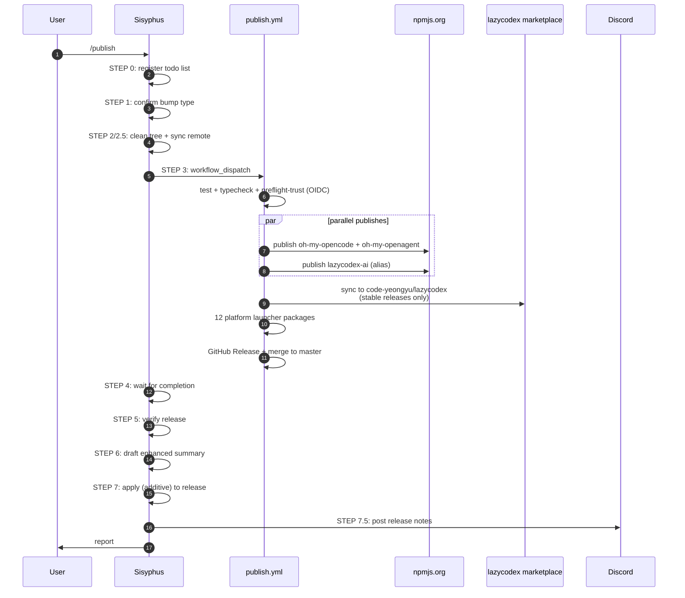
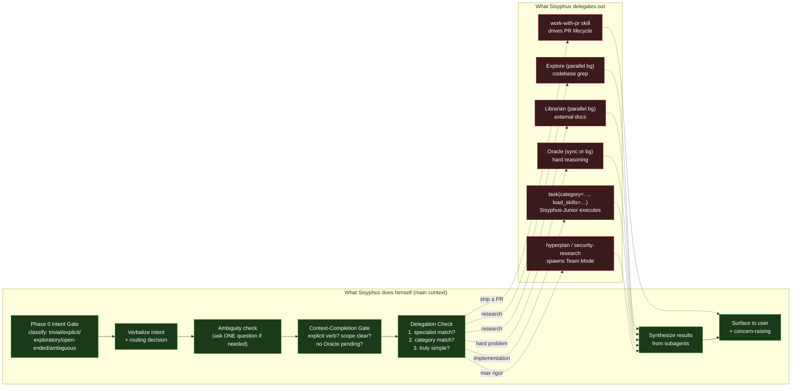

# Research: oh-my-openagent — Multi-Agent Prompt System

> Repository: [code-yeongyu/oh-my-openagent](https://github.com/code-yeongyu/oh-my-openagent)
> Branch: `dev` · Pinned SHA: [`14083b89`](https://github.com/code-yeongyu/oh-my-openagent/commit/14083b89f1cbf4680be13493a6c4afd67c957e8a)
> Studied: 2026-07-17
> Scope: how the system routes work between agents, what each agent/subagent is for, and the flows the repo prescribes.

---

## 1. Executive Summary

- **oh-my-openagent (a.k.a. "omo")** is a large OpenCode/Codex plugin built around a Greek-mythology-themed **cast of 11 named agents** (Sisyphus, Hephaestus, Prometheus, Atlas, Oracle, Librarian, Explore, Multimodal-Looker, Metis, Momus, Sisyphus-Junior). The orchestrator is **Sisyphus**; everything else is either a peer primary or a delegated subagent. See [`packages/omo-opencode/src/agents/AGENTS.md`](https://github.com/code-yeongyu/oh-my-openagent/blob/14083b89f1cbf4680be13493a6c4afd67c957e8a/packages/omo-opencode/src/agents/AGENTS.md).
- **Default delivery flow is `work-with-pr`** — every non-trivial change is decomposed into atomic PRs, each driven through an `ulw-loop` (ultrawork) implementation phase with mandatory evidence-bound manual QA, then pushed through a CI + Cubic verification loop. QA is the gate, not tests; "no evidence file means QA did not happen." See [`AGENTS.md`](https://github.com/code-yeongyu/oh-my-openagent/blob/14083b89f1cbf4680be13493a6c4afd67c957e8a/AGENTS.md) and [`.agents/skills/work-with-pr/SKILL.md`](https://github.com/code-yeongyu/oh-my-openagent/blob/14083b89f1cbf4680be13493a6c4afd67c957e8a/.agents/skills/work-with-pr/SKILL.md).
- **Two editions share one codebase**: Ultimate = `packages/omo-opencode/` (the OpenCode plugin), Light = `packages/omo-codex/` (Codex CLI plugin, distributed as `lazycodex`/`lazycodex-ai`). Each has its own mandatory QA skill (`opencode-qa` vs `codex-qa`) and you must run the one matching the surface you touched.
- **Delegation is the default bias.** Sisyphus's own instructions say *"Default Bias: DELEGATE. WORK YOURSELF ONLY WHEN IT IS SUPER SIMPLE"* — work goes through the `task` tool with a *category* (`deep`, `ultrabrain`, `quick`, `unspecified-low`, `unspecified-high`, `visual-engineering`, `artistry`, `writing`, …) that picks the model, plus `load_skills=[...]` that injects specialized knowledge. See [`packages/omo-opencode/src/agents/sisyphus-dynamic-prompt-role.ts`](https://github.com/code-yeongyu/oh-my-openagent/blob/14083b89f1cbf4680be13493a6c4afd67c957e8a/packages/omo-opencode/src/agents/sisyphus-dynamic-prompt-role.ts).
- **Team Mode** (off by default) is the parallel-multi-agent tier: a `team_create` tool spawns an ordered roster of up to 8 members that message each other through mailboxes. Two heavy skills — `hyperplan` (adversarial 5-member planning) and `security-research` (5-member vulnerability audit) — are entirely built on it.

---

## 2. System at a Glance

oh-my-openagent is a plugin for the **OpenCode** AI-CLI that wraps the host with a curated multi-agent organization, a category-based delegation tool (`task`), a hook system that injects prompts and enforces invariants on every tool call, and a stack of high-level "skills" that codify repo-specific workflows (PR lifecycle, release, security audit, dead-code cleanup, etc.). It is dual-published as `oh-my-opencode` and `oh-my-openagent` during a rename transition; the Codex edition (`omo-codex`/`lazycodex`) is a stripped-down sibling for OpenAI's Codex CLI. The package layer is unusual: ~42 sibling packages under `packages/`, of which `omo-opencode` is the OpenCode adapter and the rest are pure-TS Core libs, MCP servers, platform launchers, and one marketing site.

The repo's own master prompt opens with an ALL-CAPS warning that the codebase is mid-refactor (the "MULTI-HARNESS AGENT OS REFACTOR"), so file locations are in flux. The agent definitions and skills below are stable enough to map; package internals may move.

### Repo layout (top-level)

| Path | Purpose | Permalink |
|------|---------|-----------|
| `AGENTS.md` | Master prompt (49 KB) — the orchestrator's brain, read by every host | [`AGENTS.md`](https://github.com/code-yeongyu/oh-my-openagent/blob/14083b89f1cbf4680be13493a6c4afd67c957e8a/AGENTS.md) |
| `packages/omo-opencode/` | **OpenCode plugin adapter** — 11 agents, 53–62 hooks, 12–38 tools, MCPs, CLI | [`packages/omo-opencode/`](https://github.com/code-yeongyu/oh-my-openagent/blob/14083b89f1cbf4680be13493a6c4afd67c957e8a/packages/omo-opencode/) |
| `packages/omo-codex/` | **Codex Light** plugin (`lazycodex`) — 11 components, no team tools | [`packages/omo-codex/AGENTS.md`](https://github.com/code-yeongyu/oh-my-openagent/blob/14083b89f1cbf4680be13493a6c4afd67c957e8a/packages/omo-codex/AGENTS.md) |
| `packages/*-core` (19) | Harness-neutral TS libs: `delegate-core`, `prompts-core`, `rules-engine`, `comment-checker-core`, `hashline-core`, `boulder-state`, `model-core`, `lsp-core`, … | [`packages/`](https://github.com/code-yeongyu/oh-my-openagent/blob/14083b89f1cbf4680be13493a6c4afd67c957e8a/packages/) |
| `.agents/skills/` | 13 project-scope skills (`work-with-pr`, `hyperplan`, `security-research`, `publish`, `opencode-qa`, `codex-qa`, …) | [`.agents/skills/`](https://github.com/code-yeongyu/oh-my-openagent/blob/14083b89f1cbf4680be13493a6c4afd67c957e8a/.agents/skills/) |
| `.agents/command/` | 5 slash commands (`/publish`, `/security-research`, `/remove-deadcode`, `/get-unpublished-changes`, `/omomomo`) | [`.agents/command/`](https://github.com/code-yeongyu/oh-my-openagent/blob/14083b89f1cbf4680be13493a6c4afd67c957e8a/.agents/command/) |
| `.opencode/` | OpenCode-format copy of skills + commands + project AGENTS.md | [`.opencode/`](https://github.com/code-yeongyu/oh-my-openagent/blob/14083b89f1cbf4680be13493a6c4afd67c957e8a/.opencode/) |
| `.omo/` | Agent workspace: `evidence/` (QA artifacts), `rules/`, `plans/`, `tasks/`, `teams/`, `notepads/` | [`.omo/`](https://github.com/code-yeongyu/oh-my-openagent/blob/14083b89f1cbf4680be13493a6c4afd67c957e8a/.omo/) |
| `docs/` | User-facing: `guide/`, `reference/`, `examples/`, `troubleshooting/`, `legal/` | [`docs/`](https://github.com/code-yeongyu/oh-my-openagent/blob/14083b89f1cbf4680be13493a6c4afd67c957e8a/docs/) |
| `signatures/` | CLA signature registry (`cla.json`) | [`signatures/`](https://github.com/code-yeongyu/oh-my-openagent/blob/14083b89f1cbf4680be13493a6c4afd67c957e8a/signatures/) |

### Supported hosts

| Host | Adapter | Notes |
|------|---------|-------|
| OpenCode | `packages/omo-opencode/` | **Ultimate** edition — full plugin, 11 agents, Team Mode, all hooks |
| Codex CLI | `packages/omo-codex/` (`lazycodex`) | **Light** edition — 11 components, no team tools, no hashline |
| Claude Code | reads `CLAUDE.md` (symlink to root `AGENTS.md`); `.claude/settings.json` runs `setup.sh` on SessionStart | first-class target but uses Claude Code's own plugin format |
| Cursor | `.cursor/environment.json` runs `setup.sh` | supported |
| Codex App (cloud) | `.codex/setup.sh` | supported via worktree hook |

> The plugin's own harness for development is OpenCode + Claude Code; `CLAUDE.md` is a symlink so both share one master prompt. ([`AGENTS.md` L327–L337](https://github.com/code-yeongyu/oh-my-openagent/blob/14083b89f1cbf4680be13493a6c4afd67c957e8a/AGENTS.md))

---

## 3. Question 1 — Recommended Flows

The repo prescribes **one default flow** (work-with-pr) and several **opt-in flows** keyed to specific skills/commands. The flow is selected at the top by Sisyphus's Intent Gate based on what the user actually asked for.

### 3.1 Default everyday flow — implement and ship through `work-with-pr`

This is the path the master prompt steers every non-trivial change toward. From [`AGENTS.md` L39–L45](https://github.com/code-yeongyu/oh-my-openagent/blob/14083b89f1cbf4680be13493a6c4afd67c957e8a/AGENTS.md):

> "Unless the user EXPLICITLY says otherwise, or the task is an urgent must-fix-now hotfix, deliver every change through the **`work-with-pr`** skill: it works in an isolated git worktree, implements with evidence-bound manual QA, opens a reviewer-readable English PR (what changed, why, observed behavior, QA/evidence, residual risk), runs the verification loop, and merges. Do NOT hand-commit normal work straight to `dev`."

Inside `work-with-pr`, Sisyphus decomposes the task into atomic PRs and then drives each through this loop (from [`.agents/skills/work-with-pr/SKILL.md` L14–L24](https://github.com/code-yeongyu/oh-my-openagent/blob/14083b89f1cbf4680be13493a6c4afd67c957e8a/.agents/skills/work-with-pr/SKILL.md)):

```text
Phase 0: Setup         → Split into atomic PRs, then branch + worktree per PR (parallel when independent)
Phase 1: Implement     → Drive the work through the ulw-loop skill:
                         evidence-bound manual QA per success criterion, atomic commits
Phase 2: PR Creation   → Push, create a reviewer-readable English PR targeting dev
Phase 3: Verify Loop   → Unbounded iteration; a failing gate routes back to Phase 1:
  ├─ Gate A: CI         → gh pr checks (bun test, typecheck, build)
  └─ Gate B: Cubic      → cubic-dev-ai[bot] "No issues found"
                         (SKIPPED, not failed, when Cubic's quota is exhausted)
Phase 4: Merge         → Auto-merge by default; wait until actually merged, then worktree cleanup
```

The crucial omo invariant: **QA is mandatory and evidence-bound**. The master prompt repeats the rule three times. For changes touching `packages/omo-opencode/`, the matching skill is `opencode-qa`; for `packages/omo-codex/`, it is `codex-qa`. The skill writes proof under `.omo/evidence/<YYYYMMDD>-<slug>/` and you may not commit or push until that file exists. ([`AGENTS.md` L7–L37](https://github.com/code-yeongyu/oh-my-openagent/blob/14083b89f1cbf4680be13493a6c4afd67c957e8a/AGENTS.md))

```mermaid
flowchart TD
    User[User: "implement X / make a PR"] --> Sisyphus[Sisyphus orchestrator]

    Sisyphus -->|classify intent| IntentGate{Intent Gate<br/>trivial / explicit / exploratory<br/>open-ended / ambiguous}
    IntentGate -->|trivial| Direct[Sisyphus does it himself]
    IntentGate -->|open-ended/implement| WWP[load work-with-pr skill]

    WWP --> Phase0[Phase 0: Decompose<br/>into atomic PRs]
    Phase0 -->|independent slices| ParallelPRs[Parallel subagents<br/>one worktree per PR]
    Phase0 -->|single slice| OnePR[One worktree]

    ParallelPRs --> Phase1
    OnePR --> Phase1

    Phase1[Phase 1: ulw-loop<br/>delegates edits + QA<br/>to category subagents] --> QA{QA evidence<br/>written to .omo/evidence/?}
    QA -->|no| Phase1
    QA -->|yes| Phase2[Phase 2: push + PR<br/>reviewer-readable English]

    Phase2 --> Phase3[Phase 3: Verify loop]
    Phase3 --> GateA{Gate A: CI}
    GateA -->|fail| ReadLogs[read failed run logs] --> Phase1
    GateA -->|pass| GateB{Gate B: Cubic bot}
    GateB -->|issues| FixCubic[fix issues] --> Phase1
    GateB -->|quota out| Skip[record SKIPPED]
    GateB -->|No issues found| Skip
    Skip --> Phase4[Phase 4: merge --auto<br/>wait until MERGED]
    Phase4 --> Cleanup[worktree cleanup +<br/>sync .omo state]
    Cleanup --> Done[done]

    classDef default fill:#1a1a1a,color:#fff,stroke:#555
    classDef gate fill:#3a1a1a,color:#fff,stroke:#a33
    classDef phase fill:#1a2a3a,color:#fff,stroke:#36a
    class GateA,GateB,QA gate
    class Phase1,Phase2,Phase3,Phase4 phase
```

### 3.2 Release / publish flow — `/publish`

A dedicated command flow, **ship-only** (go straight to the workflow, no design discussion). From [`.agents/skills/publish/SKILL.md`](https://github.com/code-yeongyu/oh-my-openagent/blob/14083b89f1cbf4680be13493a6c4afd67c957e8a/.agents/skills/publish/SKILL.md) and [`.agents/command/publish.md`](https://github.com/code-yeongyu/oh-my-openagent/blob/14083b89f1cbf4680be13493a6c4afd67c957e8a/.agents/command/publish.md), the steps are:

1. **Register todo list** (mandatory first action — the skill script-style enforces it).
2. **Confirm bump type** (patch/minor/major).
3. **Check uncommitted changes** (must be clean).
4. **Sync with remote** (`git fetch`).
5. **Trigger `publish.yml` GitHub Actions workflow** (manual dispatch) — this does test + typecheck + preflight-trust + dual npm publish (`oh-my-opencode` + `oh-my-openagent`) + `lazycodex-ai` alias + automatic Codex marketplace sync + 12 platform launcher packages + GitHub release + merge to master.
6. **Wait for workflow completion**.
7. **Verify release & preview auto-generated content** (pull the version bump the workflow committed).
8. **Draft enhanced release summary** (What's New / Improvements / etc., over the auto-generated body).
9. **Apply enhanced summary to release** (additive: enhanced on top, auto-generated below).
10. **Post release notes to Discord** (a third release surface — failure is a workflow failure).



### 3.3 Other notable flows

#### Adversarial planning — `/hyperplan` (Team Mode)

Triggered when the user wants maximum rigor. Spawns a **5-member hostile team** that attacks each other's findings, then distills only what survives the gauntlet and hands it to the `plan` agent for formalization. From [`.agents/skills/hyperplan/SKILL.md`](https://github.com/code-yeongyu/oh-my-openagent/blob/14083b89f1cbf4680be13493a6c4afd67c957e8a/.agents/skills/hyperplan/SKILL.md):

| Member | Category | Model | Role |
|--------|----------|-------|------|
| `skeptic` | `unspecified-low` | gpt-5.6-luna xhigh | Pragmatist Skeptic — attacks over-engineering |
| `validator` | `unspecified-high` | claude-opus-4-7 max | Integration Tester — attacks missed edge cases |
| `researcher` | `deep` | gpt-5.6-terra xhigh | Autonomous Researcher — attacks unfounded claims |
| `architect` | `ultrabrain` | gpt-5.6-sol xhigh | Architect Strategist — attacks structural flaws |
| `creative` | `artistry` | gemini-3.1-pro high | Creative Challenger — attacks orthodox thinking |

Each member is `kind: "category"` and routes through `sisyphus-junior` with the category's prompt-add shaping its identity. Requires `team_mode.enabled: true`. Output → `plan` agent for executable plan formalization.

#### Security audit — `/security-research` (Team Mode)

A 5-member team for vulnerability audits: 3 hunters + 2 PoC engineers. Severity requires an attack path; no critical without concrete exploit preconditions. From [`.agents/skills/security-research/SKILL.md` L41–L50](https://github.com/code-yeongyu/oh-my-openagent/blob/14083b89f1cbf4680be13493a6c4afd67c957e8a/.agents/skills/security-research/SKILL.md).

#### Issue/PR triage — `/github-triage`

Skill for processing incoming GitHub issues and PRs (mentioned in `.opencode/skills/github-triage/`).

#### Dead-code cleanup — `/remove-deadcode`

Command ([`.agents/command/remove-deadcode.md`](https://github.com/code-yeongyu/oh-my-openagent/blob/14083b89f1cbf4680be13493a6c4afd67c957e8a/.agents/command/remove-deadcode.md)) — finds and removes dead code in a target area.

#### Capture changelog-worthy work — `/get-unpublished-changes`

Command ([`.agents/command/get-unpublished-changes.md`](https://github.com/code-yeongyu/oh-my-openagent/blob/14083b89f1cbf4680be13493a6c4afd67c957e8a/.agents/command/get-unpublished-changes.md)) — walks recent commits to surface work not yet in the changelog.

#### Multi-step planning (single agent) — `plan` / `prometheus`

When the user asks for a structured plan but doesn't need the hostile-team rigor of hyperplan, the work routes to the `plan` agent (or its sibling `prometheus`, the strategic interviewer). The plan agent's system-prepend mandates a task dependency graph, parallel-execution waves, and category+skills recommendations per task — emitted wrapped in a `<plan>` envelope. See [`packages/omo-opencode/src/tools/delegate-task/constants.ts` L20–L289](https://github.com/code-yeongyu/oh-my-openagent/blob/14083b89f1cbf4680be13493a6c4afd67c957e8a/packages/omo-opencode/src/tools/delegate-task/constants.ts).

---

## 4. Question 2 — Agent & Subagent Decomposition

### 4.1 The delegation mechanism — three layers

omo's delegation is layered. Each layer is a separate concept and the user/orchestrator reaches for them at different altitudes.

**Layer 1 — `call_omo_agent` (named subagent dispatch).** Fires a typed subagent (Oracle, Librarian, Explore, Multimodal-Looker, Metis, Momus) synchronously or in the background. Used for **consultation** and **research**, not for code edits. From the plan agent's prepend ([`delegate-task/constants.ts` L24–L26](https://github.com/code-yeongyu/oh-my-openagent/blob/14083b89f1cbf4680be13493a6c4afd67c957e8a/packages/omo-opencode/src/tools/delegate-task/constants.ts)):

```text
1. Launch background agents to gather context:
   - call_omo_agent(description="Explore codebase patterns", subagent_type="explore",
                    run_in_background=true, prompt="<search for relevant patterns...>")
   - call_omo_agent(description="Research documentation", subagent_type="librarian",
                    run_in_background=true, prompt="<search for external documentation...>")
```

**Layer 2 — `task` (category-routed delegation).** The workhorse. Picks a **category** that determines the model + system-prompt add, optionally loads **skills** into the spawned agent, and returns the result. Categories are a fixed vocabulary defined per provider (see `builtin-categories.ts`):

- OpenAI: `ultrabrain`, `deep`, `quick`, `unspecified-low` ([`openai-categories.ts` L152–L171](https://github.com/code-yeongyu/oh-my-openagent/blob/14083b89f1cbf4680be13493a6c4afd67c957e8a/packages/omo-opencode/src/tools/delegate-task/openai-categories.ts))
- Anthropic: `unspecified-high` ([`anthropic-categories.ts` L20](https://github.com/code-yeongyu/oh-my-openagent/blob/14083b89f1cbf4680be13493a6c4afd67c957e8a/packages/omo-opencode/src/tools/delegate-task/anthropic-categories.ts))
- Google: `visual-engineering`, `artistry` ([`google-categories.ts` L111–L117](https://github.com/code-yeongyu/oh-my-openagent/blob/14083b89f1cbf4680be13493a6c4afd67c957e8a/packages/omo-opencode/src/tools/delegate-task/google-categories.ts))
- Kimi: `writing` ([`kimi-categories.ts` L31](https://github.com/code-yeongyu/oh-my-openagent/blob/14083b89f1cbf4680be13493a6c4afd67c957e8a/packages/omo-opencode/src/tools/delegate-task/kimi-categories.ts))

Each category's prompt-add shapes the worker's identity. For example, `deep` ([`openai-categories.ts` L26–L45](https://github.com/code-yeongyu/oh-my-openagent/blob/14083b89f1cbf4680be13493a6c4afd67c957e8a/packages/omo-opencode/src/tools/delegate-task/openai-categories.ts)):

> "You are working on GOAL-ORIENTED AUTONOMOUS tasks. You are NOT an interactive assistant. You are an autonomous problem-solver. BEFORE making ANY changes: 1. Silently explore the codebase extensively (5-15 minutes of reading is normal) …"

Model resolution for `task` is centralized in `delegate-core` ([`packages/delegate-core/AGENTS.md` L17–L19](https://github.com/code-yeongyu/oh-my-openagent/blob/14083b89f1cbf4680be13493a6c4afd67c957e8a/packages/delegate-core/AGENTS.md)): user override → skip sentinel (cold cache) → category default → user `fallback_models` → hardcoded `fallbackChain` → system default.

**Layer 3 — `team_create` (Team Mode).** Off by default (`team_mode.enabled`). A team is a directory under `~/.omo/teams/{name}/` with a spec, mailbox, tasklist, and per-member worktrees. Members declared `kind: "subagent_type"` (direct agent) or `kind: "category"` (routed through `sisyphus-junior`). Up to 8 members; 12 team tools (`team_create`, `team_send_message`, `team_task_create`, …). This is the layer `hyperplan` and `security-research` are built on. From [`AGENTS.md` L154–L187](https://github.com/code-yeongyu/oh-my-openagent/blob/14083b89f1cbf4680be13493a6c4afd67c957e8a/AGENTS.md).

> Note on team eligibility: only **Sisyphus, Atlas, Sisyphus-Junior** are eligible as direct members. Hephaestus is conditional (lacks `teammate: "allow"` by default). The read-only subagents (Oracle, Librarian, Explore, Multimodal-Looker, Metis, Momus, Prometheus) are **hard-rejected** — they get delegated to via `task` instead. ([`packages/omo-opencode/src/agents/AGENTS.md` L50–L58](https://github.com/code-yeongyu/oh-my-openagent/blob/14083b89f1cbf4680be13493a6c4afd67c957e8a/packages/omo-opencode/src/agents/AGENTS.md))

### 4.2 Catalogue of agents

The 11 built-in agents. Factory pattern: `createXXXAgent(model) → AgentConfig` with a static `mode` property. 10 register via `agentSources` in [`builtin-agents.ts` L32–L45](https://github.com/code-yeongyu/oh-my-openagent/blob/14083b89f1cbf4680be13493a6c4afd67c957e8a/packages/omo-opencode/src/agents/builtin-agents.ts); Prometheus is special-cased via `prometheus-agent-config-builder.ts`. Table below from [`agents/AGENTS.md` L20–L32](https://github.com/code-yeongyu/oh-my-openagent/blob/14083b89f1cbf4680be13493a6c4afd67c957e8a/packages/omo-opencode/src/agents/AGENTS.md).

| Agent | Mode | Default model | Job (one line) | Calls / spawned by | Permalink |
|-------|------|---------------|----------------|--------------------|-----------|
| **Sisyphus** | primary | claude-opus-4-7 max | Main orchestrator; plans + delegates; never works alone when specialists fit | delegates via `task` to categories, `call_omo_agent` to specialists, `team_create` for hyperplan/security | [`agents/sisyphus.ts`](https://github.com/code-yeongyu/oh-my-openagent/blob/14083b89f1cbf4680be13493a6c4afd67c957e8a/packages/omo-opencode/src/agents/sisyphus.ts) |
| **Hephaestus** | primary | gpt-5.6-sol medium | Autonomous deep worker for hairy, exploratory tasks | delegated by Sisyphus via `task(category="deep")` typically; runs its own explore/librarian subagents | [`agents/hephaestus.ts`](https://github.com/code-yeongyu/oh-my-openagent/blob/14083b89f1cbf4680be13493a6c4afd67c957e8a/packages/omo-opencode/src/agents/hephaestus.ts) |
| **Prometheus** | primary | claude-opus-4-7 max | Strategic planner (interview-style) — **`.md`-only writes** enforced by hook | receives work from Sisyphus or user; emits plan wrapped in `<plan>` envelope | [`plugin-handlers/prometheus-agent-config-builder.ts`](https://github.com/code-yeongyu/oh-my-openagent/blob/14083b89f1cbf4680be13493a6c4afd67c957e8a/packages/omo-opencode/src/plugin-handlers/prometheus-agent-config-builder.ts) |
| **Atlas** | primary | claude-sonnet-4-6 | Todo-list orchestrator — manages the task tracker and dispatches waves | delegates via `task` to category subagents | [`agents/atlas/agent.ts`](https://github.com/code-yeongyu/oh-my-openagent/blob/14083b89f1cbf4680be13493a6c4afd67c957e8a/packages/omo-opencode/src/agents/atlas/agent.ts) |
| **Oracle** | subagent | gpt-5.5 high | Read-only strategic consultant; denies write/edit/task/call_omo_agent | spawned by Sisyphus/Hephaestus on hard problems; "after 2+ failed fix attempts" is a documented trigger | [`agents/oracle.ts`](https://github.com/code-yeongyu/oh-my-openagent/blob/14083b89f1cbf4680be13493a6c4afd67c957e8a/packages/omo-opencode/src/agents/oracle.ts) |
| **Librarian** | subagent | gpt-5.4-mini-fast | External docs/code search (cheap model) | spawned in background by Sisyphus or by the plan agent's context-gathering step | [`agents/librarian.ts`](https://github.com/code-yeongyu/oh-my-openagent/blob/14083b89f1cbf4680be13493a6c4afd67c957e8a/packages/omo-opencode/src/agents/librarian.ts) |
| **Explore** | subagent | gpt-5.4-mini-fast | Contextual codebase grep (cheap model) | spawned in background; same triggers as Librarian | [`agents/explore.ts`](https://github.com/code-yeongyu/oh-my-openagent/blob/14083b89f1cbf4680be13493a6c4afd67c957e8a/packages/omo-opencode/src/agents/explore.ts) |
| **Multimodal-Looker** | subagent | gpt-5.5 medium | PDF/image analysis; ALL tools denied except `read` | spawned when the work involves vision/PDF inputs | [`agents/multimodal-looker.ts`](https://github.com/code-yeongyu/oh-my-openagent/blob/14083b89f1cbf4680be13493a6c4afd67c957e8a/packages/omo-opencode/src/agents/multimodal-looker.ts) |
| **Metis** | subagent (temp 0.3) | claude-sonnet-4-6 | Pre-planning consultant — consulted before producing a plan | spawned by Sisyphus when planning rigor is needed but not full hyperplan | [`agents/metis.ts`](https://github.com/code-yeongyu/oh-my-openagent/blob/14083b89f1cbf4680be13493a6c4afd67c957e8a/packages/omo-opencode/src/agents/metis.ts) |
| **Momus** | subagent | gpt-5.6-terra high | Plan reviewer — reviews plans produced by Prometheus/plan agent | spawned by Sisyphus after planning; plan agent's prompt explicitly says "FAILURE TO INCLUDE THESE SECTIONS = PLAN WILL BE REJECTED BY MOMUS REVIEW" | [`agents/momus.ts`](https://github.com/code-yeongyu/oh-my-openagent/blob/14083b89f1cbf4680be13493a6c4afd67c957e8a/packages/omo-opencode/src/agents/momus.ts) |
| **Sisyphus-Junior** | subagent | claude-sonnet-4-6 | Category-spawned executor — the agent that actually runs when `task(category=…)` is invoked (for `kind: "category"` members) | spawned by Sisyphus, Atlas, or Team Mode; carries the category's prompt-add and loaded skills | [`agents/sisyphus-junior`](https://github.com/code-yeongyu/oh-my-openagent/blob/14083b89f1cbf4680be13493a6c4afd67c957e8a/packages/omo-opencode/src/agents/sisyphus-junior/) |

**Canonical agent order** (visible to the user in the UI): `Sisyphus → Hephaestus → Prometheus → Atlas`, then alphabetical. Enforced by a narrow `Array.prototype.sort` patch in `installAgentSortShim()`. ([`AGENTS.md` L258](https://github.com/code-yeongyu/oh-my-openagent/blob/14083b89f1cbf4680be13493a6c4afd67c957e8a/AGENTS.md))

### Catalogue of skills (13, project-scope under `.agents/skills/`)

| Skill | File | Job | Calls (skills/agents) | Permalink |
|-------|------|-----|-----------------------|-----------|
| `work-with-pr` | `.agents/skills/work-with-pr/SKILL.md` | Full PR lifecycle (Phase 0–4 above) | `ulw-loop` (impl), `opencode-qa` / `codex-qa` (QA gate), `smart-rebase` (conflicts) | [work-with-pr](https://github.com/code-yeongyu/oh-my-openagent/blob/14083b89f1cbf4680be13493a6c4afd67c957e8a/.agents/skills/work-with-pr/SKILL.md) |
| `work-with-pr-workspace` | `.agents/skills/work-with-pr-workspace/` | Workspace setup helper for `work-with-pr` | (companion to `work-with-pr`) | [work-with-pr-workspace](https://github.com/code-yeongyu/oh-my-openagent/blob/14083b89f1cbf4680be13493a6c4afd67c957e8a/.agents/skills/work-with-pr-workspace/) |
| `ulw-loop` (referenced by `work-with-pr`) | (lives in `prompts-core` and `omo-codex`'s `ulw-loop` component) | Ultrawork loop: decompose brief → goals → delegate edits + manual QA | `task(category=...)` | see [`packages/omo-codex`](https://github.com/code-yeongyu/oh-my-openagent/blob/14083b89f1cbf4680be13493a6c4afd67c957e8a/packages/omo-codex/) |
| `hyperplan` | `.agents/skills/hyperplan/SKILL.md` | Adversarial 5-member planning | `team_create` → 5 category members → `plan` agent | [hyperplan](https://github.com/code-yeongyu/oh-my-openagent/blob/14083b89f1cbf4680be13493a6c4afd67c957e8a/.agents/skills/hyperplan/SKILL.md) |
| `security-research` | `.agents/skills/security-research/SKILL.md` | 5-member vulnerability audit team | `team_create` → 3 hunters + 2 PoC engineers | [security-research](https://github.com/code-yeongyu/oh-my-openagent/blob/14083b89f1cbf4680be13493a6c4afd67c957e8a/.agents/skills/security-research/SKILL.md) |
| `github-triage` | `.agents/skills/github-triage/` | Process incoming GitHub issues/PRs | (delegates via `task`) | [github-triage](https://github.com/code-yeongyu/oh-my-openagent/blob/14083b89f1cbf4680be13493a6c4afd67c957e8a/.agents/skills/github-triage/) |
| `publish` | `.agents/skills/publish/SKILL.md` | Drive the release workflow end-to-end (the 10-step flow in §3.2) | `gh workflow run publish.yml`, Discord posting | [publish](https://github.com/code-yeongyu/oh-my-openagent/blob/14083b89f1cbf4680be13493a6c4afd67c957e8a/.agents/skills/publish/SKILL.md) |
| `pre-publish-review` | `.agents/skills/pre-publish-review/` | Pre-release sanity review | (read-only review before `publish`) | [pre-publish-review](https://github.com/code-yeongyu/oh-my-openagent/blob/14083b89f1cbf4680be13493a6c4afd67c957e8a/.agents/skills/pre-publish-review/) |
| `opencode-qa` | `.agents/skills/opencode-qa/` | Mandatory QA gate for changes touching `omo-opencode/` | spawns opencode in isolated XDG sandbox; asserts hooks fired | [opencode-qa](https://github.com/code-yeongyu/oh-my-openagent/blob/14083b89f1cbf4680be13493a6c4afd67c957e8a/.agents/skills/opencode-qa/) |
| `codex-qa` | `.agents/skills/codex-qa/` | Mandatory QA gate for changes touching `omo-codex/` | drives real `codex app-server` + asserts `hook/started`/`hook/completed` | [codex-qa](https://github.com/code-yeongyu/oh-my-openagent/blob/14083b89f1cbf4680be13493a6c4afd67c957e8a/.agents/skills/codex-qa/) |
| `get-unpublished-changes` | `.agents/skills/get-unpublished-changes/` | Surface changelog-worthy work not yet captured | walks recent commits | [get-unpublished-changes](https://github.com/code-yeongyu/oh-my-openagent/blob/14083b89f1cbf4680be13493a6c4afd67c957e8a/.agents/skills/get-unpublished-changes/) |
| `remove-deadcode` | `.agents/skills/remove-deadcode/` | Find and remove dead code | (scoped exploration + deletion) | [remove-deadcode](https://github.com/code-yeongyu/oh-my-openagent/blob/14083b89f1cbf4680be13493a6c4afd67c957e8a/.agents/skills/remove-deadcode/) |
| `tech-debt-audit` | `.agents/skills/tech-debt-audit/` | Audit tech debt in an area | (analysis only) | [tech-debt-audit](https://github.com/code-yeongyu/oh-my-openagent/blob/14083b89f1cbf4680be13493a6c4afd67c957e8a/.agents/skills/tech-debt-audit/) |
| `omomomo` | `.agents/skills/omomomo/SKILL.md` | Easter egg — prints plugin info | (no calls) | [omomomo](https://github.com/code-yeongyu/oh-my-openagent/blob/14083b89f1cbf4680be13493a6c4afd67c957e8a/.agents/skills/omomomo/SKILL.md) |

> Skills vs commands: each `.agents/command/<name>.md` has a matching `.agents/skills/<name>/SKILL.md`. The command is the slash-trigger; the skill is the loaded body. They are kept in sync.

### Catalogue of delegation categories

| Category | Provider | Default model | Use when | Permalink |
|----------|----------|---------------|----------|-----------|
| `ultrabrain` | OpenAI | gpt-5.6-sol xhigh | Deep logical reasoning / complex architecture | [`openai-categories.ts:152`](https://github.com/code-yeongyu/oh-my-openagent/blob/14083b89f1cbf4680be13493a6c4afd67c957e8a/packages/omo-opencode/src/tools/delegate-task/openai-categories.ts) |
| `deep` | OpenAI | gpt-5.6-terra xhigh | Goal-oriented autonomous work, hairy problems | [`openai-categories.ts:158`](https://github.com/code-yeongyu/oh-my-openagent/blob/14083b89f1cbf4680be13493a6c4afd67c957e8a/packages/omo-opencode/src/tools/delegate-task/openai-categories.ts) |
| `quick` | OpenAI | (small model) | Small/quick tasks | [`openai-categories.ts:165`](https://github.com/code-yeongyu/oh-my-openagent/blob/14083b89f1cbf4680be13493a6c4afd67c957e8a/packages/omo-opencode/src/tools/delegate-task/openai-categories.ts) |
| `unspecified-low` | OpenAI | gpt-5.6-luna xhigh | Simplicity-leaning mid-tier work | [`openai-categories.ts:171`](https://github.com/code-yeongyu/oh-my-openagent/blob/14083b89f1cbf4680be13493a6c4afd67c957e8a/packages/omo-opencode/src/tools/delegate-task/openai-categories.ts) |
| `unspecified-high` | Anthropic | claude-opus-4-7 max | High-effort broad-impact / cross-module | [`anthropic-categories.ts:20`](https://github.com/code-yeongyu/oh-my-openagent/blob/14083b89f1cbf4680be13493a6c4afd67c957e8a/packages/omo-opencode/src/tools/delegate-task/anthropic-categories.ts) |
| `visual-engineering` | Google | gemini-3.1-pro | Frontend / UI / visual work | [`google-categories.ts:111`](https://github.com/code-yeongyu/oh-my-openagent/blob/14083b89f1cbf4680be13493a6c4afd67c957e8a/packages/omo-opencode/src/tools/delegate-task/google-categories.ts) |
| `artistry` | Google | gemini-3.1-pro high | Unconventional / pattern-breaking / lateral | [`google-categories.ts:117`](https://github.com/code-yeongyu/oh-my-openagent/blob/14083b89f1cbf4680be13493a6c4afd67c957e8a/packages/omo-opencode/src/tools/delegate-task/google-categories.ts) |
| `writing` | Kimi | (kimi model) | Writing-heavy work | [`kimi-categories.ts:31`](https://github.com/code-yeongyu/oh-my-openagent/blob/14083b89f1cbf4680be13493a6c4afd67c957e8a/packages/omo-opencode/src/tools/delegate-task/kimi-categories.ts) |
| `ulw-plan` | (task system) | — | Plan-family tasks | referenced in [`native-skill-prompt-filter.test.ts:121`](https://github.com/code-yeongyu/oh-my-openagent/blob/14083b89f1cbf4680be13493a6c4afd67c957e8a/packages/omo-opencode/src/tools/delegate-task/native-skill-prompt-filter.test.ts) |

### 4.3 What stays in the main agent vs. what is delegated — and why

Sisyphus is an **orchestrator, not an implementer**. From its own role definition ([`sisyphus-dynamic-prompt-role.ts` L13–L22](https://github.com/code-yeongyu/oh-my-openagent/blob/14083b89f1cbf4680be13493a6c4afd67c957e8a/packages/omo-opencode/src/agents/sisyphus-dynamic-prompt-role.ts)):

> "**Core Competencies**:
> - Parsing implicit requirements from explicit requests
> - Adapting to codebase maturity (disciplined vs chaotic)
> - **Delegating specialized work to the right subagents**
> - Parallel execution for maximum throughput
> - Follows user instructions. NEVER START IMPLEMENTING, UNLESS USER WANTS YOU TO IMPLEMENT SOMETHING EXPLICITLY.
>
> **Operating Mode**: You NEVER work alone when specialists are available. Frontend work → delegate. Deep research → parallel background agents (async subagents). Complex architecture → consult Oracle."

The decision rule is codified as a "Delegation Check" the agent runs before every non-trivial action ([`sisyphus-dynamic-prompt-role.ts` L89–L95](https://github.com/code-yeongyu/oh-my-openagent/blob/14083b89f1cbf4680be13493a6c4afd67c957e8a/packages/omo-opencode/src/agents/sisyphus-dynamic-prompt-role.ts)):

> 1. Is there a specialized agent that perfectly matches this request?
> 2. If not, is there a `task` category best describes this task? (visual-engineering, ultrabrain, quick etc.) What skills are available to equip the agent with?
>    - MUST FIND skills to use, for: `task(load_skills=[{skill1}, ...])` MUST PASS SKILL AS TASK PARAMETER.
> 3. Can I do it myself for the best result, FOR SURE? REALLY, REALLY, THERE IS NO APPROPRIATE CATEGORIES TO WORK WITH?
>
> **Default Bias: DELEGATE. WORK YOURSELF ONLY WHEN IT IS SUPER SIMPLE.**

**What stays in the main agent (Sisyphus):**
- Intent classification and routing (Phase 0 Intent Gate)
- User interaction (clarifying questions, concern-raising)
- Plan/strategy synthesis (after specialists return)
- Final review of subagent output before surfacing to user
- Trivial one-shot edits

**What is pushed into separate subagents — and the stated rationale:**
- **Codebase grep (Explore)** and **external docs (Librarian)** → parallel background agents, because research is independent of implementation and can run concurrently. Cost: cheap models (gpt-5.4-mini-fast).
- **Strategic consultation (Oracle)** → isolated subagent because it's expensive (gpt-5.5 high) and you want fresh context for hard reasoning. Triggered after "2+ failed fix attempts" or on "complex architecture design."
- **Plan review (Momus)** → separate subagent so the planner and reviewer don't share a context window — Momus can reject a Prometheus plan without having authored it. The plan agent's prompt explicitly threatens this: *"FAILURE TO INCLUDE THESE SECTIONS = PLAN WILL BE REJECTED BY MOMUS REVIEW. DO NOT SKIP."* ([`constants.ts` L190–L196`](https://github.com/code-yeongyu/oh-my-openagent/blob/14083b89f1cbf4680be13493a6c4afd67c957e8a/packages/omo-opencode/src/tools/delegate-task/constants.ts))
- **Pre-planning consultation (Metis)** → separate subagent (temp 0.3) to widen the idea space before committing to a plan.
- **PDF / image analysis (Multimodal-Looker)** → isolated, ALL tools denied except `read`, because vision is a different model capability.
- **Implementation work** → `task(category=…)` so the model and prompt-add match the task shape (`deep` for hairy exploration, `quick` for trivial, `ultrabrain` for architecture, etc.). Sisyphus-Junior is the agent that actually runs.
- **Adversarial planning (hyperplan) / security audit (security-research)** → Team Mode teams because the members need to attack each other independently. Cannot be done in one context window.
- **PR lifecycle** → `work-with-pr` skill because the workflow is long, stateful (worktree, CI watch), and benefits from a single scripted spine rather than improvisation.

```mermaid
flowchart TD
    User[User prompt]
    User --> Sisyphus

    Sisyphus["Sisyphus<br/>(primary, claude-opus-4-7 max)<br/>orchestrator + intent gate"]

    Sisyphus -->|"call_omo_agent<br/>(named subagent)"| Specialists
    Sisyphus -->|"task(category=…, load_skills=…)"| Category
    Sisyphus -->|"team_create(...)"| TeamMode
    Sisyphus -->|"load skill"| Skills

    subgraph Specialists["Named specialist subagents"]
        Oracle["Oracle<br/>read-only consultant<br/>gpt-5.5 high"]
        Metis["Metis<br/>pre-plan consultant<br/>claude-sonnet-4-6, temp 0.3"]
        Momus["Momus<br/>plan reviewer<br/>gpt-5.6-terra high"]
        Librarian["Librarian<br/>external docs<br/>gpt-5.4-mini-fast"]
        Explore["Explore<br/>codebase grep<br/>gpt-5.4-mini-fast"]
        ML["Multimodal-Looker<br/>vision/PDF<br/>(read-only)"]
    end

    subgraph Category["Category-routed executor"]
        SJ["Sisyphus-Junior<br/>(claude-sonnet-4-6)<br/>+ category prompt-add"]
        Cats["Categories: deep / ultrabrain / quick /<br/>unspecified-low / unspecified-high /<br/>visual-engineering / artistry / writing"]
        Cats -.shapes.-> SJ
    end

    subgraph TeamMode["Team Mode (opt-in, parallel)"]
        direction LR
        TM1["member 1<br/>kind: category or subagent_type"]
        TM2["member 2"]
        TM3["member N (≤8)"]
        TM1 -.mailbox.-> TM2
        TM2 -.mailbox.-> TM3
    end

    subgraph Skills["High-level skills (load on demand)"]
        WWP["work-with-pr<br/>(default delivery)"]
        HYPER["hyperplan<br/>(5-hostile-member plan)"]
        SEC["security-research<br/>(5-member vuln audit)"]
        QA["opencode-qa / codex-qa<br/>(mandatory QA gate)"]
        PUB["publish<br/>(release flow)"]
    end

    WWP -.->|delegates impl to| Category
    WWP -.->|delegates QA to| QA
    HYPER -.->|builds| TeamMode
    SEC -.->|builds| TeamMode
    HYPER -.->|distills into| Plan
    PUB -.->|runs| GHA["gh workflow run publish.yml"]

    Plan["plan / Prometheus agent<br/>(plan family)"]
    Plan -.reviewed by.-> Momus

    Hephaestus["Hephaestus<br/>(primary, gpt-5.6-sol medium)<br/>autonomous deep worker"]
    Atlas["Atlas<br/>(primary, claude-sonnet-4-6)<br/>todo orchestrator"]
    Sisyphus -->|"direct (peer primary)"| Hephaestus
    Sisyphus -->|"direct (peer primary)"| Atlas
    Atlas -->|"task(category=…)"| Category

    classDef primary fill:#1a2a3a,color:#fff,stroke:#36a
    classDef sub fill:#2a2a1a,color:#fff,stroke:#a83
    classDef skill fill:#1a3a1a,color:#fff,stroke:#3a3
    class Sisyphus,Hephaestus,Atlas,Plan primary
    class Oracle,Metis,Momus,Librarian,Explore,ML,SJ,Cats,TM1,TM2,TM3 sub
    class WWP,HYPER,SEC,QA,PUB skill
```



### Anatomy of one representative agent — Sisyphus

Sisyphus's prompt is composed at runtime by `dynamic-agent-prompt-builder.ts` stitching together: identity (this is "Sisyphus" from "OhMyOpenCode"), role/intent sections, key triggers, the delegation table, the available categories + skills (filled from config), tool categorization, and policy sections (citation, verification, anti-patterns). The role file makes the orchestrator-vs-implementer split explicit; everything else is assembled around it.



---

## 5. Code Snippets & Key Prompts

### 5.1 The QA mandate (master prompt)

> "**'It typechecks' is NOT QA. '`bun test` is green' is NOT QA.** YOU MUST DRIVE THE REAL HARNESS, and then **YOU MUST WRITE THE EVIDENCE TO DISK.** If there is no evidence file, **the QA DID NOT HAPPEN**, and **YOU ARE NOT ALLOWED TO COMMIT OR PUSH.**"
> — [`AGENTS.md` L11–L13`](https://github.com/code-yeongyu/oh-my-openagent/blob/14083b89f1cbf4680be13493a6c4afd67c957e8a/AGENTS.md)

### 5.2 Sisyphus's operating mode

> "**Identity**: SF Bay Area engineer. Work, delegate, verify, ship. No AI slop.
>
> **Operating Mode**: You NEVER work alone when specialists are available. Frontend work → delegate. Deep research → parallel background agents (async subagents). Complex architecture → consult Oracle."
> — [`packages/omo-opencode/src/agents/sisyphus-dynamic-prompt-role.ts` L10–L21`](https://github.com/code-yeongyu/oh-my-openagent/blob/14083b89f1cbf4680be13493a6c4afd67c957e8a/packages/omo-opencode/src/agents/sisyphus-dynamic-prompt-role.ts)

### 5.3 The plan agent's threat about Momus review

> "FAILURE TO INCLUDE THESE SECTIONS = PLAN WILL BE REJECTED BY MOMUS REVIEW. DO NOT SKIP. DO NOT ABBREVIATE."
> — [`packages/omo-opencode/src/tools/delegate-task/constants.ts` L190–L196`](https://github.com/code-yeongyu/oh-my-openagent/blob/14083b89f1cbf4680be13493a6c4afd67c957e8a/packages/omo-opencode/src/tools/delegate-task/constants.ts)

### 5.4 Plan-family and coordinator-agent guards

> "Plan family: plan + prometheus. Shares mutual delegation blocking and task tool permission."
>
> "Coordinator/meta agents that own the orchestration loop and must not be used as arbitrary subagent targets via task(). … Scoped to AGENT_ELIGIBILITY_REGISTRY hard-reject entries only — sisyphus and atlas are explicitly marked `verdict: 'eligible'` for team membership in the registry … so they are NOT included here."
> — [`packages/omo-opencode/src/tools/delegate-task/constants.ts` L373–L413`](https://github.com/code-yeongyu/oh-my-openagent/blob/14083b89f1cbf4680be13493a6c4afd67c957e8a/packages/omo-opencode/src/tools/delegate-task/constants.ts)

### 5.5 Category prompt-add example (`deep`)

> "You are working on GOAL-ORIENTED AUTONOMOUS tasks. You are NOT an interactive assistant. You are an autonomous problem-solver. BEFORE making ANY changes: 1. Silently explore the codebase extensively (5-15 minutes of reading is normal) … Sub-steps of ONE goal = execute all steps as phases of one atomic task. Genuinely independent tasks = flag and refuse, require separate delegations."
> — [`packages/omo-opencode/src/tools/delegate-task/openai-categories.ts` L26–L45`](https://github.com/code-yeongyu/oh-my-openagent/blob/14083b89f1cbf4680be13493a6c4afd67c957e8a/packages/omo-opencode/src/tools/delegate-task/openai-categories.ts)

### 5.6 The hyperplan framing

> "This is not consensus building. This is intellectual combat. Weakness gets exposed. Lazy thinking gets eviscerated. Only what survives the gauntlet makes it into the plan."
> — [`.agents/skills/hyperplan/SKILL.md` L13–L14`](https://github.com/code-yeongyu/oh-my-openagent/blob/14083b89f1cbf4680be13493a6c4afd67c957e8a/.agents/skills/hyperplan/SKILL.md)

### 5.7 The PR merge policy

> "**PRs into `dev` MUST use merge commits.** Use `gh pr merge <number> --merge --delete-branch` after CI, review-work, and Cubic pass. **NEVER squash merge or rebase merge** PRs in this repository, even if a generic workflow, skill, or GitHub default suggests it."
> — [`AGENTS.md` L361–L364`](https://github.com/code-yeongyu/oh-my-openagent/blob/14083b89f1cbf4680be13493a6c4afd67c957e8a/AGENTS.md)

---

## 6. References

All accessed 2026-07-17. SHA-pinned to `14083b89f1cbf4680be13493a6c4afd67c957e8a`.

- [AGENTS.md (master prompt)](https://github.com/code-yeongyu/oh-my-openagent/blob/14083b89f1cbf4680be13493a6c4afd67c957e8a/AGENTS.md)
- [README.md](https://github.com/code-yeongyu/oh-my-openagent/blob/14083b89f1cbf4680be13493a6c4afd67c957e8a/README.md)
- [packages/omo-opencode/src/agents/AGENTS.md (11-agent reference)](https://github.com/code-yeongyu/oh-my-openagent/blob/14083b89f1cbf4680be13493a6c4afd67c957e8a/packages/omo-opencode/src/agents/AGENTS.md)
- [packages/omo-opencode/src/agents/builtin-agents.ts (agentSources registry)](https://github.com/code-yeongyu/oh-my-openagent/blob/14083b89f1cbf4680be13493a6c4afd67c957e8a/packages/omo-opencode/src/agents/builtin-agents.ts)
- [packages/omo-opencode/src/agents/sisyphus-dynamic-prompt-role.ts (Sisyphus role + Intent Gate)](https://github.com/code-yeongyu/oh-my-openagent/blob/14083b89f1cbf4680be13493a6c4afd67c957e8a/packages/omo-opencode/src/agents/sisyphus-dynamic-prompt-role.ts)
- [packages/omo-opencode/src/agents/oracle.ts (read-only consultant)](https://github.com/code-yeongyu/oh-my-openagent/blob/14083b89f1cbf4680be13493a6c4afd67c957e8a/packages/omo-opencode/src/agents/oracle.ts)
- [packages/delegate-core/AGENTS.md (model-selection + retry primitives)](https://github.com/code-yeongyu/oh-my-openagent/blob/14083b89f1cbf4680be13493a6c4afd67c957e8a/packages/delegate-core/AGENTS.md)
- [packages/omo-opencode/src/tools/delegate-task/constants.ts (plan-agent system prepend, plan family, coordinator guards)](https://github.com/code-yeongyu/oh-my-openagent/blob/14083b89f1cbf4680be13493a6c4afd67c957e8a/packages/omo-opencode/src/tools/delegate-task/constants.ts)
- [packages/omo-opencode/src/tools/delegate-task/builtin-categories.ts (category aggregation)](https://github.com/code-yeongyu/oh-my-openagent/blob/14083b89f1cbf4680be13493a6c4afd67c957e8a/packages/omo-opencode/src/tools/delegate-task/builtin-categories.ts)
- [packages/omo-opencode/src/tools/delegate-task/openai-categories.ts (ultrabrain/deep/quick/unspecified-low)](https://github.com/code-yeongyu/oh-my-openagent/blob/14083b89f1cbf4680be13493a6c4afd67c957e8a/packages/omo-opencode/src/tools/delegate-task/openai-categories.ts)
- [packages/omo-opencode/src/tools/delegate-task/anthropic-categories.ts (unspecified-high)](https://github.com/code-yeongyu/oh-my-openagent/blob/14083b89f1cbf4680be13493a6c4afd67c957e8a/packages/omo-opencode/src/tools/delegate-task/anthropic-categories.ts)
- [packages/omo-opencode/src/tools/delegate-task/google-categories.ts (visual-engineering, artistry)](https://github.com/code-yeongyu/oh-my-openagent/blob/14083b89f1cbf4680be13493a6c4afd67c957e8a/packages/omo-opencode/src/tools/delegate-task/google-categories.ts)
- [packages/omo-opencode/src/tools/delegate-task/kimi-categories.ts (writing)](https://github.com/code-yeongyu/oh-my-openagent/blob/14083b89f1cbf4680be13493a6c4afd67c957e8a/packages/omo-opencode/src/tools/delegate-task/kimi-categories.ts)
- [.agents/skills/work-with-pr/SKILL.md (PR lifecycle)](https://github.com/code-yeongyu/oh-my-openagent/blob/14083b89f1cbf4680be13493a6c4afd67c957e8a/.agents/skills/work-with-pr/SKILL.md)
- [.agents/skills/hyperplan/SKILL.md (5-member adversarial planning)](https://github.com/code-yeongyu/oh-my-openagent/blob/14083b89f1cbf4680be13493a6c4afd67c957e8a/.agents/skills/hyperplan/SKILL.md)
- [.agents/skills/security-research/SKILL.md (5-member vuln audit)](https://github.com/code-yeongyu/oh-my-openagent/blob/14083b89f1cbf4680be13493a6c4afd67c957e8a/.agents/skills/security-research/SKILL.md)
- [.agents/skills/publish/SKILL.md (release workflow)](https://github.com/code-yeongyu/oh-my-openagent/blob/14083b89f1cbf4680be13493a6c4afd67c957e8a/.agents/skills/publish/SKILL.md)
- [.agents/skills/omomomo/SKILL.md (easter egg)](https://github.com/code-yeongyu/oh-my-openagent/blob/14083b89f1cbf4680be13493a6c4afd67c957e8a/.agents/skills/omomomo/SKILL.md)
- [.agents/command/ directory (5 slash commands)](https://github.com/code-yeongyu/oh-my-openagent/blob/14083b89f1cbf4680be13493a6c4afd67c957e8a/.agents/command/)
- [packages/omo-codex/AGENTS.md (Codex Light edition)](https://github.com/code-yeongyu/oh-my-openagent/blob/14083b89f1cbf4680be13493a6c4afd67c957e8a/packages/omo-codex/AGENTS.md)
- [docs/guide/team-mode.md (Team Mode user guide)](https://github.com/code-yeongyu/oh-my-openagent/blob/14083b89f1cbf4680be13493a6c4afd67c957e8a/docs/guide/team-mode.md)

---

## 7. Open Questions / Gaps

- **`ulw-loop` is referenced but its home is not a project-scope skill.** The `work-with-pr` SKILL.md says "Drive all implementation through the `ulw-loop` skill" but `.agents/skills/ulw-loop/` does not exist. The Codex side has a `ulw-loop` *component* (per [`AGENTS.md` L197](https://github.com/code-yeongyu/oh-my-openagent/blob/14083b89f1cbf4680be13493a6c4afd67c957e8a/AGENTS.md)), and the CLI has an `ulw-loop` subcommand ([`AGENTS.md` L69](https://github.com/code-yeongyu/oh-my-openagent/blob/14083b89f1cbf4680be13493a6c4afd67c957e8a/AGENTS.md)), so it appears to be partly CLI/binary and partly a Codex component rather than a `.agents/skills/` entry. An OpenCode-only install may rely on the binary or on built-in skill loading that I did not fully trace.
- **`smart-rebase` is named but its location is unverified.** `AGENTS.md` L44 says "Conflicts → `smart-rebase`" but there is no `.agents/skills/smart-rebase/` directory in the project-scope tree, and it is not in `packages/omo-opencode/src/features/builtin-skills/` either (the builtin skills there are: `agent-browser`, `dev-browser`, `frontend`, `git-master`, `security-research`, plus a `skills/` subdirectory). It may live under `builtin-skills/skills/` (which I did not enumerate) or be loaded from elsewhere; not verified.
- **`opencode-qa` and `codex-qa` are project-scope skills under `.agents/skills/`** but their internal SKILL.md bodies were not read line-by-line; only the master-prompt summaries and the directory listing. The diagram above treats them as the QA gate per the master prompt's repeated rule, but the exact internal step list is inferred.
- **Atlas's todo-orchestration loop** — the Atlas agent's prompt was not read in full; its job ("todo-list orchestrator that dispatches waves") is taken from the inventory table and `atlas/agent.ts` filename. The exact dispatch protocol inside Atlas is unverified.
- **Repo is mid-refactor.** The master prompt opens with "THIS ENTIRE GODDAMN CODEBASE IS BEING RIPPED APART AND REBUILT RIGHT NOW" (QA mandate intro, [`AGENTS.md` L3](https://github.com/code-yeongyu/oh-my-openagent/blob/14083b89f1cbf4680be13493a6c4afd67c957e8a/AGENTS.md)). File locations for the package layering refactor may drift; the agent definitions and skills mapped here are stable.
